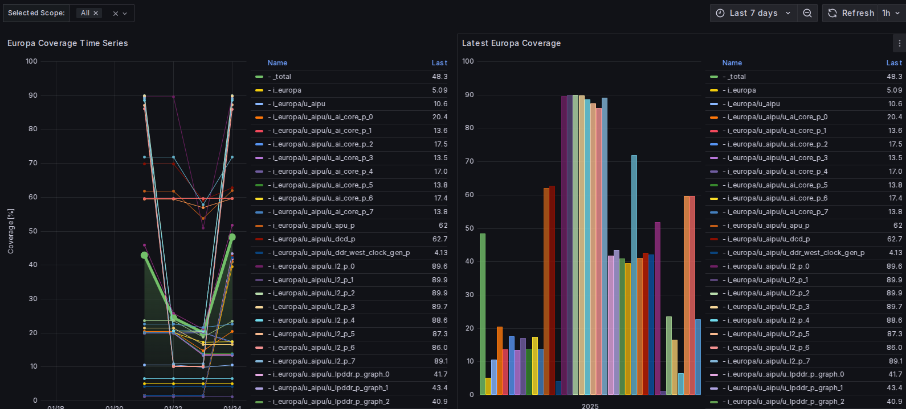

# 📊 Top-level Coverage

Top-level Coverage and [Architectural Requirements](https://doc.axelera.ai/prod/europa/latest/user_guide/requirement_links/) are the main metrics we use at top-level.

## Toggle coverage

The main coverage we gather at top-level is the IO toggle coverage on the folowing instance:

* `i_europa`
* `i_europa/u_europa_io`
* `i_europa/u_aipu`
* all instances in `u_aipu` (apu, aicores, pve, noc, lpddr, decoder etc)

## Dashboard

[Graphana top-level coverage dashboard](https://grafana.htz1.axelera.ai/d/aeak7qw0lmj9cd/europa-coverage?orgId=1&from=now-7d&to=now&timezone=browser&var-selected_scopes=$__all&refresh=1h)



## Detailed report

In order to analyze which IO did/didn't toggle, you can:
```bash
# in Hetzner:
cd /data/regression/europa/verif_team/coverage/top/<date>
vis -viewcov merged.ucdb # open the gui on the merged coverage database
nvim report.txt # details all the IOs for each instance, which one toggled/did not toggle
cat testnames.txt # list all tests that where merged
```

## Local Run

Both simulation and emulation can dump `ucdb` files:

* useful to see the impact your test has on coverage
* open with `vis -viewcov <name>.ucdb`

How to generate coverage:

* emulation: done by default, look in `coverage_veloce/` in your database
* simulation: see [top-level simulation userguide](https://doc.axelera.ai/prod/europa/latest/user_guide/top_level_simulation/#profiling)
