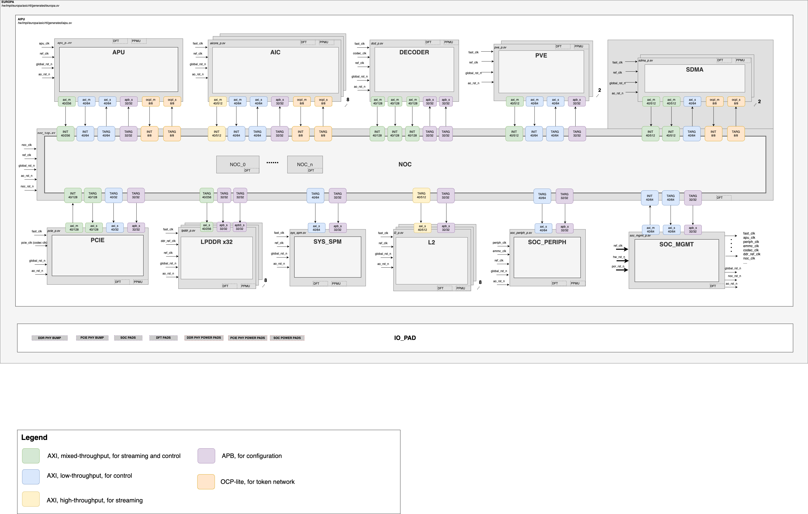
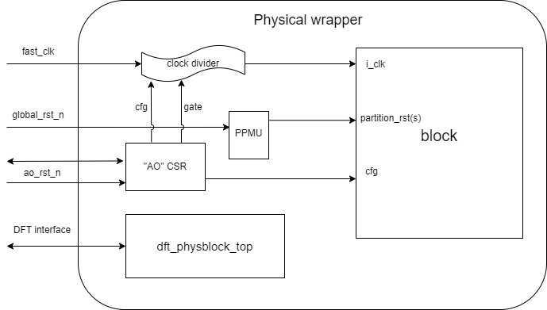

# Europa top level

## Top level overview

Europa system consists of 8 AI Core susbsystems, 1 system orchestration
subsystem, 1 PCIe subsystem, 1 video pre/post processing subsystem and 2 LPDDR
subsystems consisting of 4 instances of LPDDR5 Phy each. There is <some> MiB
memory on chip divided into <small> MiB chunks.

Following figure shows a schematic of above subsystems.

## Sub-systems

### Sub-system overview

| sub-system | Vendor | Description |
|------------|--------|-------------|
| AIC | in-house | ai_core can independently or collaboratively execute neural network workloads. It contains a large matrix-vector-multiplier unit mvm, 4MiB of low-latency/high-bandwidth software controlled memory l1, multiple dedicated vector processors iau dpu dwpu, a core_controller and a dma responsible for transferring data back and forth from l2 to l1 and vice-versa. All of them are connected through an AXI interface fabric ai_core_fabric |
| APU | in-house | The APU is the central managing agency that runs mainline, full-distro Linux. That also includes support for upstream RISC-V ported SW (such as Python, ffmpeg, etc.).  The APU will be required to boot further stages (such as U-Boot, UEFI, Grub, and Linux - exact boot flow to be decided). The APU will need to have support for the secure boot as well. |
| DECODER | Allegro | The Decoder is a block for the decoding of encoded video streams and images to obtain raw pixel data for processing in the Europa system |
| L2 module | in-house | l2 - medium-latency/medium-bandwidth software controlled scratchpad memory. The 128MiB total on-chip l2 memory is split into 8 l2-modules of 16MiB each. |
| LPDDR | SNPS | A LPDDR block acts as the interfaces between our system and an off-chip memory |
| NOC | Arteris | ai_core: can independently or collaboratively execute neural network workloads. It contains a large matrix-vector-multiplier unit mvm, 4MiB of low-latency/high-bandwidth software controlled memory l1, multiple dedicated vector processors iau dpu dwpu, a core_controller and a dma responsible for transferring data back and forth from l2 to l1 and vice-versa. All of them are connected through an AXI interface fabric ai_core_fabric |
| PCIE | SNPS | The PCIe block is used as interface between the AIPU system and external components, such as the host or another AIPU system |
| PVE | in-house | The PVE (Programmable Vector/Vision Engine) is the HW engine that drives pre-, mid- (between two NNs), and post-processing that are typically found in full-stack applications |
| SOC MGMT | in-house | SOC_MGMT is the collection of IP that are the central hub for system wide functions, for example, for booting, SOC_MGMT contains system PLLs, resetgen for primary device resets and the root of trust security enclave. For debug, there is the system debug unit, system trace buffering IP, and boot observability |
| SOC PERIPH | in-house | The SOC PERIPH block contains all slow IO peripherals |
| SOC SPM |||

### Physical wrapper
For each physical partition listed in above table, there is a physical wrapper as shown below:

## Global address map
The global address map can be found [here](only initial version, not finalized)

## Top level IO
Top level IO are listed here [here](top_io.md)

## Clock network
Clock network are described [here](top_clock.md)

## Reset network

### Reset sequence

## Bus connections

Top level AMBA bus connections are listed [here](bus_connections.md)

## Functional interface signal connections of sub-systems

Functional interface signal connections are listed [here](sideband_connections.md)

