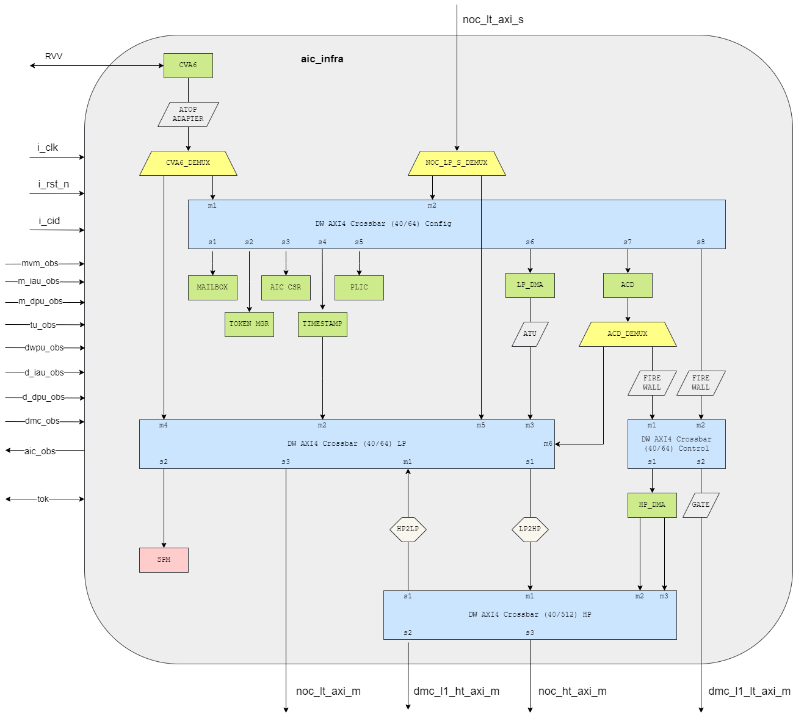
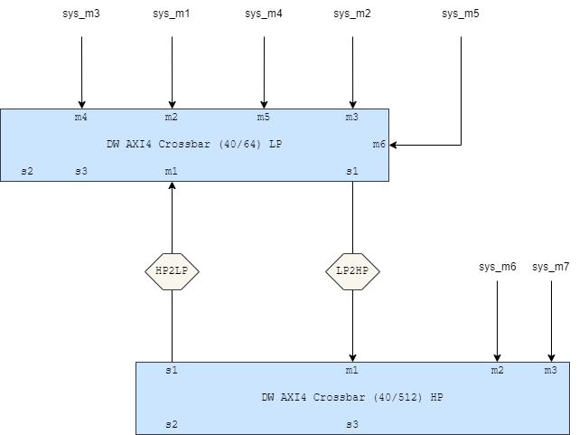
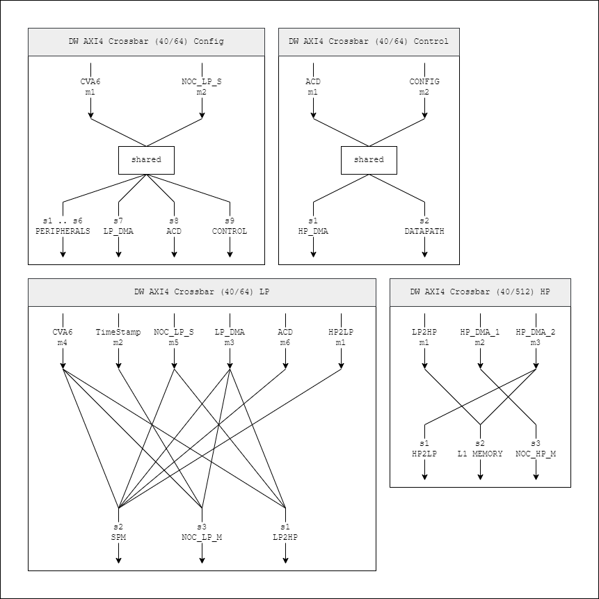

# aic_infra

This document describes the aic_infra subsystem.

## Architectural overview diagram

## Main feature and requirements
The ai core infra provides bus interconnects for communication between NoC and ai core.
The ai core infra (via cva6) manages the control of other sub systems within ai core.

## Clock & reset Requirements

|Clock | clock requirement|
|-------|--------|
|`i_clk`| 1.2GHz |

| Reset            | Reset Requirements                    |
|:---------------- |:------------------------------------- |
| `i_rst_n`     | active low     |

## Bus interfaces

The aic_infra provides AXI interface connecting to NoC and other subsystems.

### AMBA Protocol busses
| Interface Name    | Type  | Configuration                          | Direction   | Clock Domain | Comment                     |
|:----------------  |:----- |:-------------------------------------- |:----------- |:------------ |:--------------------------- |
| `noc_lt_axi_s`    | AXI4  | Address Width: 16, Data Width:  32     | subordinate | `i_ref_clk`  | Low throughput inteface     |
| `noc_lt_axi_m`    | AXI4  | Address Width: 40, Data Width: 512     | manager     | `i_clk`      | low throughput interface    |
| `noc_ht_axi_m`    | AXI4  | Address Width: 40, Data Width:  64     | manager     | `i_clk`      | high throughput interface   |
| `dmc_l1_ht_axi_m` | AXI4  | Address Width: 40, Data Width:  64     | subordinate | `i_clk`      | high throughput interface   |
| `dmc_l1_lt_axi_m` | AXI4  | Address Width: 40, Data Width:  64     | manager     | `i_clk`      | low throughput interface    |

### Token signals
| Interface Name    | Type  | Configuration                          | Direction   | Clock Domain | Comment                     |
|:----------------  |:----- |:-------------------------------------- |:----------- |:------------ |:--------------------------- |
| `tok_prod_ocpl_m` | OCPL| Address Width: 8, Data Width: 8 | manager | `i_clk` | top token network |
| `tok_cons_ocpl_s` | OCPL| Address Width: 8, Data Width: 8 | subordinate | `i_clk` | top token network |
| `m_ifd0_tok`| token | - | - | `i_clk` | ai core token network |
| `m_ifd1_tok`| toekn | - | - | `i_clk` | ai core token network |
| `m_ifd2_tok`| token | - | - | `i_clk` | ai core token network |
| `m_ifdw_tok`| token | - | - | `i_clk` | ai core token network |
| `d_ifd0_tok`| token | - | - | `i_clk` | ai core token network |
| `d_ifd1_tok`| token | - | - | `i_clk` | ai core token network |
| `m_odr_tok`| token   | - | - | `i_clk` | ai_core_token_network |
| `d_odr_tok`| token   | - | - | `i_clk` | ai_core_token_network |
| `mvm_exe_tok`| token | - | - | `i_clk` | ai_core_token_network |
| `mvm_prg_tok`| token | - | - | `i_clk` | ai_core_token_network |
| `m_iau_tok`| token   | - | - | `i_clk` | ai_core_token_network |
| `m_dpu_tok`| token   | - | - | `i_clk` | ai_core_token_network |
| `dwpu_tok`| token    | - | - | `i_clk` | ai_core_token_network |
| `d_iau_tok`| token   | - | - | `i_clk` | ai_core_token_network |
| `d_dpu_tok`| token   | - | - | `i_clk` | ai_core_token_network |

### cva6v mem interface
| Interface Name    | Type  | Configuration                          | Direction   | Clock Domain | Comment                     |
|:----------------  |:----- |:-------------------------------------- |:----------- |:------------ |:--------------------------- |
| `rvv_0`    | mem  | Address Width: 22, Data Width:  128     | - | `i_clk`      | cva6v mem interface |
| `rvv_1`    | mem  | Address Width: 22, Data Width:  128     | - | `i_clk`      | cva6v mem interface |
| `rvv_2`    | mem  | Address Width: 22, Data Width:  128     | - | `i_clk`      | cva6v mem interface |
| `rvv_3`    | mem  | Address Width: 22, Data Width:  128     | - | `i_clk`      | cva6v mem interface |
| `rvv_4`    | mem  | Address Width: 22, Data Width:  128     | - | `i_clk`      | cva6v mem interface |
| `rvv_5`    | mem  | Address Width: 22, Data Width:  128     | - | `i_clk`      | cva6v mem interface |
| `rvv_6`    | mem  | Address Width: 22, Data Width:  128     | - | `i_clk`      | cva6v mem interface |
| `rvv_7`    | mem  | Address Width: 22, Data Width:  128     | - | `i_clk`      | cva6v mem interface |

### Other
Other interfaces that do not fit a protocol as described before.

| Interface Name                    |  Width  |  Direction   | Functionality                                | Clock Domain  | Synced to   |
|:----------------------------------| :-----  | :----------- | :------------------------------------------- |:------------- | :------     |
| `cid`                             |  8      |   in         | Core ID                                      | static        | NA          |
| `mvm_exe_obs`                     |  8      |   in         | Observation signals from mvm_exe             | `i_clk`       | NA          |
| `mvm_prg_obs`                     |  8      |   in         | Observation signals from mvm_prg             | 'i_clk'       | NA          |
| `m_iau_obs`                       |  8      |   in         | Observation signals from m_iau               | `i_clk`       | NA          |
| `m_dpu_obs`                       |  8      |   in         | Observation signals from m_dpu               | `i_clk`       | NA          |
| `tu_obs`                          |  15     |   in         | Observation signals from throttle unit       | `i_clk`       | NA          |
| `dwpu_obs`                        |  8      |   in         | Observation signals from dwpu                | `i_clk`       | NA          |
| `d_iau_obs`                       |  8      |   in         | Observation signals from d_iau               | `i_clk`       | NA          |
| `d_dpu_obs`                       |  8      |   in         | Observation signals from d_dpu               | `i_clk`       | NA          |
| `dmc_obs`                         |  64     |   in         | Observation signals from dmc                 | `i_clk`       | NA          |
| `aic_obs`                         |  16     |  out         | Observation signals from aic                 |               |             |
| `dmc_ts_start`                    |  8      |   in         | timestamp start for dmc                      | `i_clk`       | NA          |
| `dmc_ts_end`                      |  8      |   in         | timestamp end for dmc                        | `i_clk        | NA          |
| `did_ts_start`                    |  3      |   in         | timestamp start for did                      | `i_clk        | NA          |
| `did_ts_end`                      |  3      |   in         | timestamp end for did                        | `i_clk`       | NA          |
| `mid_ts_start`                    |  4      |   in         | timestamp start for mid                      | `i_clk`       | NA          |
| `mid_ts_end`                      |  4      |   in         | timestamp end for mid                        | `i_clk`       | NA          |
| `dmc_acd_sync`                    |  8      |   in         | acd sync from dmc                            | NA            | NA          |
| `did_acd_sync`                    |  3      |   in         | acd sync from did                            | NA            | NA          |
| `mid_acd_sync`                    |  4      |   in         | acd sync from mid                            | `i_clk`       | NA          |
| `cva6v_boot_addr`                 |  40     |   in         | cva6v boot address                           | static        | NA          |
| `cva6v_debug_req_async`           |  1      |   in         | cva6v debug interface                        | async         | NA          |
| `cva6v_debug_rst_halt_req_async`  |  1      |   in         | cva6v debug interface                        | async         | NA          |
| `cva6v_debug_stop_time_async`     |  1      |  out         | cva6v debug interface                        | `i_clk`       | NA          |
| `cva6v_hart_unavail_async`        |  1      |  out         | cva6v debug interface                        | `i_clk`       | NA          |
| `cva6v_hart_under_reset_async`    |  1      |  out         | cva6v debug interface                        | `i_clk`       | NA          |
| `mtip_async`                      |  1      |   in         | PLTM interrupt                               | NA            | NA          |
| `msip_async`                      |  1      |   in         | software interrupt                           | NA            | NA          |
| `irq_dmc`                         |  8      |   in         | dmc interrupt                                | `i_clk`       | NA          |
| `irq_mvm_dpu`                     |  3      |   in         | mvm_dpu interrupt                            | NA            | NA          |
| `irq_aic_did`                     |  3      |   in         | aic_did interrupt                            | NA            | NA          |
| `sram_mcs`                        |  2      |   in         | memory config interface                      | `i_clk`       | NA          |
| `sram_ret`                        |  1      |   in         | memory config interface                      | NA            | NA          |
| `sram_pde`                        |  1      |   in         | memory config interface                      | NA            | NA          |
| `sram_adme`                       |  3      |   in         | memory config interface                      | NA            | NA          |
| `sram_prn`                        |  1      |   in         | memory config interface                      | NA            | NA          |
| `inter_core_sync`                 |  1      |   in         |                                              | NA            | NA          |
| `o_reserved`                      |  10     |  out         | reserved pins                                | NA            | NA          |
| `i_reserved`                      |  10     |   in         | reserved pins                                | NA            | NA          |

## IPs

aic infra contains the following IPs

### cva6
 TODO: add link to the IP doc
### mailbox
 TODO: add link to the IP doc
### token manager
 TODO: add link to the IP doc
### time stamp
 TODO: add link to the IP doc
### PLIC
 TODO: add link to the IP doc
### CSR
 TODO: add link to the IP doc
### LP DMA
 TODO: add link to the IP doc
### HP DMA
 TODO: add link to the IP doc
### ACD
 TODO: add link to the IP doc
### ATU
 TODO: add link to the IP doc
### Firewall
 TODO: add link to the IP doc

### aic fabric

The following components are in aic fabric:

- cva6_demux
- noc_lp_s_demux
- acd_demux
- config
- LP
- HP
- control
- hp2lp
- lp2hp

#### cva6_demux

This is an AXI demux between `LP` and `config`

|  Port Index     | type    | Config                   | Source (for m) / Destination (for s) |
|:--------------- |:--------|:------------------------ |:------------------------------------ |
| m1              | m       | AW: 40, DW: 64, IDW: 6   | cva6                                 |
| s1              | s       | AW: 40, DW: 64, IDW: 6   | LP                                   |
| s2              | s       | AW: 40, DW: 64, IDW: 6   | config                               |

#### noc_lp_s_demux

This is an AXI demux between 'config' and 'LP'

|  Port Index     | type    | Config                   | Source (for m) / Destination (for s) |
|:--------------- |:--------|:------------------------ |:------------------------------------ |
| m1              | m       | AW: 40, DW: 64, IDW: 6   | noc_lt_axi_s                         |
| s1              | s       | AW: 40, DW: 64, IDW: 6   | config                               |
| s2              | s       | AW: 40, DW: 64, IDW: 6   | LP                                   |

#### acd_demux

This is an AXI demux between 'LP' and 'control'

|  Port Index     | type    | Config                   | Source (for m) / Destination (for s) |
|:--------------- |:--------|:------------------------ |:------------------------------------ |
| m1              | m       | AW: 40, DW: 64, IDW: 6   | ACD                                  |
| s1              | s       | AW: 40, DW: 64, IDW: 6   | LP                                   |
| s2              | s       | AW: 40, DW: 64, IDW: 6   | control                              |

#### Config

|  Port Index     | type    | Config                   | Source (for m) / Destination (for s) |
|:--------------- |:--------|:------------------------ |:------------------------------------ |
| m1              | m       | AW: 40, DW: 64, IDW: 6   | cva6_demux: s2                       |
| m2              | m       | AW: 40, DW: 64, IDW: 6   | noc_lp_s_demux: s1                   |
| s1              | s       | AW: 40, DW: 64, IDW: 7   | mailbox                              |
| s2              | s       | AW: 40, DW: 64, IDW: 7   | token manager                        |
| s3              | s       | AW: 40, DW: 64, IDW: 7   | csr                                  |
| s4              | s       | AW: 40, DW: 64, IDW: 7   | time stamp                           |
| s5              | s       | AW: 40, DW: 64, IDW: 7   | PLIC                                 |
| s6              | s       | AW: 40, DW: 64, IDW: 7   | LP_DMA                               |
| s7              | s       | AW: 40, DW: 64, IDW: 7   | ACD                                  |
| s8              | s       | AW: 40, DW: 64, IDW: 7   | control: m2 (via firewall)           |

The connectivity inside `config` bus is shown below

#### Control

|  Port Index     | type    | Config                   | Source (for m) / Destination (for s) |
|:--------------- |:--------|:------------------------ |:------------------------------------ |
| m1              | m       | AW: 40, DW: 64, IDW: 7   | acd_demux: s2                        |
| m2              | m       | AW: 40, DW: 64, IDW: 7   | config: s9                           |
| s1              | s       | AW: 40, DW: 64, IDW: 8   | HP DMA                               |
| s2              | s       | AW: 40, DW: 64, IDW: 8   | datapath                             |

The connectivity inside `control` bus is shown below

#### LP & HP

LP and HP are 2 AXI buses which are cascaded by using DICMD (bidirectional command support). In this way, AXI manager ports directly connected to an AXI manager are referred
as "system managers" as shwon in Figure below. Manager port used for cacaded connection is referred as "interconnectiong manager (IMC)".

|  sys manager index  | mapped IP port  | Source             |
|:------------------- |:----------------|:------------------ |
| sys_m1              | LP: m2          | time stamp         |
| sys_m2              | LP: m3          | LP DMA             |
| sys_m3              | LP: m4          | cva6 (cva6_demux: s1)  |
| sys_m4              | LP: m5          | noc_lt_axi_s (lp_s_demux: s2) |
| sys_m5              | LP: m6          | acd (acd_demux: s1)    |
| sys_m6              | HP: m2          | HP DMA: s1   |
| sys_m7              | HP: m3          | HP DMA: s2   |

##### LP

|  Port Index     | type    | Config                   | Source (for m) / Destination (for s) |
|:--------------- |:--------|:------------------------ |:------------------------------------ |
| m1 (IMC)        | m       | AW: 40, DW: 64, IDW: 6   | HP: s1 (via hp2lp)                   |
| m2              | m       | AW: 40, DW: 64, IDW: 6   | time stamp                           |
| m3              | m       | AW: 40, DW: 64, IDW: 6   | LP DMA (via ATU)                     |
| m4              | m       | AW: 40, DW: 64, IDW: 6   | cva6_demux: s1                       |
| m5              | m       | AW: 40, DW: 64, IDW: 6   | noc_lp_s_demux: s2                   |
| m6              | m       | AW: 40, DW: 64, IDW: 6   | acd_demux: s1                        |
| s1              | s       | AW: 40, DW: 64, IDW: 9   | HP: m1 (via lp2hp)                   |
| s2              | s       | AW: 40, DW: 64, IDW: 9   | spm                                  |
| s3              | s       | AW: 40, DW: 64, IDW: 9   | noc_lt_axi_m                         |

The connectivity inside `LP` is shown below

##### HP

|  Port Index     | type    | Config                   | Source (for m) / Destination (for s) |
|:--------------- |:--------|:------------------------ |:------------------------------------ |
| m1 (IMC)        | m       | AW: 40, DW: 512, IDW: 6  | LP: s1 (via lp2lhp)                  |
| m2              | m       | AW: 40, DW: 512, IDW: 6  | HP DMA: s1                           |
| m3              | m       | AW: 40, DW: 512, IDW: 6  | HP DMA: s2                           |
| s1              | s       | AW: 40, DW: 512, IDW: 9  | LP: m1 (via hp2lp)                   |
| s2              | s       | AW: 40, DW: 512, IDW: 9  | spm                                  |
| s3              | s       | AW: 40, DW: 512, IDW: 9  | noc_lt_axi_m                         |

The connectivity inside `HP` is shown below.

#### hp2lp

This is an AXI protocal converter which convert HP data into LP data.

|  config item      | value   | Comments                 |
|:----------------- |:--------|:------------------------ |
| Clocking          | sync    |   |
| waddr buffer depth| 4       |   |
| wdata buffer depth| 16      |   |
| wresp buffer depth| 2       |   |
| raddr buffer depth| 4       |   |
| rdata buffer depth| 16      |   |

#### lp2hp

This is an AXI protocal converter which converts LP data into HP data

|  config item      | value   | Comments                 |
|:----------------- |:--------|:------------------------ |
| Clocking          | sync    |   |
| waddr buffer depth| 4       |   |
| wdata buffer depth| 16      |   |
| wresp buffer depth| 2       |   |
| raddr buffer depth| 4       |   |
| rdata buffer depth| 16      |   |

#### fabric decoder

External decoders are used in fabric.

##### cva6_demux

|  addresses              | desination   | Comments            |
|:----------------------- |:--------|:------------------------ |
| Addresses in the core address region but not mapped to any slave | s0 | |
| AIC_SPM                 | s1    | SPM |
| AIC_L1                  | s1    | L1  |
| DDR_0                   | s1    | DDR 0  |
| DDR_1                   | s1    | DDR 1  |
| L2                      | s1    | L2  |
| TODO                    | s1    | Address not hitting any defined core address region and not within core address region  |
| AIC_CFG_MAILBOX         | s2    | mailbox |
| AIC_CFG_TOK_MGR         | s2    | token manager  |
| AIC_CFG_CSR_INFRA_PART  | s2    | infra CSR  |
| AIC_CFG_TIMESTAMP       | s2    | time stamp  |
| AIC_CFG_PLIC            | s2    | PLIC  |
| AIC_CFG_LP_DMA          | s2    | LP DMA |
| AIC_CFG_ACD             | s2    | ACD  |
| AIC_HP_DMA_CSR          | s2    | HP DMA|
| AIC_HP_DMA_CMD          | s2    | HP DMA  |
| AIC_HP_DMA_PRG          | s2    | HP DMA  |
| AIC_DMC_CSR             | s2    | DMC  |
| AIC_DMC_CMD             | s2    | DMC  |
| AIC_DMC_PRG             | s2    | DMC  |
| AIC_MID_CSR             | s2    | MID  |
| AIC_MID_CMD             | s2    | MID |
| AIC_MID_PRG             | s2    | MID  |
| AIC_DID_CSR             | s2    | DID  |
| AIC_DID_CMD             | s2    | DID  |
| AIC_DID_PRG             | s2    | DID  |

##### noc_lp_s_demux

|  addresses              | desination   | Comments            |
|:----------------------- |:--------|:------------------------ |
| Addresses in the core address region but not mapped to any slave and addresses not in the core region | s0 | |
| AIC_CFG_MAILBOX         | s1    | mailbox |
| AIC_CFG_TOK_MGR         | s1    | token manager  |
| AIC_CFG_CSR_INFRA_PART  | s1    | infra CSR  |
| AIC_CFG_TIMESTAMP       | s1    | time stamp  |
| AIC_CFG_PLIC            | s1    | PLIC  |
| AIC_CFG_LP_DMA          | s1    | LP DMA |
| AIC_CFG_ACD             | s1    | ACD  |
| AIC_HP_DMA_CSR          | s1    | HP DMA|
| AIC_HP_DMA_CMD          | s1    | HP DMA  |
| AIC_HP_DMA_PRG          | s1    | HP DMA  |
| AIC_DMC_CSR             | s1    | DMC  |
| AIC_DMC_CMD             | s1    | DMC  |
| AIC_DMC_PRG             | s1    | DMC  |
| AIC_MID_CSR             | s1    | MID  |
| AIC_MID_CMD             | s1    | MID |
| AIC_MID_PRG             | s1    | MID  |
| AIC_DID_CSR             | s1    | DID  |
| AIC_DID_CMD             | s1    | DID  |
| AIC_DID_PRG             | s1    | DID  |
| AIC_SPM                 | s2    | SPM |
| AIC_L1                  | s2    | L1  |

##### acd_demux

|  addresses              | desination   | Comments            |
|:----------------------- |:--------|:------------------------ |
| Addresses in the core address region but not mapped to any slave and addresses not in the core region | s0 | |
| AIC_SPM                 | s1    | SPM |
| AIC_HP_DMA_CSR          | s2    | HP DMA|
| AIC_HP_DMA_CMD          | s2    | HP DMA  |
| AIC_HP_DMA_PRG          | s2    | HP DMA  |
| AIC_DMC_CSR             | s2    | DMC  |
| AIC_DMC_CMD             | s2    | DMC  |
| AIC_DMC_PRG             | s2    | DMC  |
| AIC_MID_CSR             | s2    | MID  |
| AIC_MID_CMD             | s2    | MID |
| AIC_MID_PRG             | s2    | MID  |
| AIC_DID_CSR             | s2    | DID  |
| AIC_DID_CMD             | s2    | DID  |
| AIC_DID_PRG             | s2    | DID  |

##### config

|  addresses              | desination   | Comments            |
|:----------------------- |:--------|:------------------------ |
|  Addresses in the core address region but not mapped to any slave and addresses not in the core region | s0 | |
| AIC_CFG_MAILBOX         | s1    | mailbox |
| AIC_CFG_TOK_MGR         | s2   | token manager  |
| AIC_CFG_CSR_INFRA_PART  | s3    | infra CSR  |
| AIC_CFG_TIMESTAMP       | s4    | time stamp  |
| AIC_CFG_PLIC            | s5    | PLIC  |
| AIC_CFG_LP_DMA          | s7    | LP DMA |
| AIC_CFG_ACD             | s8    | ACD  |
| AIC_CFG_CSR_MID_PART    | s9    | CFG CSR MID   |
| AIC_HP_DMA_CSR          | s9    | HP DMA|
| AIC_HP_DMA_CMD          | s9    | HP DMA  |
| AIC_HP_DMA_PRG          | s9    | HP DMA  |
| AIC_DMC_CSR             | s9    | DMC  |
| AIC_DMC_CMD             | s9    | DMC  |
| AIC_DMC_PRG             | s9    | DMC  |
| AIC_MID_CSR             | s9    | MID  |
| AIC_MID_CMD             | s9    | MID |
| AIC_MID_PRG             | s9    | MID  |
| AIC_DID_CSR             | s9    | DID  |
| AIC_DID_CMD             | s9    | DID  |
| AIC_DID_PRG             | s9    | DID  |

##### LP

|  addresses              | desination   | Comments            |
|:----------------------- |:--------|:------------------------ |
| Addresses in the core address region but not mapped to any slave | s0 | |
| AIC_L1                  | s1    | L1  |
| AIC_SPM                 | s2    | SPM |
| TODO                    | s3    | Address not within core address region  |

##### HP

|  addresses              | desination   | Comments            |
|:----------------------- |:--------|:------------------------ |
| Addresses in the core address region but not mapped to any slave and addresses not in the core region | s1 | |
| AIC_L1                  | s2    | L1  |
| DDR_0                   | s3    | DDR 0 |
| DDR_1                   | s3    | DDR 1 |
| L2                      | s3    | L2    |

##### control

|  addresses              | desination   | Comments            |
|:----------------------- |:--------|:------------------------ |
| Addresses in the core address region but not mapped to any slave and addresses not in the core region | s0 | |
| AIC_HP_DMA_CSR          | s1    | HP DMA|
| AIC_HP_DMA_CMD          | s1    | HP DMA  |
| AIC_HP_DMA_PRG          | s1    | HP DMA  |
| AIC_CFG_CSR_MID_PART    | s2    | CFG CSR MID   |
| AIC_DMC_CSR             | s2    | DMC  |
| AIC_DMC_CMD             | s2    | DMC  |
| AIC_DMC_PRG             | s2    | DMC  |
| AIC_MID_CSR             | s2    | MID  |
| AIC_MID_CMD             | s2    | MID |
| AIC_MID_PRG             | s2    | MID  |
| AIC_DID_CSR             | s2    | DID  |
| AIC_DID_CMD             | s2    | DID  |
| AIC_DID_PRG             | s2    | DID  |
