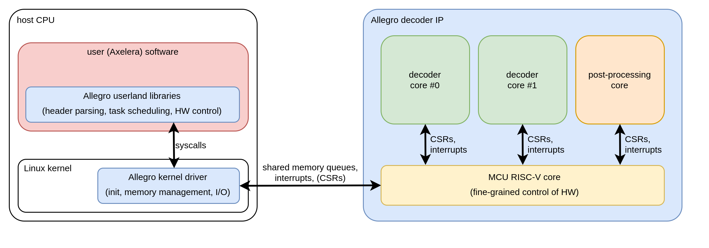

# DCD (Decoder)

The DCD (Decoder) is a block for the decoding of encoded video streams and images to obtain raw pixel data for processing in the Europa system.

## Abbreviations

| Abbreviation | Description |
| --- | --- |
| CODEC | decoder block |
| DCD | decoder block |
| DEC | decoder block |
| MCU | microcontroller unit |

## Overview

The DCD (Decoder) is a block for the decoding of encoded video streams and images to obtain raw pixel data for processing in the Europa system.
It is a third-party soft IP block (provided by *Allegro DVT*) that we integrate ourselves.

> Throughout the project, various names are in use for this block/IP, including: **DCD**, **decoder**, **CODEC**, and **DEC**.

The DCD consists of four main subsystems:

* two identical **decoder cores**,
* **post-processing** engine, and an
* **MCU** (RISC-V core for low-level control).

From the system-level point of view, the fact that the DCD contains a RISC-V core is mostly opaque.
Simply put, the DCD is "just" a hardware IP that processes streams of data based on command lists.

## Block Diagram

For a hardware block diagram, see the [architectural specification](../../../europa_architecture/blocks/dcd/dcd_block_spec.md).

## Software

Most of the software for the DCD is provided by Allegro:

* **MCU firmware:** FreeRTOS-based software stack which handles low-level control of the different processing blocks.
* **Linux driver:** for interaction between the *host CPU* (in our case, APU) and the MCU.
* **Control software:** userspace libraries that run on the *host CPU* and interact with the DCD through the Linux driver.

The control software is documented in the [Decoder User Manual](https://axeleraai.sharepoint.com/:b:/r/sites/AXELERAAI-ResearchandDevelopment/Gedeelde%20documenten/Research%20and%20Development/hw/doc/vendors/Allegro/AllegroSoftware-Axelera-d20240507/AllegroDVT.pdf?csf=1&web=1&e=WEwnZ4).

### Hardware-software Cooperation

Decoding of an encoded bitstream consists of multiple steps that are handled either in software (on the host CPU) or inside the DCD IP.
Broadly speaking, only the actual *slice data* is handled in hardware, while other parts of the bitstream (e.g., headers) are decoded in software.
Furthermore, the software is responsible for time-multiplexing the hardware between different bitstreams to enable concurrent decoding of multiple streams.

The communication channels between the different components (userland code, kernel driver, MCU firmware, hardware) are shown in this block diagram:

### Linux Driver

The linux driver performs three main functions:

* **initialization:** On startup, it loads the MCU firmware blob into memory.
It then configures and starts the MCU (via memory-mapped CSRs).
* **communication:** The Linux driver enables communication between the control software and DCD, using memory-mapped FIFOs to pass messages between the host and DCD MCU.
It also handles interrupts from the DCD.
* **memory management:** It is responsible for the memory used by the DCD hardware.

## Resources

* **Vendor Documentation:** [SharePoint](https://axeleraai.sharepoint.com/sites/AXELERAAI-ResearchandDevelopment/Gedeelde%20documenten/Forms/AllItems.aspx?newTargetListUrl=%2Fsites%2FAXELERAAI%2DResearchandDevelopment%2FGedeelde%20documenten&viewpath=%2Fsites%2FAXELERAAI%2DResearchandDevelopment%2FGedeelde%20documenten%2FForms%2FAllItems%2Easpx&id=%2Fsites%2FAXELERAAI%2DResearchandDevelopment%2FGedeelde%20documenten%2FResearch%20and%20Development%2Fhw%2Fdoc%2Fvendors%2FAllegro&viewid=2b136c51%2D6ee8%2D4597%2Db229%2Dda1ce90e5a74)
* **Vendor Support:** [https://tickets.allegrodvt.com](https://tickets.allegrodvt.com)
