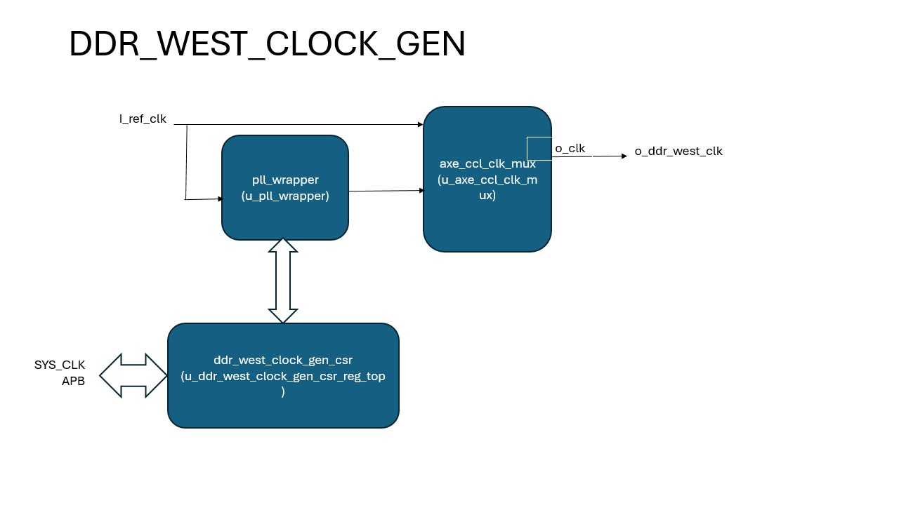

# DDR West Clock Gen Functional Spec

## Introduction
DDR West clock gen includes a single PLL that is used to generate the DDR west clock. Also included in the module is a CSR that supports PLL configuration and status monitoring. The CSR can be accessed via the SYS Config interface.

### System Diagram

## Functional Description
The clock gen is responsible for generation a single clocks that is intended to drive the DDR west module. The target clock frequency is 800MHz. A dedicated PLL is included for this purpose. A CSR provides a means to configure the PLL and monitor the device status. CSR is accessible from the SYS config interface.

Steps to output PLL clock:
  - Configure PLL Divider to set the required frequency.
  - Remove PLL reset.
  - Wait for PLL lock.
  - Program clock mux to select the PLL clock output. After this the PLL clock will be available on o_ddr_west_clk.

Target clock frequency is 800MHz. 

### CSR Details

| CSR Name                  | Size (bits) | Reset Value | Description                                     |
|:-------------------------:|:-----------:|:-----------:|:-----------------------------------------------:|
| pll_reset                 | 32          | 0           | PLL Reset.                                      |
| pll_bypass                | 32          | 0           | PLL bypass.                                     |
| pll_lock                  | 32          | 0           | PLL lock status.                                |
| pll_divider               | 32          | 1           | PLL Divider control.                            |
| clk_select                | 32          | 0           | Module output clock select.                     |

### PLL_RESET Register Description

| Field Name             | Position | Reset  | Access Type | Description                                 |
| ---------------------- | -------- | ------ | ----------- | ------------------------------------------- |
| RESET                  | 0        | 0      | RW          | PLL Reset.                                  |
|                        |          |        |             | 0 = Reset PLL                               |
|                        |          |        |             | 1 = Remove PLL reset                        |

### PLL_BYPASS Register Description

| Field Name             | Position | Reset  | Access Type | Description                                 |
| ---------------------- | -------- | ------ | ----------- | ------------------------------------------- |
| BYPASS                 | 0        | 0      | RW          | PLL Bypass.                                 |
|                        |          |        |             | 0 = Bypass PLL                              |
|                        |          |        |             | 1 = Enable PLL outputs                      |

### PLL_LOCK Register Description

| Field Name             | Position | Reset  | Access Type | Description                                 |
| ---------------------- | -------- | ------ | ----------- | ------------------------------------------- |
| LOCK                   | 0        | 0      | RO          | PLL Lock status.                            |
|                        |          |        |             | 0 = PLL not locked.                         |
|                        |          |        |             | 1 = PLL is locked.                          |

### PLL_DIVIDER Register Description

| Field Name             | Position | Reset  | Access Type | Description                                 |
| ---------------------- | -------- | ------ | ----------- | ------------------------------------------- |
| REF_DIVIDER_OUTPUT     | 5:0      | 0      | RW          | PLL post divider reference value            |
| FEEDBACK_DIVIDER       | 15:6     | 0      | RW          | Feedback divider value                      |
| PRE_OUTPUT_DIVIDER     | 18:16    | 0      | RW          | PLL Pre output divider value                |

### CLK_SELECT Register Description

| Field Name             | Position | Reset  | Access Type | Description                                 |
| ---------------------- | -------- | ------ | ----------- | ------------------------------------------- |
| CLK_SELECT             | 31:0     | 0      | RW          | Select clock source by ID                   |
