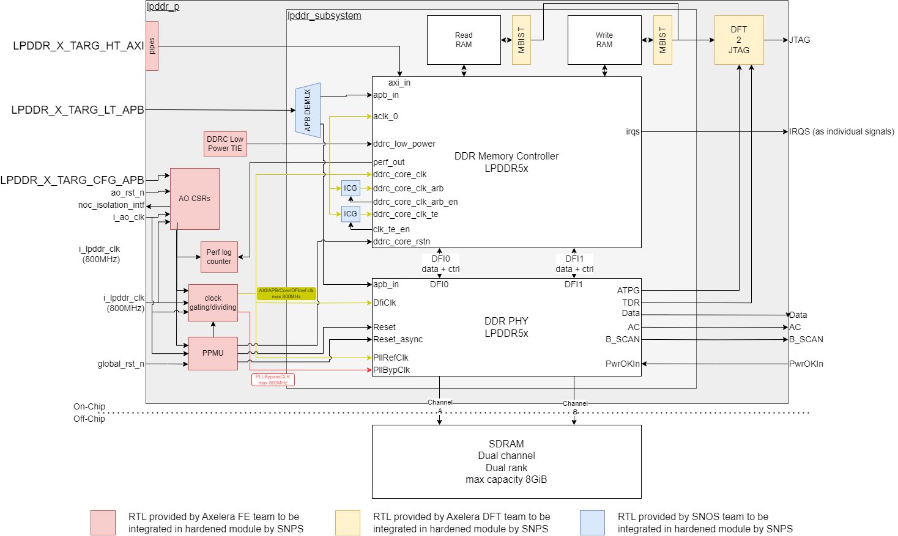

# LPDDR

The LPDDR module is IP from SNPS and most of the documentation can be found in the release directories of the IP.

In this document, reference to access the SNPS IP docs are given. And, our additional RTL around the SNPS subsys, the `lpddr_p` module, is documented.

## SNPS DOC links

### SUBSYS release docs

`$DDR_SUBSYSTEM_RTL_PATH/doc`

### CTRL IP docs

Documentation is generated after making a workspace. To crease a local lpddr ctrl workspace you can use this command
`${REPO_ROOT}/hw/vendor/synopsys/lpddr_subsys/default/scripts/create_workspace.sh`

Once completed, you should be able to find the docs in

`${REPO_ROOT}/hw/vendor/synopsys/lpddr_subsys/default/workspaces/my_workspace/doc`

### PHY IP docs

Documentation is generated after making a workspace. To create a local lpddr phy workspace you can use this flow starting from REPO_ROOT.

``` bash
source .env-default-modules
cd ${REPO_ROOT}/hw/vendor/synopsys/lpddr_subsys/default/workspaces
export PHY_PROJ=my_first_phy #or any other name you would like to give your workspace
coreConsultant -shell -f $DDR_SUBSYSTEM_RTL_PATH/customer_config/configs/axelera_phy_config
```

Documentation will be under `${REPO_ROOT}/hw/vendor/synopsys/lpddr_subsys/default/workspaces/my_first_phy/doc`.

## LPDDR_P

The `lpddr_p` wrapper module is similar to the `_p` level of all other IPs. Below you can find the exact contents for the LPDDR as well as a top-level lpddr block diagram listing the major components and interfaces.

### Top-level block diagram



Note: the diagram does not list all individual signals and connections, but gives a representative global picture. For exact details, consult the code.

### Content list of the wrapper.

The list below RTL elements to be included in the wrapper, and that thus need to be provided by us to SNPS. 

* Two clocks
  * `ao_clk` (max 100MHz), to drive the always-on logic in the wrapper.
  * `lpddr_clk` (max 800MHz), to drive all of the SNPS IP clocks as wel as the performance counters. The PPMU splits it in a dedicated logic and PLL clock for the IP.
* DFT logic, @leonidas.katselas confirmed a piece of magic DFT logic will make interfacing with DFT related elements possible through JTAG.
* Pipes on interfaces to relax timing, AXI only for now. APB interface towards SNPS IP could be required later to meet timing.
* AO CSR, similar to other blocks, this will control the top-level clock div/gate of the LPDDR block. Further, together with the `PPMU` it 
* PPMU, including clock gates/divs and reset constrol
* performance counters, simple counters that increment when a respective performance signal is high. Documented in [performance counters](europa_lpddr_async_perf_counter.md)
* DDRC and AXI Low Power Interface Tie, simple hardwired always on setting for the DDRC low power interface.
* CDCs between `ao_clk` domain and `lpddr_clk` domain (Not shown in diagram above)

## SNPS SS sims

SNPS includes a set of coreConsultant generated simulation with the subsystem release. These can be executed using the `hw/vendor/synopsys/lpddr_subsys/default/scripts/create_release_sim_space.sh` script. It can either run the simulations on the original SNPS subsystem without any modifications (this is the default). 

### create_release_sim_space options
#### -d
Dryrun, create the required snps cC workspace, but do not compile or run the simulations yet.
#### -s
Skip the cC workspace creation. This assumes you have already a workspace from a previous simulation run.
#### -p
The `-p` option includes our wrapper levels in the simulation. This effectively changes the DUT from `snps_subsystem` to our `lpddr_p`. To match our `lpddr_p` interface with the expected subsystem interface, an additional 'inverse' wrapper is added on the TB-side fo the simulation, `hw/impl/europa/blocks/lpddr/rtl/generated/lpddr_subsys_inv_wrapper.sv`. This wrapper bypasses most of our `lpddr_p` wrapper using `force` in order to expose an identical interface as the original snps subsystem.

#### -t
Take the DFT modified version of the RTL. This requires the `-p` option to be present as well.

### usage

```bash
source .env-default-modules
module switch gcc/9.2.0
./hw/vendor/synopsys/lpddr_subsys/default/scripts/create_release_sim_space.sh
```

Note that cC simulations strictly require gcc version 9.2.0 due to a limitation in cC.

## Creating a SNPS release

As we are modifying the SNPS subsystem RTL with DFT insertion, and add additional wrapper levels around it, we have to release RTL from ourside back to SNPS.

`hw/impl/europa/blocks/lpddr/scripts/create_snps_release.sh` is a script that can be used to create a release. It does the following in a semi-automated way

- Create a new PD-release using our normal PD release flow (and location)
- Restructure the PD-release to have a more hierarchical directory structure
- Remove and FC scripts that will not work outside our env
- Copy the DFT related files and modified files directly to the release dir
- Copy the simulation related files to the release dir
  - `adapt_sim_setup.sh` is a manually maintained script based on `create_release_sim_space.sh`, it might need manual updating before creating the release
- Create file-lists for SNPS to use
  - `modified_files.lst` is manually maintained and might need manual updating before creating the release
- Add a readme to the release
- Make a tar of the release directory and move it in the directory itself. 

## Discussion from (old) RFC on LPDDR_P top

https://git.axelera.ai/prod/europa/-/issues/722

### Content of the SNPS subsystem integration

**SNSP will provide the RTL for the elements below.**

* `APB DEMUX`. We would like group all APB interfaces that are not related to the `sys_cfg` APB interface into a single `DDR_APB` interface. This requires a demux that can hopefully be provided by SNPS. (In Alpha and Omega, invecas provided something similar for us).
* `ICG`. Internal clock gates to control the `te` and `arb` clock gating.

**SNPS does is not willing to provide the RTL these elements.**

* `perf log counter`. The performance monitoring signals of the LPDDR controller provide a single high pulse per event. These can not be read directly over the NoC through the ABP interface. Some simple local counters to keep track of the events would already allow to get some useful information out.
* `DDRC Low Power FSM`, if we want to use the DDRC Low Power signals from the controller to also put the AXI interface logic of the controller into its low power state, we need som logic to drive this interface. If SNPS is not willing to help on this, I propose that we ask them to tie-off this feature (the most effective power saving modes can be reached without using the interface).


### Open items (all solved at this point)

- @yassine.fkih, the boundary scan related signals on the bottom right of the block diagram. Do you know how these will be handled? Is there anything else that needs to be provisioned for those inside the wrapper? DFT connects to them
- Does the PLLRefClk needs to pass through a clock gate/div controlled by the AO CSRs? Yes, this avoids having it go off during resets.
- Do the PHY reset signals need to pass through the PPMU? Yes this helps to relax timing. The PPMU controls all resets.
- Async or sync `LPDDR_X_TARG_HT_AXI` interface w.r.t `ddr_clk` SYNC
- Async or sync `LPDDR_X_TARG_LT_APB` interface w.r.t `ddr_clk` SYNC

