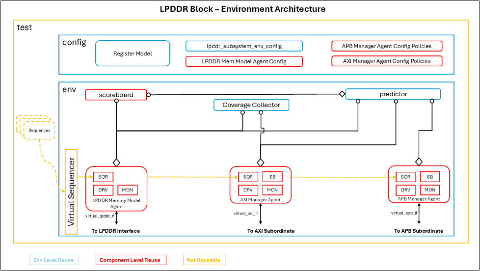

# LPDDR Verification Specification

## Introduction

### Overview
<!-- Describe the scope and purpose of the work package

 - Which projects does this work package belong to?
 - Where in system / chip is it located?
 - What are the high level use-cases? -->

A LPDDR subsystem consisting of a Controller and PHY provided by Synopsys is used to access the external DRAM memories. 8 of these subsystems will be instantiated into our design with a maximum capacity per module of 8GB (64GB in total). These subsystems can be reached by any of the NoC initiators.

The IP being already verified by Synospys, Axelera verification will focus on the integration verification and the performance verification.

Siemens Verification Services will also perform the Subsystem verification of the provided IP from Synopsys.
This testbench and test suite will be integrated into our environment and serve as the block level verification.

### Ownership
Who to contact for information

|  Team              | Contact         |
| ------------------ | --------------- |
| ***Architecture*** | @roel.uytterhoeven|
| ***Design***       | @roel.uytterhoeven / @milos.stanisavljevic / Synopsys|
| ***Verification*** | @rodrigo.borges|

### Reference
Where to find the design documentation

| Team               | Specification |
| ------------------ | ------------- |
| ***Architecture*** |[Arch Spec](https://axeleraai.atlassian.net/wiki/spaces/archrd/pages/377913520/DDR)|
| ***Design***       |[Block Spec](https://axeleraai.sharepoint.com/sites/AXELERAAI-ResearchandDevelopment/Gedeelde%20documenten/Forms/AllItems.aspx?csf=1&web=1&e=cQIR4P&ovuser=9c838ba7%2Dc38c%2D416d%2Da793%2D1de07a190ebd%2Crodrigo%2Eborges%40axelera%2Eai&OR=Teams%2DHL&CT=1684227523438&clickparams=eyJBcHBOYW1lIjoiVGVhbXMtRGVza3RvcCIsIkFwcFZlcnNpb24iOiIyOC8yMzA0MDIwMjcwNSIsIkhhc0ZlZGVyYXRlZFVzZXIiOmZhbHNlfQ%3D%3D&cid=8728d09c%2D2743%2D4013%2D831b%2D6a3218925e60&FolderCTID=0x012000F56590EB3DA39949813F2AC81EB290DA&id=%2Fsites%2FAXELERAAI%2DResearchandDevelopment%2FGedeelde%20documenten%2FResearch%20and%20Development%2Fhw%2Fdoc%2Fvendors%2FSynopsys%2Fdoc%2FDDR%2FLPDDR5&viewid=2b136c51%2D6ee8%2D4597%2Db229%2Dda1ce90e5a74)|

### Project Planning and Tracking
Where to find project plans and trackers

|   | Link |
| - | ---- |
| ***Plan*** |[Gitlab Issues Board](https://git.axelera.ai/ai-dv-team/dv-europa-planning/LPDDR5/-/boards)|
| ***Issues*** |[Gitlab Open Issues](https://git.axelera.ai/prod/europa/-/issues/?sort=created_date&state=opened&label_name%5B%5D=block%3Alpddr&first_page_size=20)|

## Block Level Testbenches

### Siemens testbench
#### Overview

Block level testbench will be provided by Siemens Verification Services.

#### Diagram


#### How to Run

**This section will be updated when the tesbench and test suite is provided by Siemens and integrated into our environment.**

How to check out and run

```
git clone etc.
source ....
cd ...
make ...
```
#### Regressions

**This section will be updated when the tesbench and test suite is provided by Siemens and integrated into our environment.**

Which regressions to run

| Regression | Description | Source | Link |
| ---------- | ----------- | ------ | ---- |
| regression | description | [Link to Source]() | [Last CI Run]()|

#### Metrics / Coverage Plan
VPlan / Verification IQ excel / csv file

This section should link to at least a testlist and a list the metrics, both should be a machine readable yaml files.
The testlist must be named test_fw_<block_name>.yaml or test_uvm_<block_name> and be located in $REPO_ROOT/verifsdk/. It describes a list of tests that can be linked to requirements and that can also be used for regressions. The file format is detailed in the following [README](/verifsdk/README.md).
The metrics file must me named metrics_<block_name>.yaml and be located in $REPO_ROOT/verifsdk/metrics. It describes a list of various metrics such as covergroups, performance and more. The goal is to be able to describe a metric and link it to requirements. The file format is detailed in the following [README](/verifsdk/metrics/README.md).

VPLAN is provided by Siemens and review by us. First versions of this VPLAN can be tracked in https://git.axelera.ai/ai-dv-team/dv-europa-planning/LPDDR5/-/issues/2.

<!-- ## Formal Proofs
### Overview
Description of any formal environments

### How To Run

```
git clone etc.
source ....
cd ...
make ...
```

#### Regressions
Which regressions to run

| Regression | Description | Source | Link |
| ---------- | ----------- | ------ | ---- |
| regression | description | [Link to Source]() | [Last CI Run]()|

#### Metrics / Coverage Plan
VPlan / Verification IQ excel / csv file

- [Link]() -->

## System Level Testcases
Tests to be run at top level / Veloce

| Testcase   | Description | Source | Link |
| --------   | ----------- | ------ | ---- |
| testcase   | description | [Link to Source]()| [Last CI Run]()|
