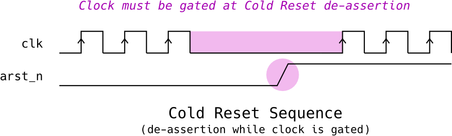
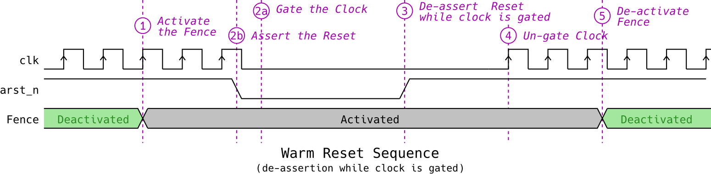
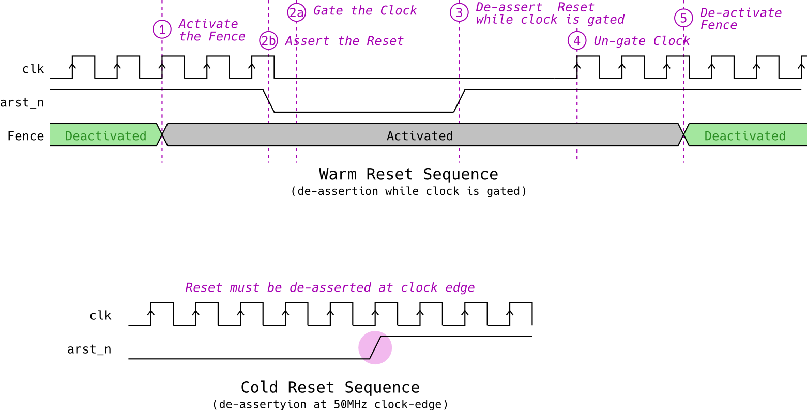
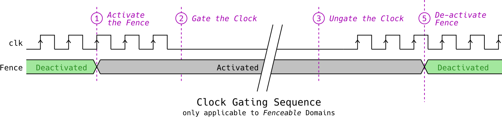
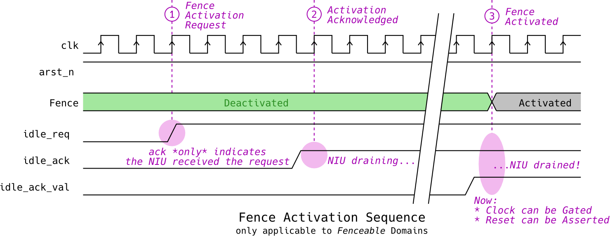
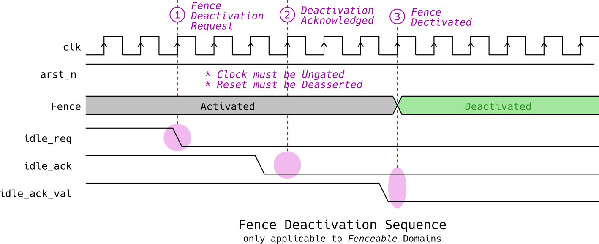
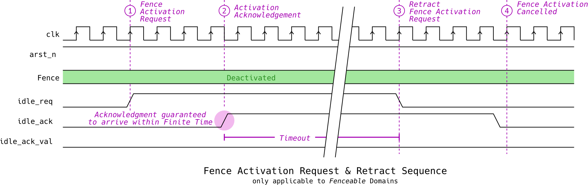

# Clocking, Resets & Fences

Each [Interface](baseband_interfaces.md) is assigned a **Clock Domain** according to the Block's clocking, reset and gating requirements.

There are **3 types** of clock domains:

1. **Fenceable** domains
    * These domains can be _Powered Off_, i.e. put to Reset or Clock-Gated independently of the rest of the system
    * Before Powering Off the domain, the Fence must be activated to protect system integrity
    * There's at least one such domain per block, serving its _primary_ Interfaces (e.g. CPU, data, memory, tracing etc)
    * Multiple Interfaces in a given Block may belong the same Domain
    * An Interface must belong to exactly one such domain
2. **SysCfg AON** domains
    * These domains *cannot* be _Powered Off_, i.e. they cannot be clock-gated and cannot be reset (unless it's for a full-chip reset)
    * They are dedicated for the System Configuration (SysCfg) APB ports
3. **NoC AON** domain(s)
    * These domains *cannot* be _Powered Off_
    * They are used to power the "Inner NoC" logic, including Switches, Links, CDCs, internal NoC Targets, Sideband Managers etc
    * For now (Jul 1, 2023), there's only one such domain

Every Domain comes with is own Clock & Reset pair which is controlled independently of the rest (this applies for clock/reset pairs of the same block, as well).

## Domain Type per Interface

The mapping of interfaces to Fenceable or AON domains is shown in the following table:

| Domain | Domain Type | Interfaces
| ------ | ----------- | -----------
| APU | Fenceable | <ul><li>Init MT</li><li>Init LT</li><li>Targ LT</li></ul>
| APU AON | AON | <ul><li>Targ SysCfg</li></ul>
| AI Core `$` | Fenceable | <ul><li>Init HT</li><li>Init LT</li><li>Targ LT</li></ul>
| AI Core `$` AON | AON | <ul><li>Targ SysCfg</li></ul>
| SDMA `$` | Fenceable | <ul><li>Init HT 0</li><li>Init HT 1</li><li>Init LT</li><li>Targ LT</li></ul>
| SDMA `$` AON | AON | <ul><li>Targ SysCfg</li></ul>
| PVE `$` | Fenceable | <ul><li>Init HT</li><li>Init LT</li><li>Targ LT</li></ul>
| PVE `$` AON | AON | <ul><li>Targ SysCfg</li></ul>
| L2 `$` | Fenceable | <ul><li>Targ HT</li></ul>
| L2 `$` AON | AON | <ul><li>Targ SysCfg</li></ul>
| DDR West PLL AON | AON | <ul><li>Targ SysCfg</li></ul>
| LPDDR West `$` Data | Fenceable | <ul><li>Targ HT</li></ul>
| LPDDR West `$` Cfg | Fenceable | <ul><li>Targ Cfg</li></ul>
| LPDDR West `$` AON | AON | <ul><li>Targ SysCfg</li></ul>
| LPDDR East `$` Data | Fenceable | <ul><li>Targ HT</li></ul>
| LPDDR East `$` Cfg | Fenceable | <ul><li>Targ PHY Cfg</li></ul>
| LPDDR East `$` AON | AON | <ul><li>Targ SysCfg</li></ul>
| Decoder Codec | Fenceable | <ul><li>Int MT 0</li><li>Int MT 1</li><li>Targ Cfg</li></ul>
| Decoder MCU | Fenceable | <ul><li>MCU Init MT</li></ul>
| Decoder AON | AON | <ul><li>Targ SysCfg</li></ul>
| PCIe Init | Fenceable | <ul><li>Init MT</li></ul>
| PCIe Targ | Fenceable | <ul><li>Targ MT</li></ul>
| PCIe Cfg | Fenceable | <ul><li>Targ Cfg</li></ul>
| PCIe DBI NIU | Fenceable | <ul><li>Targ Cfg DBI</li></ul>
| PCIe AON | AON | <ul><li>Targ SysCfg</li></ul>
| SOC-MGMT | Fenceable | <ul><li>Init LT</li><li>Targ LT</li><li>Targ LT</li></ul>
| SOC-MGMT AON | AON | <ul><li>Targ SysCfg</li></ul>
| SOC-PERIPH | Fenceable | <ul><li>Init LT</li><li>Targ LT</li><li>Targ LT</li></ul>
| SOC-PERIPH AON | AON | <ul><li>Targ SysCfg</li></ul>
| SYS-SPM | Fenceable | <ul><li>Targ LT</li></ul>
| SYS-SPM AON | AON | <ul><li>Targ SysCfg</li></ul>

## Reset Requirements

The following table summarizes the assumptions made on Reset De-assertion for various clock domain types.

| Domain Type | Reset De-assertion | Reset Resync | Comments
| ----------- | ------------------ | ------------ | --------
| **Fenceable** | While clock is **Gated** | No | -
| **SysCfg AON** | At **clock-edge** | Yes | Clock assumed running at 50MHz when Reset is de-asserted
| **NoC AON** | While clock is **Gated** | No | Clock assumed running at 50MHz when Reset is de-asserted

### Cold Reset (clock gated de-assertion)

Affects the following domain types:

* **Fenceable**
* **NoC AON**

Below is the timing diagram assumed for Fenceable Domains' **Cold Reset** procedure:

{width=500}

Note that:

* The NoC AON Domain _cannot_ be put into Warm Reset (unless it's for a full-chip Reset)

### Warm Reset (clock gated de-assertion)

Affects the following domain types:

* Fenceable

The Fenceable Domain's Reset is allowed to be asserted during run-time and independently of all other Resets. During the **Warm Reset**, the domain's Fence must be activated, as follows:

{width=900}

Note that Clock Gating and Reset assertion (Steps 2a and 2b) can be executed in any order. Once the Fence is Deactivated at Step 5, it must be guaranteed that the Reset is already de-asserted and the Clock is running (Ungated).

### Cold Reset (de-assertion at clock-edge)

Affects the following domains types:

* SysCfg AON

Below is the timing diagram assumed for SysCfg & NoC AON Domains' **Cold Reset** procedure:

{width=500}

Note that:

* The clock must be running at 50MHz during the Reset de-assertion
* AON Domains _cannot_ be put into Warm Reset (unless it's for a full-chip Reset)

!!! danger "No Warm Reset for AON Domains"

    If an AON domain's reset is asserted during run-time partially and independently of other resets, the NoC is guaranteed to hang. Whenever an AON Domain's Reset is asserted, it has to be part of a global chip reset.

## Clock Gating Requirements

Fenceable domains' clocks can be gated to save power or to divide their clock. When gating the clock to save power, the Fence must be activated. An example timing diagram of a Clock Gating sequence looks like this:

Note that SysCfg & NoC AON domains' clock _cannot_ be gated.

## Fences

The Fences are used to functionally _isolate_ an interface from the rest of the system before it's put into a _Powered-Off_ state (into Reset or Clock-Gate). They ensure that:

* _Before_ a Power-Off event takes place, there are no outstanding transactions from/to that Interface
* _During_ the Power-Off event, the Interface is isolated and all requests are responded with _Error_

### Fence Interface & Handshaking

For each **Fenceable** domain, a set of 3 pins are used to control the Fence's state through handshaking between the external environment (e.g. a Power Management Unit - PMU):

* The **Idle Request** signal, driven externally, is used to request Fence state transitions
* The **Idle Acknowledgement** signal, driven by the NoC, indicates the reception of the Idle Request
* The **Idle Value** signal, driven by the NoC, indicates Fence state

It's critical to note that the Idle Acknowledgment signal does _not_ indicate the completion of a request. One must inspect both the Idle Acknowledgement and Idle Value signals to conclude on the Fence state and confirm whether the Fence Request has been served. A summary of the Fence handshake signals and their usage is shown in the following table:

| \# | Pin | Name | Direction | Description
| -- | --- | ---- | --------- | -----------
| 1 | `idle_req` | **Idle Request** | Input | <ul><li>Asserted to request disconnect</li><li>Deassert to request reconnect</li><li>Can be retracted (only once idleAck received )</li></ul>
| 2 | `idle_ack` | **Idle Acknowledgement** | NoC Output | <ul><li>Acknowledges that IdleReq has been distributed to every initiator socket</li></ul>
| 3 | `idle_ack_val` | **Idle Value** | NoC output | <ul><li>Asserted when a domain is disconnected by the socket and internal traffic has been depleted</li></ul>

Note that the Fence handshaking protocol is an **asynchronous** one, i.e. signal transitions may occur asynchronously to the domain's clock. Idle Request is synchronized in the NoC. Idle Acknowledgement and Idle Value must be synchronized by the external receiving blocks.

#### Fence Activation Sequence

An example of how the Fence Handshaking works, when the external environment needs to Activate the Fence on a domain is shown in the following diagram:

As soon as the Fence Activation Request is made, by driving `idle_req = 1`, the NoC responds by driving `idle_ack = 1` within approximately constant time, which might be different for each Domain Fence. This acknowledgement only indicates that the request has been received by the NIU. The Fence is eventually Activated, when `idle_ack_val = 1`. This might take some time until all NIUs that are part of that domain drain of their outstanding transactions. Once the Fence is Activated, all subsequent transactions to the NIUs will be responded with a `DISC` Error. Note that:

* The Acknowledgement is guaranteed to arrive after an approximately constant latency
* The time between the Acknowledgement and the Activation is unknown and might vary depending on system run-time conditions
* Clock must be Ungated and Reset must be de-asserted from the begining of the sequence, until the Fence is successfully de-activated

!!! note "Fence Acknowledgement Latency"

    The latency of the Idle Acknowledgement signal can vary across domains and is approximately constant on a specific domain. Be cautious that the latency of the Acknowledgement signal in RTL simulation shall _not_ be trusted since the actual latency might differ due to relaxed physical implementation constraints of the design (note that this signal is the output of an asynchronous network).

!!! note "Fence Activation Latency"

    In order for the Fence to be Activated, the NIUs behind that Fence must be drained of outstanding transactions. For Target NIUs, this means that the attached Subordinate Port responds to all outstanding requests. For Initiator NIUs, this means that all the outstanding requests to Target NIUs are responded. In both cases, the draining time depends on the latency of the attached blocks and the NoC traffic conditions.

!!! note "Can Fence Activation stall indefinitely?"

    Since the NoC is guaranteed to serve all outstanding transactions within finite time, and, given that the system is responsive and no fatal condition has occurred (e.g. system deadlock), the Fence Activation is guaranteed to complete within finite time.

#### Fence Deactivation Sequence

The Fence Deactivation sequence is very similar:

The Deactivation request starts by driving `idle_req = 0`. The request is acknowledged by the NoC by setting `idle_ack = 0` and then is completed by `idle_ack_val = 0`. Note that:

* Both the Acknowledgement and the Deactivation are guaranteed to complete within approximately constant time
* Clock must be Ungated and Reset must be de-asserted from the begining of the sequence, until the Fence is successfully Activated

!!! note "Can Fence Deactivation stall indefinitely?"

    Given that the clock is ungated and the reset is de-asserted, Fence Activation is guaranteed to complete within finite time.

#### Fence Activation Retraction Sequence

The external environment (e.g. a PMU) is allowed to retract the Fence Activation request. E.g. the PMU might employ a Timeout value, after which, it cancels the Fence Activation by restoring `idle_req = 0` before the Fence has been Activated (indicated by `idle_ack_val = 1`). An example sequence would look like this:

Recall that a Fence Deactivation will _always_ be completed unconditionally within approx. constant time, so the Fence Retraction will always be completed.

#### Post-Reset Fence State

During Cold Reset, the Fence is automatically Activated. Upon Cold Reset, the Fence must be **either**:

1. Activated and its Clock Gated, or
2. De-activated (and obviously, the Clock Running)

It is strongly advised that the Clock is _not_ Running when the Fence is Activated, due to power Concerns (see warning below). The top-level system strategy ("are the Interface clocks Gated after Cold Reset or not?") shall define the post-reset value of the Idle Request (`idle_req`) pin.

!!! warning "Power Consumption Concerns"

    It is known that the NoC will consume more power when the Fence is Activated and the clock is running (citation needed - triton pcie). Therefore, it is advised that a Fence is not put to a de-activated state, unless the itention is to execute _Power-Off_ sequences (Clock Gating or Reset). More details in https://git.axelera.ai/ai-hw-team/triton/-/issues/2241#note_162172

## Resources

* Waveform Figures Source file (Inkscape 0.48 SVG): [europa-noc-clocks-resets-fences.svg](hw/impl/europa/blocks/noc/docs/figures/clocks-resets-fences/europa-noc-clocks-resets-fences.svg)
* Arteris Documentation on Clocks, Resets & Power Management in SharePoint:
    * Training Presentation on Power: [`FlexNoC_Power.pdf`](https://axeleraai.sharepoint.com/:b:/r/sites/AXELERAAI-ResearchandDevelopment/Gedeelde%20documenten/Research%20and%20Development/hw/doc/vendors/Arteris/training_2021_11/FlexNoC_Power.pdf?csf=1&web=1&e=k9339I)
    * Docs on Power Management: [`dmpFlexNoC_Power_Management.pdf`](https://axeleraai.sharepoint.com/:b:/r/sites/AXELERAAI-ResearchandDevelopment/Gedeelde%20documenten/Research%20and%20Development/hw/doc/vendors/Arteris/FlexNoC-5.2.0/FlexNoC/PDF/dmpFlexNoC_Power_Management.pdf?csf=1&web=1&e=mBTMEy)
    * Training Presentation on Clocks and Resets: [`FlexNoC_Clocks_Reset.pdf`](https://axeleraai.sharepoint.com/:b:/r/sites/AXELERAAI-ResearchandDevelopment/Gedeelde%20documenten/Research%20and%20Development/hw/doc/vendors/Arteris/training_2021_11/FlexNoC_Clocks_Reset.pdf?csf=1&web=1&e=FUrixV)
    * Docs on Clocking and Reset: [`dmpFlexNoC_ClockingAndReset.pdf`](https://axeleraai.sharepoint.com/:b:/r/sites/AXELERAAI-ResearchandDevelopment/Gedeelde%20documenten/Research%20and%20Development/hw/doc/vendors/Arteris/FlexNoC-5.2.0/FlexNoC/PDF/dmpFlexNoC_ClockingAndReset.pdf?csf=1&web=1&e=K4ptxY)
