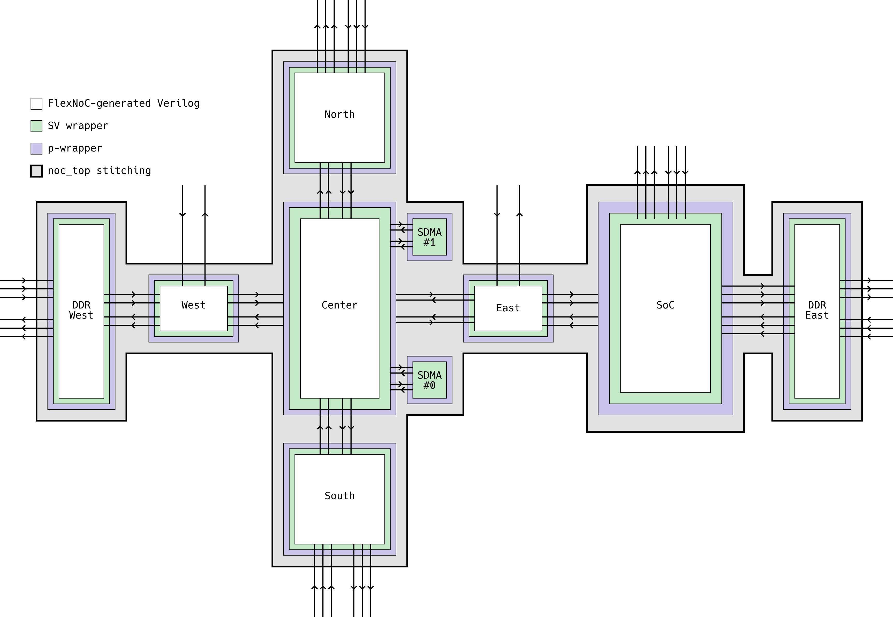

# Overview

TODO(psarras, jmartins)

## Block Diagram

TODO(psarras, jmartins)

## AXI Support

Europa NoC is _mostly_ AXI compliant. Exceptions and AXI Features that are not fully supported are summarized below:

* **AXI-M** ports are _allowed to_ issue Requests of any AXI-compliant combination of Burst Type, Size, Length and Transaction Attributes **except from**:
    * Exclusive Narrow WRAP bursts: these will cause the NoC to **hang**
    * Exclusive FIXED bursts: these will cause the NoC to **hang**
* **AXI-S** ports are _expected to_ support any Requests whose combination of Burst Type, Size, Length and Transaction Attributes is a legal AXI one
* AXI **Modifiable** bit (`AxCACHE[1]`) is _not_ respected. Transactions marked as non-modifiable (`AxCACHE[1]=0`) might be modified en-route
* AXI **Exclusive** Accesses are supported according to the [Exclusives](#exclusives) section below
* AXI **QoS** signals (`AxQOS`) are _ignored_ at the **Initiator** AXI-M ports
* AXI **QoS** signals (`AxQOS`) are _not_ driven at the **Target** AXI-S ports
* AXI **User** signals (`xxUSER`) are _ignored_ at the **Initiator** AXI-M ports

### Exclusives

AXI Exclusive accesses are tracked on the following **Initiators**:

* APU Init LT: up to 8 outstanding Exclusives
* AI Core Init LT: up to 1 outstanding Exclusive
* PVE Init LT: up to 8 outstanding Exclusives

AXI Exclusives are monitored on the following **Targets**:

* SYS-SPM Targ LT: 8 monitors
* LPDDR Graph HT: 8 monitors
* LPDDR PPP MT: 8 monitors

The number of monitors at the Target side defines the maximum number of simultaneous Exclusives to that Target. Note that the number of monitors can be less than the maximum number of Exclusive accesses. That is 32 at the moment (8 for APU, 8 for the AI Cores and 16 for the 2 PVEs). In the case where all monitors have been allocated and the target NIU receives another Exclusive Read to an address that is not being monitored and from an ID that is not in the allocated monitors, the target NIU will pick *randomly* one of the allocated monitors and reallocate it for this incoming exclusive read.

To differentiate between Exclusive sequences, the NoC uses an internal 5b `EXID` field. For AI Cores, all 5b are statically assigned per AI Core. For all other Initiators (APU & PVEs), the 3 LSBs are dynamically assigned during run-time, based on the value of the `AxID`.

* This **requires** that the Initiator only uses a specific set of `AxID` values when it issues Exclusive sequences
* NoC **can break** if the Initiator issues an Exclusive sequence using an `AxID` that does not map to an `EXID` (responses on Exclusive accesses shall not be trusted from that point on)

The mapping for `AxID` Initiator to equivalent `EXID` values is shown below:

| Init    | `AxID`  | `EXID` | 4 | 3 | 2 | 1 | 0 |
| ------- | -------:| ------:| - | - | - | - | - |
| APU 0   | `0x3`   |   0x0  | 0 | 0 | 0 | 0 | 0 |
| APU 1   | `0x7`   |   0x1  | 0 | 0 | 0 | 0 | 1 |
| APU 2   | `0xb`   |   0x2  | 0 | 0 | 0 | 1 | 0 |
| APU 3   | `0xf`   |   0x3  | 0 | 0 | 0 | 1 | 1 |
| APU 4   | `0x13`  |   0x4  | 0 | 0 | 1 | 0 | 0 |
| APU 5   | `0x17`  |   0x5  | 0 | 0 | 1 | 0 | 1 |
| -       |         |   0x6  | 0 | 0 | 1 | 1 | 0 |
| -       |         |   0x7  | 0 | 0 | 1 | 1 | 1 |
| AIC 0   |  any    |   0x8  | 0 | 1 | 0 | 0 | 0 |
| AIC 1   |  any    |   0x9  | 0 | 1 | 0 | 0 | 1 |
| AIC 2   |  any    |   0xA  | 0 | 1 | 0 | 1 | 0 |
| AIC 3   |  any    |   0xB  | 0 | 1 | 0 | 1 | 1 |
| AIC 4   |  any    |   0xC  | 0 | 1 | 1 | 0 | 0 |
| AIC 5   |  any    |   0xD  | 0 | 1 | 1 | 0 | 1 |
| AIC 6   |  any    |   0xE  | 0 | 1 | 1 | 1 | 0 |
| AIC 7   |  any    |   0xF  | 0 | 1 | 1 | 1 | 1 |
| PVE 0.0 | `[6:4]` |   0x10 | 1 | 0 | 0 | 0 | 0 |
| PVE 0.1 | `[6:4]` |   0x11 | 1 | 0 | 0 | 0 | 1 |
| PVE 0.2 | `[6:4]` |   0x12 | 1 | 0 | 0 | 1 | 0 |
| PVE 0.3 | `[6:4]` |   0x13 | 1 | 0 | 0 | 1 | 1 |
| PVE 0.4 | `[6:4]` |   0x14 | 1 | 0 | 1 | 0 | 0 |
| PVE 0.5 | `[6:4]` |   0x15 | 1 | 0 | 1 | 0 | 1 |
| PVE 0.6 | `[6:4]` |   0x16 | 1 | 0 | 1 | 1 | 0 |
| PVE 0.7 | `[6:4]` |   0x17 | 1 | 0 | 1 | 1 | 1 |
| PVE 1.0 | `[6:4]` |   0x18 | 1 | 1 | 0 | 0 | 0 |
| PVE 1.1 | `[6:4]` |   0x19 | 1 | 1 | 0 | 0 | 1 |
| PVE 1.2 | `[6:4]` |   0x1A | 1 | 1 | 0 | 1 | 0 |
| PVE 1.3 | `[6:4]` |   0x1B | 1 | 1 | 0 | 1 | 1 |
| PVE 1.4 | `[6:4]` |   0x1C | 1 | 1 | 1 | 0 | 0 |
| PVE 1.5 | `[6:4]` |   0x1D | 1 | 1 | 1 | 0 | 1 |
| PVE 1.6 | `[6:4]` |   0x1E | 1 | 1 | 1 | 1 | 0 |
| PVE 1.7 | `[6:4]` |   0x1F | 1 | 1 | 1 | 1 | 1 |

Note:

* **APU** can only issue Exclusive sequences for `AxID` values listed above. Exclusives with a other `AxID` values are not supported.
* **PVE** a slice of the 3 upper MSBs is used to map `AxID` to `EXID`, meaning that multiple `AxID` values can map to the same `EXID`. Therefore, the PVE block must ensure that there's only 1 Exclusive sequence in flight for a specific value of `AxID[6:4]`. For instance, if PVE issues an Exclusive sequence for `AxID = 0x20 = 0b010_0000`, before the whole Exclusive sequence ends (indicated by the Write Response), there can't be another Exclusive sequence for AXI IDs `0x20`, `0x21` , ... , `0x2F` (i.e. any ID whose slice `[6:4] = 3b010` is forbidden). If there's no Exclusive transaction in flight, there's no restriction to the value of the `AxID[3:0]` LSBs
* Similarly, for **AI Core**, any `AxID` value can be used to issue an Exclusive sequence. Therefore, an AI Core can have at most one outstanding exclusive

Failure to abide to the above rules can lead to undefined NoC behavior and the system to hang.

## Addressing

The NoC implements the _top layer_ of the hierarchical Europa Memory map, which can be found here: [`europa_memory_map.md`](../../../../../../docs/europa/memory_map/europa_memory_map.md)

### RTL Structure

### L2 Interleaving

The L2 Address Space can be configured in 7 different modes:

* Contiguous
* 1x8 Interleaving with a step of 1K, 2K or 4K
* 2x4 Interleaving with a step of 1K, 2K or 4K

Read more on the [Arch Spec](../../../../../../docs/europa_architecture/blocks/noc/network-on-chip.md#l2-mapping).

The L2 address mode is configured by driving the following pins, with the following values:

|  Mode                    | Contiguous | 1x8 - 1K | 1x8 - 2K | 1x8 - 4K | 2x4 - 1K | 2x4 - 2K | 2x4 - 4K |
| ------------------------ | ----------:| --------:| --------:| --------:| --------:| --------:| --------:|
| `i_l2_intr_mode_port_b1` | x          | 0        | 1        | 1        | 0        | 1        | 1        |
| `i_l2_intr_mode_port_b0` | x          | 1        | 0        | 1        | 1        | 0        | 1        |
| `i_l2_addr_mode_port_b1` | 0          | 0        | 0        | 0        | 1        | 1        | 1        |
| `i_l2_addr_mode_port_b0` | 0          | 1        | 1        | 1        | 0        | 0        | 0        |

### LPDDR-Graph Interleaving

Read more on the [Arch Spec](../../../../../../docs/europa_architecture/blocks/noc/network-on-chip.md#lpddr-mapping).

The LPDDR-Graph address mode is configured by driving the following pins, with the following values:

|  Mode                             | Contiguous |  1x4 - 1K |  1x4 - 2K |  1x4 - 4K |  2x2 - 1K |  2x2 - 2K |  2x2 - 4K |
| --------------------------------- | ----------:| ---------:| ---------:| ---------:| ---------:| ---------:| ---------:|
| `i_lpddr_graph_intr_mode_port_b1` | x          | 0         | 1         | 1         | 0         | 1         | 1         |
| `i_lpddr_graph_mode_port_b0`      | x          | 1         | 0         | 1         | 1         | 0         | 1         |
| `i_lpddr_graph_addr_mode_port_b1` | 0          | 0         | 0         | 0         | 1         | 1         | 1         |
| `i_lpddr_graph_addr_mode_port_b0` | 0          | 1         | 1         | 1         | 0         | 0         | 0         |

### LPDDR-PPP Interleaving

Read more on the [Arch Spec](../../../../../../docs/europa_architecture/blocks/noc/network-on-chip.md#lpddr-mapping).

The LPDDR-Graph address mode is configured by driving the following pins, with the following values:

|  Mode                           |  Contiguous |  1x4 - 1K |  1x4 - 2K |  1x4 - 4K |  2x2 - 1K |  2x2 - 2K |  2x2 - 4K |
| ------------------------------- | -----------:| ---------:| ---------:| ---------:| ---------:| ---------:| ---------:|
| `i_lpddr_ppp_intr_mode_port_b1` |  x          | 0         | 1         | 1         | 0         | 1         | 1         |
| `i_lpddr_ppp_mode_port_b0`      |  x          | 1         | 0         | 1         | 1         | 0         | 1         |
| `i_lpddr_ppp_addr_mode_port_b1` | 0           | 0         | 0         | 0         | 1         | 1         | 1         |
| `i_lpddr_ppp_addr_mode_port_b0` | 0           | 1         | 1         | 1         | 0         | 0         | 0         |
