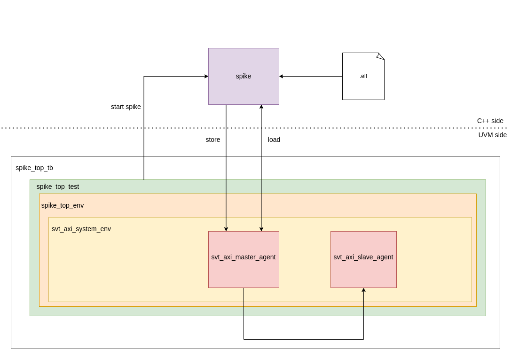

# Spike testbench example

This directory contains an example of UVM testbench driven by the spike simulator. The testbench is architectured as follows:



## Run the testbench

To run the testbench, follow these steps:

```bash
cd sim
# Run with vsim
make run_spike_dpi_vsim ELF_FILE=abspath/to/elf/file/to/run

# Run with vcs
make run_spike_dpi_vcs ELF_FILE=abspath/to/elf/file/to/run

# Unload modules loaded
source setup_env.sh deactivate
```

## Clean up

To clean up all compilation artifacts, run the following command:

```bash
make clean
```

## Project organization:

```bash
.
├── cpp # Spike configuration and instantiation
│   └── spike_dpi.cpp
├── README.md
├── sim # Simulation directory
│   ├── Bender.yml
│   ├── Makefile
│   ├── questasim_config.mk
│   ├── requirements.txt
│   ├── setup_env.sh
│   └── simulation.mk -> ../../../../../../../scripts/flow_makefiles/simulation.mk
│   └── load_waves.do # Load AXI read and write interfaces in the wave window
└── uvm # Basic testbench displayed above
    ├── seq
    │   ├── axi_slave_mem_seq.sv
    │   ├── spike_axi_single_read_seq.sv
    │   ├── spike_axi_single_write_seq.sv
    │   └── spike_seq_pkg.sv
    ├── spike_top_config.sv
    ├── spike_top_env.sv
    ├── spike_top_pkg.sv
    ├── tb
    │   ├── spike_top_tb.sv
    │   └── spike_top_th.sv
    └── test
        ├── spike_top_test_pkg.sv
        └── spike_top_test.sv
```
