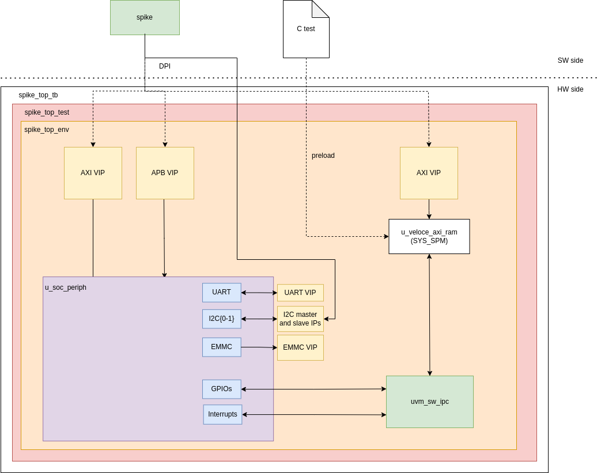
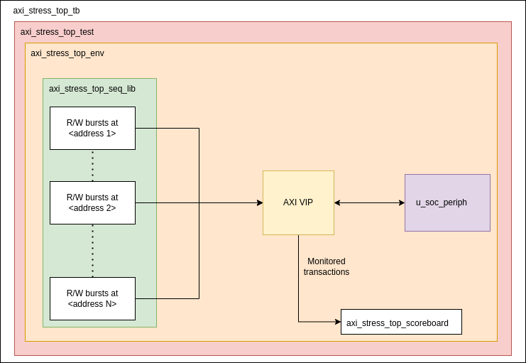

# SOC_PERIPH Verification Specification
## Introduction

### Overview

This subsystem is part of the Europa project. SOC_PERIPH contains all the slow IO peripherals such as I2C, UART, SPI or eMMC. It is connected to the rest of the system through an AXI port and an APB port (only for syscfg signals).

SOC_PERIPH is used mainly for the following purposes:

  - Loading the first and second stage bootloaders and the linux image stored in eMMC.
  - Debugging through UART and I2C.
  - Providing GPIOs if needed (e.g. for semistatic signals).

### Ownership
Who to contact for information

|  Team              | Contact         |
| ------------------ | --------------- |
| ***Architecture*** | @matt.morris|
| ***Design***       | @stefan.linz|
| ***Verification*** | @jerome.sauger|

### Reference
Where to find the design documentation

| Team               | Specification |
| ------------------ | ------------- |
| ***Architecture*** |[Arch Spec](https://doc.axelera.ai/prod/europa/latest/europa/blocks/soc_periph/soc_periph_block_spec/)|
| ***Design***       |[Block Spec](../docs/index.md)|

### Project Planning and Tracking
Where to find project plans and trackers

|   | Link |
| - | ---- |
| ***Plan*** |[Gitlab Issues Board](https://git.axelera.ai/ai-dv-team/dv-europa-planning/SOC-PERIPH/-/boards)|
| ***Issues*** |[Gitlab Open Issues](https://git.axelera.ai/prod/europa/-/issues/?sort=created_date&state=opened&label_name%5B%5D=block%3Asoc_periph&first_page_size=20)|

## Block Level Testbenches

### SPIKE Testbench
#### Overview

Since the IPs inside the SOC_PERIPH all come from the Designware suite, they do not need extensive IP-level testing. Therefore this testbench is built to support a high-level tests. It integrates the SPIKE simulator which emulates the APU and allows to run C code to test the subsystem. SPIKE load and store accesses are forwarded to the testbench through DPI calls that create read and write transactions. 

Communication between C and UVM is achieved with the UVM SW IPC. It is connected to an AXI memory that acts as the SYS_SPM. This memory is preloaded after reset. The UVM SW IPC is the interface between the C code and the VIPs connected to the SOC_PERIPH outputs. Namely, it enables the C code to:

- Trigger the VIPs to send stimuli to the SOC_PERIPH
- Read wire values
- Retrieve data sent by the peripherals to the VIPs
- Wait on SOC_PERIPH interrupts

#### Diagram



#### How to Run

```bash
cd spike_tb/sim

# Run a single test
mkdir -p build_sw
cd build_sw
verifsdk -P top.SIM_SOC_PERIPH_SPIKE
cd <testname>
./run.sh --fc

# Run a regression
make regress_vsim REGRESS_VERIFSDK_LABEL=SOC_PERIPH_NIGHTLY
```

### AXI stress testbench
#### Overview

Communication between the peripherals and the rest of the system is done through a single AXI interface. To make sure that the fabric generated by the Designware tools is correct, this testbench stresses it by generating a large batch of concurrent read and write operations. Each access is monitored and sent to a scoreboard. Data read and written are compared to make sure all accesses were correct

#### Diagram




#### How to Run

```bash
cd axi_tb/sim

# Run a single test
mkdir -p build_sw
cd build_sw
verifsdk -P uvm.SIM_SOC_PERIPH_AXI
cd <testname>
./run.sh --fc

# Run a regression
make regress_vsim REGRESS_VERIFSDK_LABEL=SOC_PERIPH_NIGHTLY
```

### Memory map


### Metrics / Coverage Plan
VPlan / Verification IQ excel / csv file

- [VPlan](../../../../../../verifsdk/tests_soc_periph.yaml)

- [Requirements Dashboard](https://grafana.htz1.axelera.ai/d/edu0ed95y0xkwe/verifsdk-requirements?orgId=1&var-block_id=SOC_PERIPH&var-block_id=TOP_SOC_PERIPH&var-criticality=bronze&var-criticality=gold&var-criticality=silver)

- [Nightly Tests Dashboard](https://grafana.htz1.axelera.ai/d/d9a8bbfa-a146-4c4a-8e7f-f5320866ff12/verifsdk-dashboard?orgId=1&var-selected_platform=top.SIM_SOC_PERIPH_SPIKE&var-selected_labels=SOC_PERIPH_NIGHTLY&var-selected_schedule=nightly)

### Regressions
Which regressions to run

| Regression | Description | Source | Link |
| ---------- | ----------- | ------ | ---- |
| SOC_PERIPH_NIGHTLY | Nightly tests for SOC_PERIPH | [Source job](../../../../../../.gitlab/ci/pipelines/dynamic/soc_periph.gitlab-ci.yml) | [Last CI Run](https://grafana.htz1.axelera.ai/d/d9a8bbfa-a146-4c4a-8e7f-f5320866ff12/verifsdk-dashboard?orgId=1&var-selected_platform=top.SIM_SOC_PERIPH_SPIKE&var-selected_platform=uvm.SIM_SOC_PERIPH_AXI&var-selected_test=&var-selected_labels=SOC_PERIPH_NIGHTLY)|


## Formal Proofs [TODO]
### Overview
Description of any formal environments

### How To Run

```
git clone etc.
source ....
cd ...
make ...
```

#### Regressions
Which regressions to run

| Regression | Description | Source | Link |
| ---------- | ----------- | ------ | ---- |
| regression | description | [Link to Source]() | [Last CI Run]()|

#### Metrics / Coverage Plan
VPlan / Verification IQ excel / csv file [TODO]

- [Link]()

## System Level Testcases [TODO]
Tests to be run at top level / Veloce

| Testcase   | Description | Source | Link |
| --------   | ----------- | ------ | ---- |
| testcase   | description | [Link to Source]()| [Last CI Run]()|
