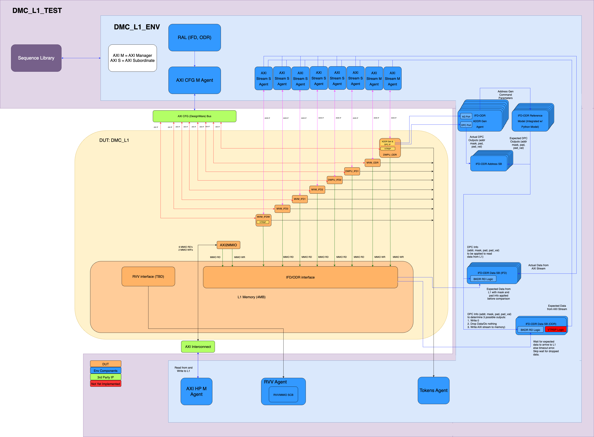

# Verification Specification

## Introduction

### Overview
This package contains DV environment for the L1 and DMC (Data Movement Cluster) blocks of the AI Core, in Europa project.
The purpose of this package is to test the functionality of the DMC, and ensure data moves from and to the L1 in a correct and safe manner.

### Ownership

|  Team              | Contact         |
| ------------------ | --------------- |
| ***Architecture*** | Gua Hao Khov |
| ***Design***       | Sander Geursen |
| ***Verification*** | Rafael Frangulian |

### Reference

| Team               | Specification |
| ------------------ | ------------- |
| ***Architecture*** |[LS](https://axeleraai.atlassian.net/wiki/spaces/archrd/pages/345604116/AICORE-L1)|
| ***Design***       |[Block Spec](https://doc.axelera.ai/prod/europa/0.0/europa/blocks/aic_ls/)|

### Project Planning and Tracking
Where to find project plans and trackers

|  | Link |
| --- | ---- |
| ***Plan*** |[Gitlab Issues Board](https://git.axelera.ai/ai-dv-team/dv-europa-planning/AIC-L1/-/boards)|
| ***Issues*** |[Gitlab Open Issues](https://git.axelera.ai/prod/europa/-/issues/?sort=created_date&state=opened&label_name%5B%5D=block%3Aaic%3Als&first_page_size=20)|

## Block Level Testbenches

### Testbench 1
#### Overview

The AIC LS testbench approaches testing in 3 ways:

- Testing IFDs/ODRs functionality, creating various commands for them, and using ICDF model as a reference model, to compare to the output of the DUT, and comparing with data stored in L1 as well. This includes functionalities like compression/VTRSP/different types of commands and command parameters, tokens etc.
- Testing direct access to reading and writing to L1, using the direct AXI read/write channel.
- Testing RVV access to L1, using RVV MMIO channel.

The tb also collects coverage on all the diffenet aspects of the testbench.

#### Diagram


#### How to Run
How to check out and run (**best practice - look at README on Europa top dir**)

```
git clone git@git.axelera.ai:prod/europa.git
cd europa
source .env-default-modules
cd hw/ip/aic_ls/default/dv/sim/
ln -s ../../../../../../../../europa_icdf/IntraCoreDataFlow/ icdf
source icdf/.venv/bin/activate
make run_vsim TESTNAME=aic_ls_sanity_test NODEPS=0 SEED=1 DEBUG=1 GUI_ENABLE=1
make -C hw/ip/aic_ls/default/dv/sim regress_vsim REGRESS_VERIFSDK_PLATFORM=uvm.HW_IP_AIC_LS_DEFAULT_DV_SIM  REGRESS_VERIFSDK_LABEL=HW_IP_AIC_LS_DEFAULT_DV_SIM_REGRE_NIGHTLY
```
#### Regressions
Which regressions to run

| Regression | Description | Source | Link |
| ---------- | ----------- | ------ | ---- |
| Nightly | Nightly tests that should cover all basic functionality of AIC LS. Details per each test can be found in verifsdk file. | [Verifsdk file](https://git.axelera.ai/prod/europa/-/blob/main/verifsdk/tests_uvm_aic_ls.yaml?ref_type=heads) | [Last CI Run]()|
| Weekly | Weekly run - longer tests that we don't need to run every day. details can also be found in found in the verifsdk AIC ls file | [Verifsdk file](https://git.axelera.ai/prod/europa/-/blob/main/verifsdk/tests_uvm_aic_ls.yaml?ref_type=heads) | [Last CI Run]()|

#### Metrics / Coverage Plan
VPlan / Verification IQ excel / csv file

- [AIC LS Vplan](https://git.axelera.ai/prod/europa/-/tree/main/hw/ip/aic_ls/default/dv/docs/vplan?ref_type=heads)

## Formal Proofs
### Overview

No formal environments exist for AIC LS, for now.

## System Level Testcases

At top level, we have AI Core top test that checks read and write to/from L1, and FIAT tests that check the various IFD/ODR testcases, using ICDF model.

