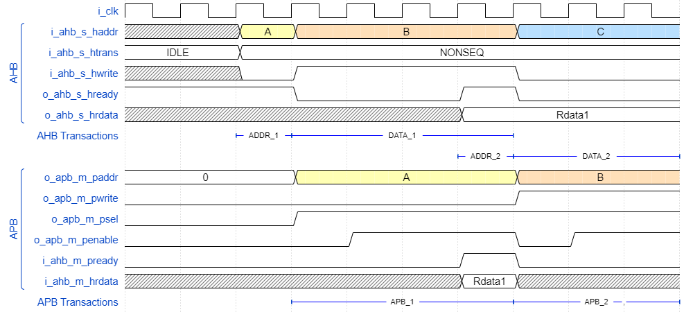

# Bridges

Collection of protocol converters.

## JTAG_TO_APB

Used to convert JTAG instructions into APB transactions.
TODO: Add more information.

## AHB_TO_APB

Converts AHB SEQ and NONSEQ transactions into APB transactions.

The following is an example waveform of its behaviour.

<!--
{signal: [
  {name: 'i_clk', wave: 'p.........'},
  ['AHB',
    {name: 'i_ahb_s_haddr', wave: 'x.34...5..', data: ['A', 'B', 'C']},
    {name: 'i_ahb_s_htrans', wave: '2.2.......', data: ['IDLE', 'NONSEQ', 'IDLE', 'NONSEQ', 'IDLE']},
    {name: 'i_ahb_s_hwrite', wave: 'x.01...0..'},
    {name: 'o_ahb_s_hready', wave: '1..0..10..'},
    {name: 'o_ahb_s_hrdata', wave: 'x.....2...', data: ['Rdata1']},
  ],
    {name:'AHB Transactions',                          node: '..AB...D..', phase:0.15},
    {                                            node: '......EF..G', phase:0.15},
  ['APB',
    {name: 'o_apb_m_paddr',   wave: '2..3...4..', data: ['0', 'A', 'B', 'C']},
    {name: 'o_apb_m_pwrite',  wave: '0......1..'},
    {name: 'o_apb_m_psel',    wave: '0..1......'},
    {name: 'o_apb_m_penable', wave: '0...1..01.'},
    {name: 'i_ahb_m_pready',  wave: '0.....10..'},
    {name: 'i_ahb_m_hrdata',  wave: 'x.....2x..', data: ['Rdata1']},
  ],
    {name:'APB Transactions',                     node: '...H...I.,K', phase:0.15},
  ], config: { hscale: 2 },
  edge: ['A+B ADDR_1', 'B+D DATA_1', 'E+F ADDR_2', 'F+G DATA_2', 'H+I APB_1', 'I+K APB_2']
}
-->

