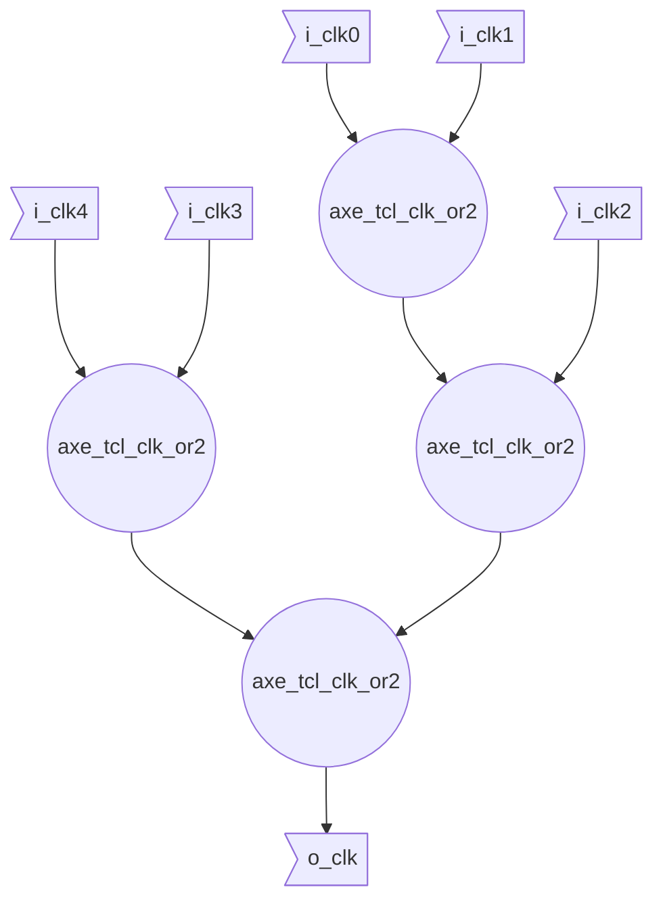

::: hw/ip/common_cell_library/default/rtl/axe_ccl_clk_or_tree.sv:axe_ccl_clk_or_tree

## Mircoarchitecture

Generates a binary tree comprised of `axe_tcl_clk_or2` modules. This allows for constructing arbitrary wide clock ors.
