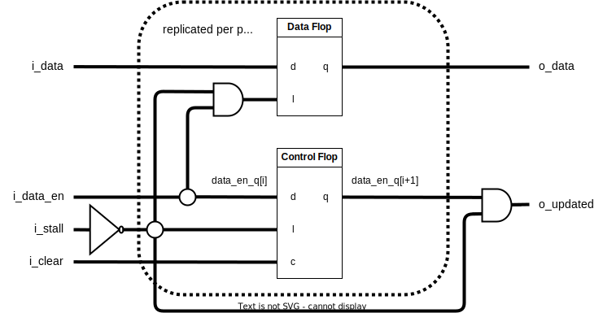

::: hw/ip/common_cell_library/default/rtl/cc_cnt_shift_reg.sv:cc_cnt_shift_reg

## Operation Principle

The control signal is added in parallel. When `i_data_en` is high the `i_data` is captured and rippled through to
the output ports.  The output `o_updated` indicates the cycle when the port `o_data` has a new value.

The module is able to be stalled, which means all values inside are frozen in place.  This has precedence over applying
`i_data_en`.
