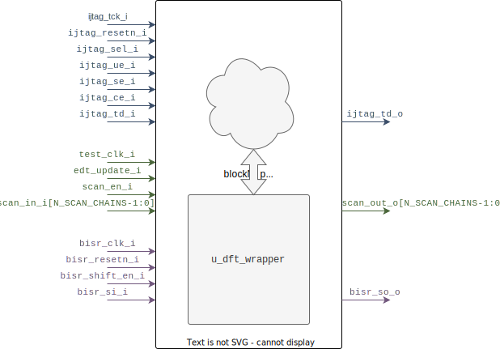

::: hw/ip/common_cell_library/default/rtl/axe_ccl_dft_block_wrapper.sv:axe_ccl_dft_block_wrapper

## Operation Principle

The DFT block wrapper is a generic placeholder wrapper used for DFT insertion. It should be instantiated at the top of `_p` partitions. It is an empty block which will be populated with DFT logic during the RTL DFT insertion step.

