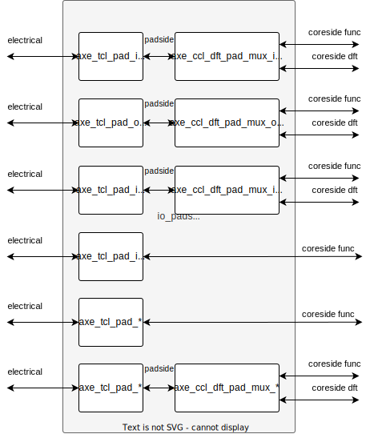
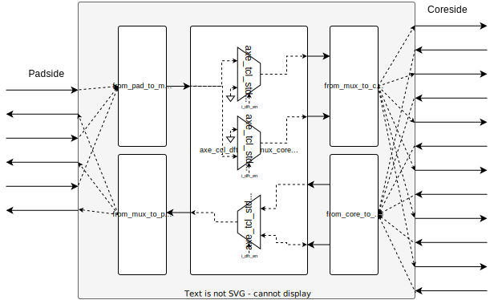

## Operation Principle

The `axe_ccl_dft_pad_mux` modules are combinational blocks designed to facilitate changing the behavior of a IO Pad between functional and DFT modes of operation. It accomplishes this by switching the single `padside` interface between two `coreside` interfaces depending on the value of `i_dft_en` (enable DFT interface, active high).

Three flavours of the pad mux exist depending on the pad type used:

- `axe_ccl_dft_pad_mux_input`
- `axe_ccl_dft_pad_mux_inout`
- `axe_ccl_dft_pad_mux_output`

All pad muxes use a common core module to instante hard-macro glitch-free muxes:

- `axe_ccl_dft_pad_mux_core`

The pad muxes should be integrated into the IO pads module as shown in the figure below. Note that it is not required to instantiate the DFT pad mux if the pad has no DFT functionality.

The internal block diagram of the pad muxes is as follows:

::: hw/ip/common_cell_library/default/rtl/axe_ccl_dft_pad_mux_inout.sv:axe_ccl_dft_pad_mux_inout

::: hw/ip/common_cell_library/default/rtl/axe_ccl_dft_pad_mux_input.sv:axe_ccl_dft_pad_mux_input

::: hw/ip/common_cell_library/default/rtl/axe_ccl_dft_pad_mux_output.sv:axe_ccl_dft_pad_mux_output
