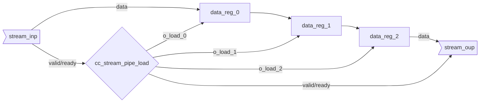

::: hw/ip/common_cell_library/default/rtl/cc_stream_pipe_load.sv:cc_stream_pipe_load

## Operation Principle

The data registers are outside of the module.
The longest combinatorial path is through the ready back-pressure.
