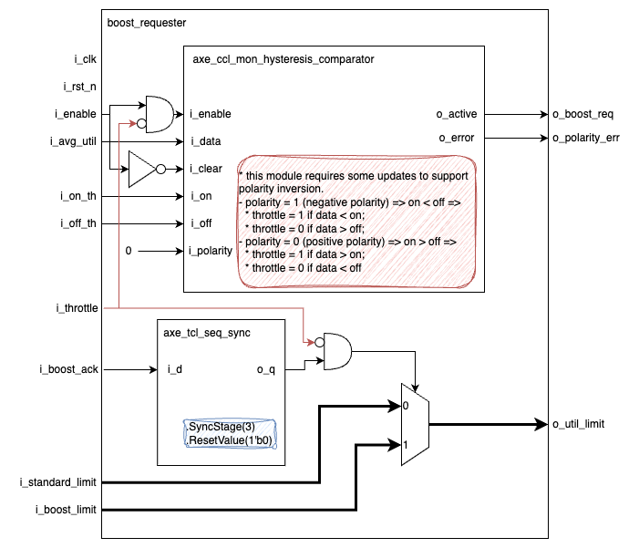

## Goal

The Boost Requester unit is responsible for asserting the boost request signal from the AI Core
if the utilisation average crosses a threshold value defined by CSRs.

## Overview

The unit observes the average utilization of the MVM if the enable input is asserted and requests a boost if the value exceeds an `on` threshold.
If the utilization value falls below the `off` threshold, the boost request is withdrawn.

The thresholds are set via external CSRs. If the threshold configuration is invalid, an error is generated.

The maximum utilization sent to the MVM depends on the boost mode.
* If the acknowledge signal is asserted (boost mode is active), the MVM utilization is set to the boost limit, which is defined by external CSRs.
* Otherwise (boost mode is inactive), it should use the standard utilization limit, also defined by external CSRs.

If the throttle is asserted, the boost request is revoked and the MVM will use the standard utilization limit.

## Integration Specifics

The unit will operate at `i_clk` and the CSRs operate at `i_ref_clk`,
a CDC synchronizer should be used (`axe_ccl_cdc_bus`).
The boost acknowledge is a multicycle path, however, a 3-stage synchroniser can be added before the mux.

## Implementation

### Boost Requester

The implementation of the `boost_requester` relies on the following existing common blocks:
* `axe_ccl_mon_hysteresis_comparator` (refer to [Observation Reader](https://git.axelera.ai/prod/europa/-/work_items/2263) for details on the requested changes)
* `axe_tcl_seq_sync`

Here's how it works:

1. **Enable Check and Hysteresis Comparison:**
  * If the `i_enable` signal is asserted (active), the `axe_ccl_mon_hysteresis_comparator` compares the average utilization (`i_avg_util`) with the on threshold (`i_on_th`) and off threshold (`i_off_th`).
  * Based on the comparison results, the `o_boost_req` signal is set to indicate a boost request or no request.
  * Any invalid threshold configuration triggers an error asserted via `o_polarity_err`.

2. **Boost Mode Selection:**
  * The `i_boost_ack` signal determines the utilisation limit sent to the MVM (`o_util_limit`).
    * If `i_boost_ack` is asserted (high), it signifies active boost mode. In this case, `o_util_limit` is set to the boost limit (`i_boost_limit`) provided by external CSRs.
    * If `i_boost_ack` is not asserted (low), it signifies inactive boost mode. In this case, `o_util_limit` is set to the standard utilisation limit (`i_standard_boost`) defined by external CSRs.

If `i_throttle` is asserted, the `axe_ccl_mon_hysteresis_comparator` is disabled and the `o_util_limit` is connected to the `i_standard_limit`.

#### Clock and Reset

This module is a single clock domain with a single asynchronous clock domain.

#### Additional details

::: hw/ip/dwm/default/rtl/dwm_boost_requester.sv:dwm_boost_requester
