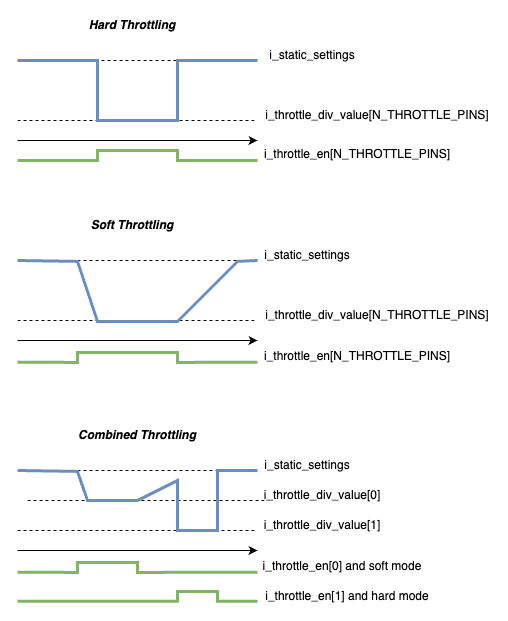
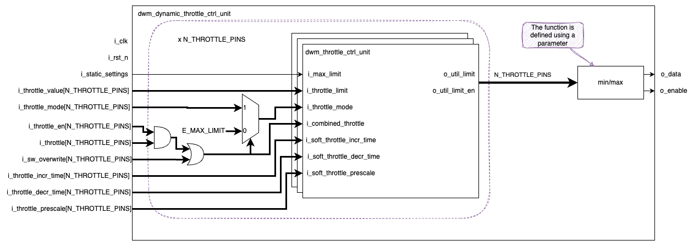

- [Goal](#goal)
- [Overview](#overview)
- [Integration Specifics](#integration-specifics)
- [Implementation](#implementation)
  - [Dynamic Throttle Control Unit](#dynamic-throttle-control-unit)
    - [Clock and Reset](#clock-and-reset)
    - [Additional details](#additional-details)

## Goal

A Dynamic Throttle Control Unit (DTCU) combines multiple throttle inputs with different configurations (hard or soft throttle) lowering the
output data from the static value down to the the values defined in the configuration ports.

## Overview

This unit defines an output value based on the throttle inputs supporting the hard and soft modes.
The picture below should provide an overview of what hard and soft modes should mean and the expected behaviour
if we have 2 throttle inputs activated simultaneously.

If no throttle is active or disabled, the `o_util_limit` value will be `i_static_settings`. When a throttle is active, it can only reduce the value. Throttling mode is defined by `i_throttle_mode` and can be either hard or soft.
* **Hard mode:** The `o_util_limit` is instantly reduced to the value defined by `i_throttle_div_value` when the throttle input is high, and it is immediately restored when the input goes low.
* **Soft mode:** The `o_util_limit` gradually decreases to `i_throttle_div_value` when the throttle input is high, at a configurable rate. If the input goes low, the clock returns to its original value at a rate that can also be configured. The rates are controlled by `i_soft_throttle_incr_time` and `i_hard_throttle_incr_time`.

If multiple throttles are active at the same time, the `o_data` will adopt the lowest or the highest value across all active hard and soft throttles depending on the parameter `PICK_MAX_NOT_MIN`.

Additionally, the `i_sw_overwrite` feature forces the throttle.

## Integration Specifics

`Dynamic Throttle Control Unit` operates at `i_clk`, eventually, a CDC synchroniser might be required to connect with the CSRs (`axe_ccl_cdc_bus`).

## Implementation

### Dynamic Throttle Control Unit

The implementation of the `Dynamic Throttle Control Unit` can be accelerated using the current implementation of the [`dwm_throttle_ctrl_unit`](dwm_throttle_ctrl_unit.md).

The `dwm_throttle_ctrl_unit` implements the soft and hard behaviors based on the prescale and incremental/decremental values. The unit will take
the maximum or the minimum of all `DTCU` instances depending on the `PICK_MAX_NOT_MIN` setting.

#### Clock and Reset

This module is a single clock domain with a single asynchronous reset domain.

#### Additional details

::: hw/ip/dwm/default/rtl/dwm_dynamic_throttle_ctrl_unit.sv:dwm_dynamic_throttle_ctrl_unit

::: hw/ip/dwm/default/rtl/pkg/dwm_throttle_ctrl_unit_pkg.sv:dwm_throttle_ctrl_unit_pkg
