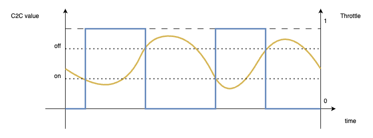
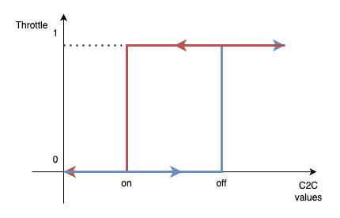
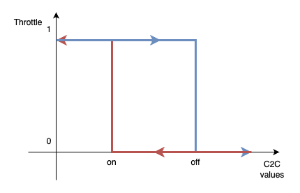
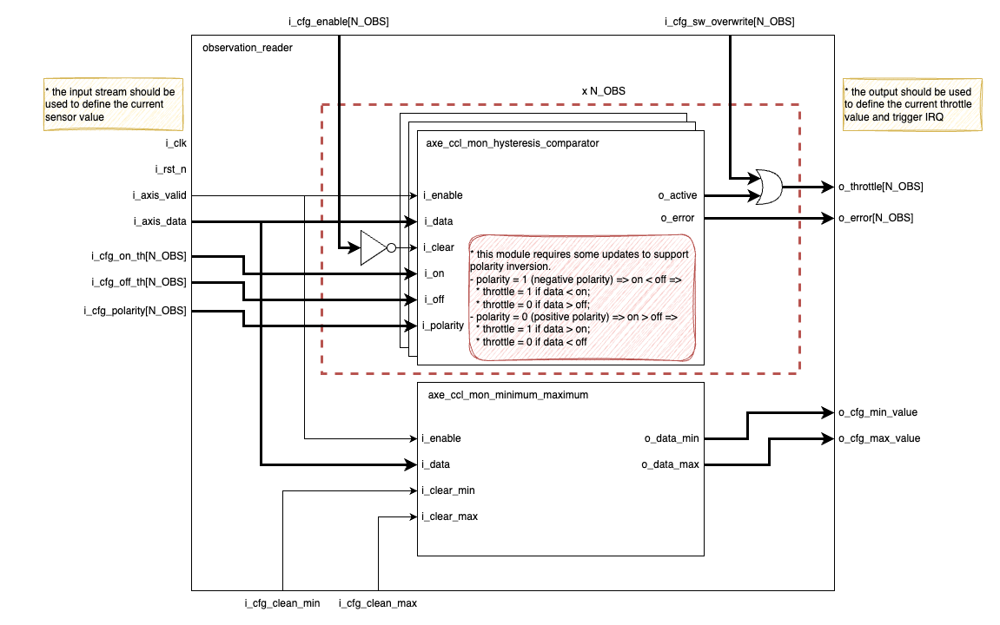

- [Goal](#goal)
- [Overview](#overview)
  - [Hysteresis configuration](#hysteresis-configuration)
    - [Positive Polarity](#positive-polarity)
    - [Negative Polarity](#negative-polarity)
- [Integration Specifics](#integration-specifics)
- [Implementation](#implementation)
  - [Observation Reader](#observation-reader)
    - [Clock and Reset](#clock-and-reset)
    - [Additional details](#additional-details)


## Goal

An observation reader (ORD) observes an AXI-Stream (data, valid), collects statistics and reacts to it by either triggering IRQ or asserting/deasserting throttle signals. The observation reader is controlled/observed over a CSR interface.

## Overview

This unit receives data from sensors and reacts based on the applicable configuration, asserting or deasserting the throttle. The unit generates multiple throttles with independent settings based on the same incoming data.
The picture below should provide an overview of how the units react based on the incoming data over time.



### Hysteresis configuration

The hysteresis comparator can be set with different polarities, as shown in the following diagrams.

#### Positive Polarity

If data is bigger than the `on` threshold, the throttle is asserted, if the data is lower than the `off` threshold, the throttle is deasserted. This behaviour assumes that the `on` is bigger than the `off` threshold.



#### Negative Polarity

If data is lower than the `on` threshold, the throttle is asserted, if the data is bigger than the `off` threshold, the throttle is deasserted. This behaviour assumes that the `on` is lower than the `off` threshold.



## Integration Specifics

`Observation Reader` operates at `i_clk`, eventually, a CDC synchroniser might be required to connect with the CSRs (`axe_ccl_cdc_bus`).

## Implementation

### Observation Reader

The implementation of the `observation reader` can be accelerated using the current implementation of [`axe_ccl_mon_minimum_maximum`](https://doc.axelera.ai/prod/europa/latest/documentation/ip/axe_ccl/mon/minimum_maximum/) and [`axe_ccl_mon_hysteresis_comparator`](https://doc.axelera.ai/prod/europa/latest/documentation/ip/axe_ccl/mon/hysteresis_comparator/).

The `axe_ccl_mon_minimum_maximum` will collect the maximum and minimum values from the input stream and expose them to the external interface to be connected to `CSRs`. This module exposes two inputs to clean the statistics, which is useful to reset the statistics after reading the `CSRs`.

The `axe_ccl_mon_hysteresis_comparator` is used to generate the throttle control signal. However, some updates are required to align its behaviour with what is required by `DWM` (`Dynamic Workload Manager`). The `i_upper` and `i_lower` will be replaced by `i_on` and `i_off` ports, which, combined with the new `i_polarity` port, define which should be the upper and the lower.
```text
polarity = 1 (negative polarity) => on < off =>
  * throttle = 1 if data < on;
  * throttle = 0 if data > off;
polarity = 0 (positive polarity) => on > off =>
  * throttle = 1 if data > on;
  * throttle = 0 if data < off
```
If the polarity is not aligned with the relation between `on` and `off`, an error should be generated.

The number of `axe_ccl_mon_hysteresis_comparator` instances depends on the number of `N_OBS`. All instances share the input stream, but the throttle, error, and other settings have independent ports.



#### Clock and Reset

This module is a single clock domain with a single asynchronous reset domain.

#### Additional details

::: hw/ip/dwm/default/rtl/dwm_observation_reader.sv:dwm_observation_reader
