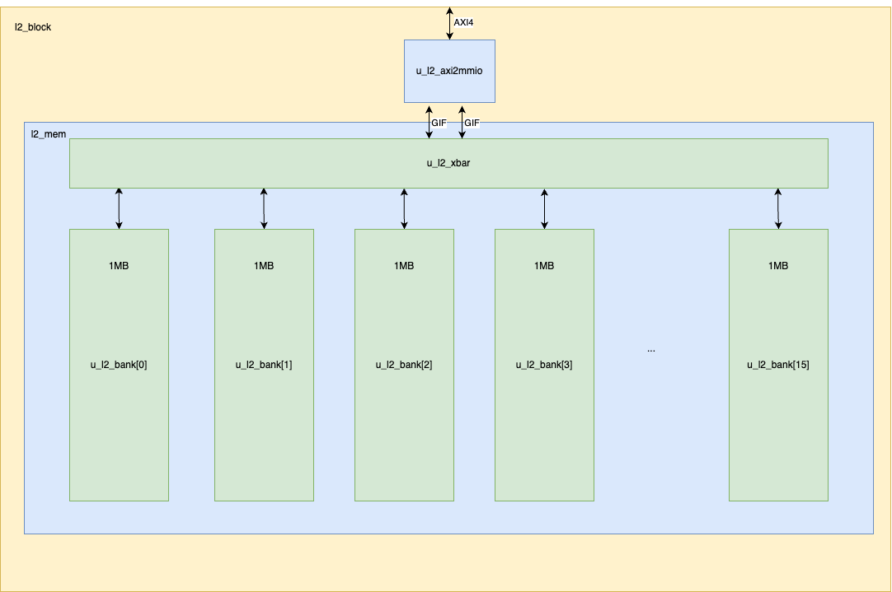
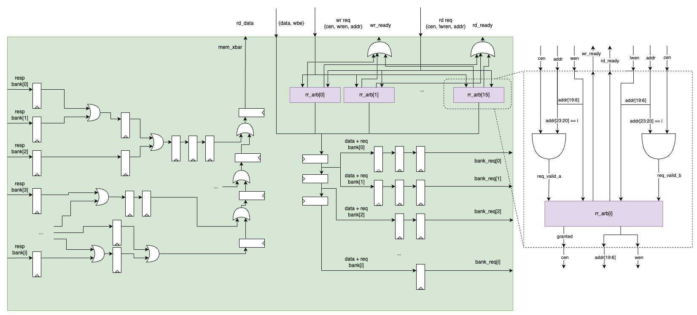
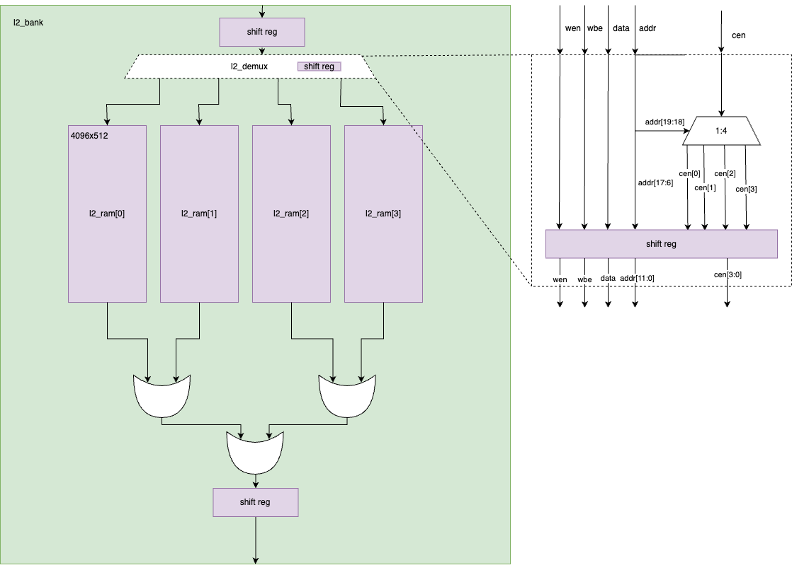
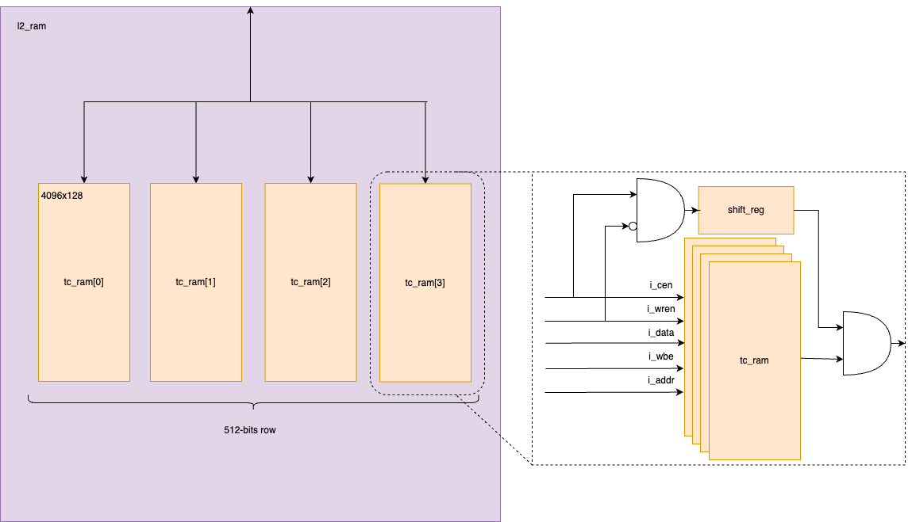

# L2

<!--
Start with the name of the block and provide author information.
-->

# Table of Contents

- [L2](#l2)
- [Table of Contents](#table-of-contents)
  - [Acronyms, Abbreviations and Typefaces](#acronyms-abbreviations-and-typefaces)
  - [Overview](#overview)
  - [High-Level Requirements](#high-level-requirements)
  - [Top-Level Block Diagram](#top-level-block-diagram)
  - [Parameters and Typedefs](#parameters-and-typedefs)
  - [Interfaces](#interfaces)
  - [Protocols](#protocols)
  - [Clocks](#clocks)
  - [Resets](#resets)
  - [Arbitration, Fairness, and QoS](#arbitration-fairness-and-qos)
  - [Power](#power)
  - [Physical Design](#physical-design)
  - [Debugging and Reliability](#debugging-and-reliability)
  - [Implementation Details](#implementation-details)
    - [L2\_XBAR](#l2_xbar)
    - [L2\_BANK](#l2_bank)
    - [L2\_RAM](#l2_ram)
  - [References](#references)

## Acronyms, Abbreviations and Typefaces

<!--
Good documentation requires a clear understanding of the acronyms and abbreviations, so
it is important to keep this table updated.
-->

| Abbreviations | Meaning                         |
| ------------- | ------------------------------- |
| AXI4          | Advanced eXtensible Interface 4 |
| RD            | Read                            |
| WR            | Write                           |
| GIF           | Generic Interface               |
| IP            | Intellectual Property           |
| GIF           | Generic Interface               |
| MRd           | Memory Read                     |
| MWr           | Memory Write                    |
| DeMUX         | DeMultiplexer                   |

## Overview

<!--
1-2 page description of the block. Briefly cover at a high level what it does and show a "birds-eye" black-box view of the top level.
Discuss goals and non-goals, how it is intended to integrate into a larger system, list any standard protocols, highlight important
performance requirements, touch on debugging features, and describe physical design assumptions (floorplanning, timing, area, power,
pin placement, reliability targets) and other relevant silicon considerations.
Outline the design methodology (coding language, in-house and third-party libraries & IPs) and anything else that a verification engineer
should know before writing their first draft of the test plan.
-->
The L2 IP is a highly flexible, high throughput and configurable memory module designed to meet a wide range of application requirements. It main features:

- **Technologically Independent:** This IP is designed to be technologically independent, meaning it does not rely on any specific foundry process.
This ensures broad compatibility and ease of integration into different technology nodes and manufacturing processes.
- **AXI4 Interface:** The L2 IP utilizes an AXI4 interface, providing high-performance, low-latency data transfers, and ensuring seamless integration
with other AXI4-compliant components.
- **Parameterizable Number of Banks:** Users can configure the number of banks within the memory module to suit their specific application needs.
This parameterizability allows for optimized performance and resource utilization.
- **Parameterizable SRAM Sizes:** The size of the SRAMs can be adjusted to meet the storage requirements of various applications.
This flexibility ensures that the L2 IP can be tailored to match the exact needs of different systems.
- **Parameterizable Structure for Wiring Reduction:** The IP includes a parameterizable structure designed to reduce wiring complexity.
This feature enhances the overall design efficiency, potentially lowering power consumption and improving signal integrity.

## High-Level Requirements

<!--
In a few paragraphs, outline the key high-level design requirements for this block — carefully distinguish between functionality (behaviour)
and performance.
It may also be helpful to define explicit non-goals.
A non-exhaustive list of things to think about clock frequencies and reset ordering; types of transactions and the interfaces they involve;
transaction concurrency within and across interfaces; side effects from transactions; ordering requirements; flow control mechanisms;
arbitration policies, fairness, and deadlock avoidance guarantees; transaction routing; performance; debuggability.
-->

L2 is a high-throughput, highly flexible, and configurable memory IP that can be used as a generic data RAM IP, capable to work up to 1.2GHz.
The L2 allows configuration of AXI4 data and address sizes, total capacity, size of the SRAM used (depth and width), and the number of balanced banks used to meet the total capacity.
Additionally, latency and the architecture of the pipeline registers are also configurable, helping to fit the floorplan requirements.

This memory module uses an AXI4-slave interface to transfer data with the system keeping the read and writes completely independents. That means no relationship is forced between RD and WR transactions. Each bank uses a GIF (generic interface) interface. The arbitration scheme between Reads and Writes follow a Round-Robin scheme.

The specific Tech interface, used to configure the single port SRAMs, is abstracted by specific blocks which wraps abstract the Tech node from memory IP implementation.

Internally, L2 has 2 main blocks: `axi2reg` which converts AXI requests into generic memory interface, and `l2_mem` which abstract the banks and the arbitration scheme to address them.

## Top-Level Block Diagram

<!--
The top-level block diagram should indicate the block boundary and all major interfaces.
Draw the top-level submodules and how they connect internally, but avoid showing an excessive amount of internal implementation detail.
The structure of the top-level block diagram should correspond 1:1 with the contents of the top-level RTL module.
Avoid "free-floating" logic at the top level (everything should be encapsulated in submodules).
-->

The diagram below presents the uArch of the IP. 

\
*L2 Top Level Diagram*

## Parameters and Typedefs

<!--
Maintain tables of typedefs and design parameters.
Include major package parameters (both block-private and shared), top-level module parameters, and preprocessor macros that set global constants.
Do not include parameters or macros that are calculated from others. Make sure to describe any constraints and any assumptions about reasonable
or default values.
Only define the types that are necessary to fully define the parameters and interfaces.
-->

The table below presents the the parameters used to configure L2. Those can be found in the [l2_cfg_pkg.sv](../rtl/pkg/l2_cfg_pkg.sv) file.

| Parameter            | Type         | Default Value | Description                                           |
| -------------------- | ------------ | ------------- | ----------------------------------------------------- |
| L2_AXI_DATA_WIDTH    | int unsigned | 512           | Defined the data width used.                          |
| L2_AXI_ID_WIDTH      | int unsigned | 4             | Defines the ID width in the AXI4 interface.           |
| L2_AXI_ADDR_WIDTH    | int unsigned | 24            | Defines the address width.                            |
| L2_MEM_SIZE          | int unsigned | 16 MiB        | Defines the total capacity of the memory.             |
| L2_NUM_BANKS         | int unsigned | 16            | Defines the number of banks used.                     |
| L2_SRAM_DATA_WIDTH   | int unsigned | 128           | Defines the SRAM data width.                          |
| L2_SRAM_DATA_DEPTH   | int unsigned | 4096          | Defines the SRAM data depth.                          |
| L2_REQ_LATENCY       | int unsigned | 5             | Defined the latency expected for the request.         |
| L2_RSP_LATENCY       | int unsigned | 5             | Defined the latency expected for the response.        |
| L2_RSP_GROUPS        | int unsigned | 6             | Number of groups used to combine the banks responses. |
| L2_REQ_WIRE_LATENCY  | array        |               | Defines the request latency per bank.                 |
| L2_RSP_STAGE_LATENCY | array        |               | Defines the response group per bank.                  |
| L2_RSP_GROUP         | array        |               | Defines the response group latency.                   |

## Interfaces

<!--
Maintain a table of top-level interfaces. Group related ports as a single interface.
Show the ports directions and types, describe what the interface is used for, and follow common naming conventions.
Mention the use of any standard protocols. Avoid excessive abbreviations. The port directions, types, and names should match 1:1 with the RTL ports.
Port directions should be from the block’s perspective (just like in RTL).
-->

The main interface used by L2 is AXI4. It is through this interface the SRAMs will receive the read and write requests.

| Interface          | Port Direction | Port Type                    | Port Name       | Description                                                                            |
| ------------------ | -------------- | ---------------------------- | --------------- | -------------------------------------------------------------------------------------- |
| AXI4 AW channel    | input          | logic                        | i_axi_s_awvalid | Address Write channel valid signal                                                     |
| AXI4 AW channel    | input          | l2_axi_addr_t                | i_axi_s_awaddr  | Write address                                                                          |
| AXI4 AW channel    | input          | l2_axi_id_t                  | i_axi_s_awid    | Write ID                                                                               |
| AXI4 AW channel    | input          | l2_axi_len_t                 | i_axi_s_awlen   | Write Length                                                                           |
| AXI4 AW channel    | input          | l2_axi_size_t                | i_axi_s_awsize  | Write Size                                                                             |
| AXI4 AW channel    | input          | l2_axi_burst_t               | i_axi_s_awburst | Write Burst                                                                            |
| AXI4 AW channel    | input          | logic                        | i_axi_s_awlock  | Write Lock (not used)                                                                  |
| AXI4 AW channel    | input          | l2_axi_cache_t               | i_axi_s_awcache | Write Cache (not used)                                                                 |
| AXI4 AW channel    | input          | l2_axi_prot_t                | i_axi_s_awprot  | Write Prot (not used)                                                                  |
| AXI4 AW channel    | output         | logic                        | o_axi_s_awready | AW channel ready                                                                       |
| AXI4 W channel     | input          | logic                        | i_axi_s_wvalid  | Write channel valid                                                                    |
| AXI4 W channel     | input          | logic                        | i_axi_s_wlast   | Write Last Beat                                                                        |
| AXI4 W channel     | input          | l2_axi_data_t                | i_axi_s_wdata   | Write Data                                                                             |
| AXI4 W channel     | input          | l2_axi_strb_t                | i_axi_s_wstrb   | Write Data Strobes                                                                     |
| AXI4 W channel     | output         | logic                        | o_axi_s_wready  | Write channel ready                                                                    |
| AXI4 B channel     | output         | logic                        | o_axi_s_bvalid  | Write response channel valid                                                           |
| AXI4 B channel     | output         | l2_axi_id_t                  | o_axi_s_bid     | Write response ID (corresponding to the Address Write ID)                              |
| AXI4 B channel     | output         | l2_axi_resp_t                | o_axi_s_bresp   | Write response Response that defines whether the request was a success or if it failed |
| AXI4 B channel     | input          | logic                        | i_axi_s_bready  | Write response channel ready                                                           |
| AXI4 AR channel    | input          | logic                        | i_axi_s_arvalid | Address Read channel valid                                                             |
| AXI4 AR channel    | input          | l2_axi_addr_t                | i_axi_s_araddr  | Read address                                                                           |
| AXI4 AR channel    | input          | l2_axi_id_t                  | i_axi_s_arid    | Read ID                                                                                |
| AXI4 AR channel    | input          | l2_axi_len_t                 | i_axi_s_arlen   | Read Length                                                                            |
| AXI4 AR channel    | input          | l2_axi_size_t                | i_axi_s_arsize  | Read Size                                                                              |
| AXI4 AR channel    | input          | l2_axi_burst_t               | i_axi_s_arburst | Read Burst                                                                             |
| AXI4 AR channel    | input          | logic                        | i_axi_s_arlock  | Read Lock (not used)                                                                   |
| AXI4 AR channel    | input          | l2_axi_cache_t               | i_axi_s_arcache | Read Cache (not used)                                                                  |
| AXI4 AR channel    | input          | l2_axi_prot_t                | i_axi_s_arprot  | Read Prot (not used)                                                                   |
| AXI4 AR channel    | output         | logic                        | o_axi_s_arready | Address Read channel ready                                                             |
| AXI4 R channel     | output         | logic                        | o_axi_s_rvalid  | Ready channel valid                                                                    |
| AXI4 R channel     | output         | logic                        | o_axi_s_rlast   | Read last beat                                                                         |
| AXI4 R channel     | output         | l2_axi_id_t                  | o_axi_s_rid     | Read response ID (corresponding to the Address Read ID)                                |
| AXI4 R channel     | output         | l2_axi_data_t                | o_axi_s_rdata   | Read Data                                                                              |
| AXI4 R channel     | output         | l2_axi_resp_t                | o_axi_s_rresp   | Read response Response that defines whether the request was a success or if it failed  |
| AXI4 R channel     | input          | logic                        | i_axi_s_rready  | Read channel ready                                                                     |
| SRAM configuration | input          | axe_tcl_sram_pkg::impl_inp_t | i_impl          | Specific Tech node input signals                                                       |
| SRAM configuration | output         | axe_tcl_sram_pkg::impl_oup_t | o_impl          | Specific Tech node output signals                                                      |

## Protocols

<!--
For all interfaces that use a standard industry protocol or an internal/proprietary protocol, list them here and link to the relevant specifications
that govern those protocols.
If any interfaces use custom protocols that are not defined elsewhere, then define them in detail here, with one subsection per protocol.
Make sure to define any protocols that involve more than one interface.
-->

The IP uses mostly AXI4 where the spec can be found [here](https://developer.arm.com/documentation/ihi0022/latest/).

## Clocks

<!--
Maintain a table of clock domains used in the design. For each clock, state its nominal frequency and the supported dynamic range.
Show the same top-level block diagram as before, but this time annotate it to show which submodules are in each clock domain.
Datapath clock domain crossings should be drawn explicitly, and they should be encapsulated within one or more submodules.
For clocks that are used for "backbone" functions that span many submodules (e.g., a CSR bus on its own clock domain), state this clearly and defer
the details to another appropriate document or section.
-->

L2 is a single clock domain IP.

| Clock | Nominal Frequency | Description          |
| ----- | ----------------- | -------------------- |
| i_clk | up to 1.2GHz      | Clock used in the IP |

## Resets

<!--
Maintain a table of reset domains used in the design.
For each reset, state whether it is synchronous or asynchronous; active high or active low; and if synchronous, to which clock.
Show the same top-level block diagram as before, but this time annotate it to show which submodules are in each reset domain.
Datapath reset domain crossings should be drawn explicitly, and they should be encapsulated within one or more submodules.
For resets that are used for "backbone" functions that span many submodules (e.g., a CSR bus on its own reset domain), state this clearly and defer
the details to another appropriate document or section.
If the reset protocol is custom to this block, include a subsection that defines the relevant procedures.
Otherwise, cite other documents that provide these details.
-->

This IP uses a single asynchronous reset.

| Reset   | Kind  | Description                   |
| ------- | ----- | ----------------------------- |
| i_rst_n | async | Active low asynchronous reset |

## Arbitration, Fairness, and QoS

<!--
If the design involves multiple traffic classes or concurrent transaction types that can share any resources or interfaces, then their fairness
properties should be defined.
For example, if two independent traffic flows arbitrate for an output interface, then the spec should clearly define the arbitration
policy and the expected impacts on steady-state throughput and loaded latency as seen by each flow (e.g., from head-of-line blocking).
Discuss any configurability features the design may have to control the arbitration policy or to achieve a different quality-of-service (QoS).
If the design is unfair to any traffic class, state this explicitly.
Ensure that any unfairness does not invalidate the forward progress guarantees (see below).
-->
Read and Write requests are independent and the `axi2reg` block ensures they have independent resources which means this IP doesn't force any dependency between reads and writes.
Since the paths are independent, the `l2_mem` can receive 2 requests simultaneously (one read and one write request). However, the SRAMs used, independently of the tech node used, are single ports, requiring an arbiter to schedule the requests properly. This arbitration is implemented in the `l2_xbar` module using Round-Robin arbiters to keep the banks' fairness.

## Power

<!--
Define the relevant power requirements for the block under idle, peak, and steady-state conditions.
If there are multiple power modes (e.g., dynamic voltage/frequency scaling or sleep modes), discuss how the block supports them.
Define any fine-grain self-clock gating requirements (e.g., the proportion of flops that are automatically gated when idle or in typical operation).
-->

L2 doesn't implement manually clock gating or other feature to save power. However, all flops in the design has enable allowing clock gating inference in the synthesis flow.
It's also possible to create multiple SRAM groups using the tech node interface, allowing to control the power mode with the desire granularity. 

## Physical Design

<!--
The block microarchitecture design and physical design are tightly coupled. Include a sketch of the intended floor plan.
It should be drawn roughly to scale and indicate the orientation. Show where the major interface pins and major SRAMs are placed.
If the design uses a structured datapath with manual placements, track reservations, or metal layer reservations, describe those details as needed.
Include a table of SRAM configurations. Summarise useful statistics about the block (estimated flop count, standard cell count, and critical path).
If physical design data is available (e.g., later in a project), show a screenshot of the block post-placement and highlight the placement of major
logic clouds that correspond to major submodules.
-->

The challenges in the physical design are related to the macro's placement. For that reason, this IP supports mechanisms to group bank requests/responses according to the floorplan focused in the wiring reduction.

## Debugging and Reliability

<!--
Describe any non-mission-mode features that are meant to only be used for debugging the design post-silicon.
This could include support for on-chip logic analysers or JTAG.
Chips are prone to failure. State the design’s relevant reliability requirements and describe any relevant features.
Examples may include memory ECC, design-for-test/BIST circuits, timing monitors, etc.
-->

JTAG and Bist circuits are not supported at IP level. They are implemented at the L2 top level.

## Implementation Details

<!--
The remainder of the spec should show the design detail of every significant submodule.
This section may often comprise 50% of the entire document.
Organize the diagrams such that they correspond 1:1 with the RTL.
Ideally, hyperlink diagrams to each other in a tree structure, thus allowing you to avoid overwhelming the reader with excessive details
in any particular diagram and making it easy for the reader to correspond their knowledge of the design with the RTL code organisation.
For complex submodules, describe their implementations. Make note of any standard libraries or IPs and link to their specifications.
-->

As the [L2 Top Level Diagram](#top-level-block-diagram) shows the IP has two main modules inside: `axi2reg`, a slave AXI4 bridge responsible to convert AXI4 transactions into generic memory transactions MRd and MWr, and the `l2_mem` which arbitrate the request per bank into the `l2_xbar` module, and sent the memory transactions to the right bank `l2_bank`.

### L2_XBAR

This block is responsible to arbitrate the requests coming from the AXI4 bridge and send them to the correct bank.

The most significate bits of the address identifies the bank and combined with chip enable will select the arbiter to handle the request. `l2_xbar` uses one arbiter per bank to avoid back pressure if MRds and MWrs targets different banks. However, if both requests target the same back, one of them will be back-pressured by the arbiter.\
Requests of each arbiter plus data are propagated to a common pipeline and the specific requests are derived from specific stages according to the `L2_REQ_WIRE_LATENCY` configuration.\
The responses are grouped according to the `L2_RSP_GROUP` configuration and merged in the stage set in `L2_RSP_STAGE_LATENCY`. A proper configuration of those parameters ensure the latency between banks is the same.\
Each flip-flop has an indication if the data received is valid or not. That indication is used to enable the flop, and to tied the output of the flop to zero if no valid data received, allowing to combine multiple responses using simple `OR` gates.

### L2_BANK

Similar to the parent module, the most significate bits of the address - after removing the bits related to the bank selection - are used to select the right `l2_ram` module together with chip enable.\
The responses of each `l2_ram` is combined using `OR` gates since it's assumes the data will be different from zero if a request target the `l2_ram`.\
If the bank doesn't received any request, the output of the bank will be also tied to zero.

### L2_RAM

This module combines the number of SRAMs required to complete AXI4 data width and the chip enable of each SRAM is activated if at least one byte enable of that SRAM will be used.\
A valid read request valid signed is generated to gate the output of the SRAMs. This is important to simplify the aggregation of multiple responses using `OR` gates instead of more complex DeMUXs.

## References

<!--
Link to other related documents — test plans, physical design information, source code location, protocol documents, chip-level specifications, etc.
-->
This IP was build to satisfy the requirements proposed on [L2 confluence page](https://axeleraai.atlassian.net/wiki/people/62610e829e7c190069e821bc?ref=confluence).
