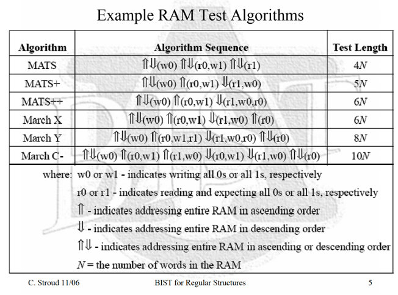
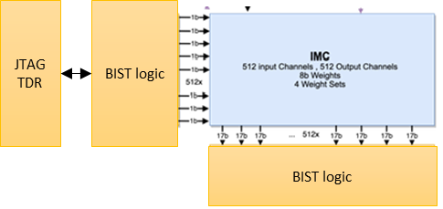
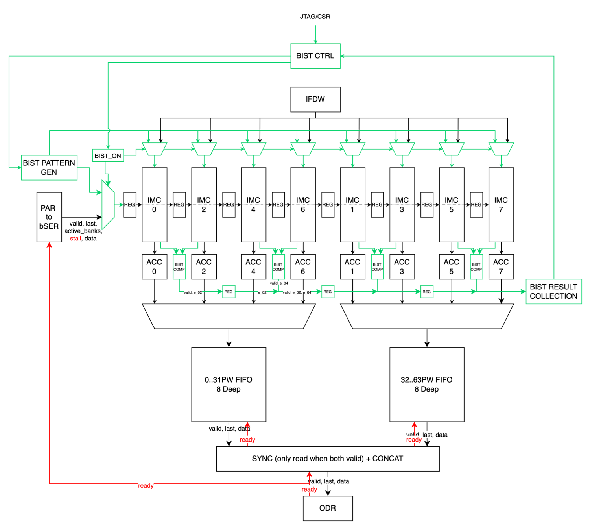
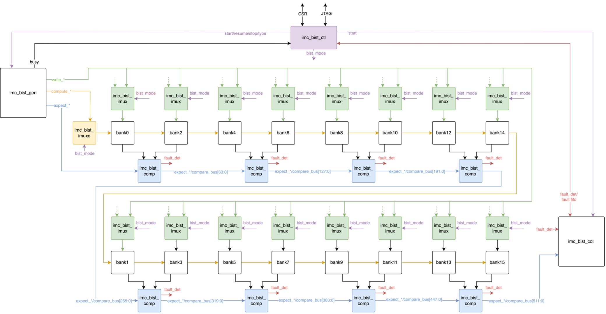
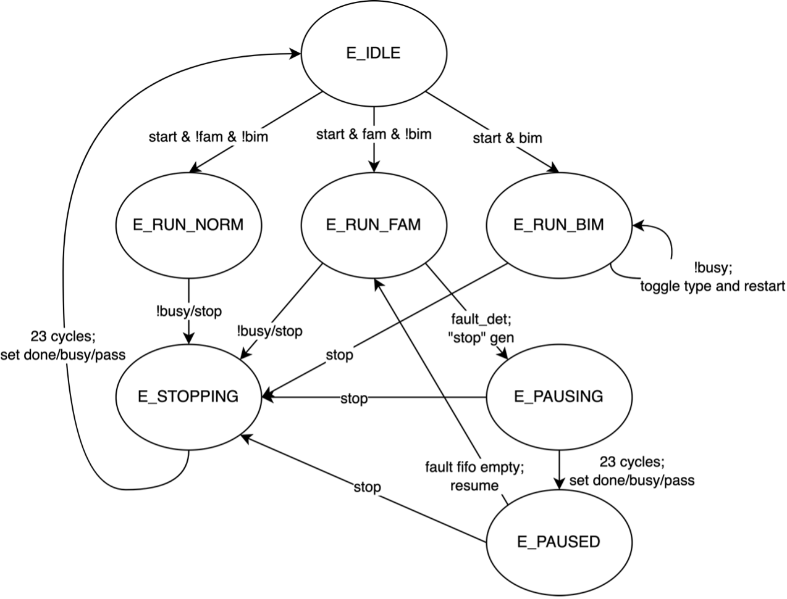

---
doc:
  status: draft
  version: [ 0, 1, 0 ]
  confidentiality: internal
---

# IMC BIST

| **Revision** | **Date**   | **Author**   | **Description** |
|--------------|------------|--------------|-----------------|
| 0.1          | 31/01/2023 | Tiago Campos | First draft     |
| 0.2          | 18/04/2023 | Roel Uytterhoeven | Translation to MD |
| 0.3          | 18/04/2023 | Tiago Campos | Review agaisnt and generate from implemented RTL |
| 0.4          | 25/09/2024 | Tiago Campos | Port to Europa repo |
| 0.5          | 02/12/2024 | Tiago Campos | Add quick guide |

## Acronyms, Abbreviations and Typefaces

| Abbreviations | Meaning                      |
|---------------|------------------------------|
| IMC           | In Memory Computing          |
| BIST          | Built-In-self-Test           |
| HW            | Hardware                     |
| DFT           | Design For Test              |
| ATE           | Automatic Test Equipment     |
| MVM           | Matrix-Vector-Multiplication |
| JTAG          | Joint Test Action Group      |
| TDR           | Test Data Register           |
| TAP           | Test Access Port             |

## Quick guide

### Run simulations (JTAG access mode)

No patterns are available yet. Once they are, standard DFT simulation flow is expected (change `PATTERN_NAME` to intended pattern).

### Run simulations (CSR access mode), dump test vector data

You can dump vector data from simulation to text files for debug, regression testing, and coverage analysis. Here is how:

1. Run simulations

```shell
cd $REPO_ROOT/hw/ip/mvm/default
make -C dv/sim run_vsim TESTNAME=ai_core_mvm_bist_no_error_test SEED=1 PLUSARGS="+CBIST" GLOBAL_DEFINES="+define+DUMP_IMC_BANKS"
make -C dv/sim run_vsim TESTNAME=ai_core_mvm_bist_no_error_test SEED=1 PLUSARGS="+MBIST" GLOBAL_DEFINES="+define+DUMP_IMC_BANKS"
```

This is the configuration expected for checking against the expected vector signature. Here are the options you have in regards to each variable:

- `TEST_NAME`: `ai_core_mvm_bist_no_error_test` (no error injection) or `ai_core_mvm_bist_error_test` (error injection).
- `SEED`: is irrelevant as there is no possible randomization for this feature. Set to `1` as this is the expectation by the vector signature checking flow.
- `PLUSARGS`: `+CBIST` or `+MBIST`.
- `GLOBAL_DEFINES`: if not using the textdump, you can remove the DUMP_IMC_BANKS define for faster runtime.
- Running repair tests: Check "Verification procedures" section of the [IMC Repair specification](imc_repair.md) page.

2. Compare IMC bank vector data with expected signature

```shell
make -C dft imc_bist_signature_check
```

Make sure all files have an `OK` status (or that the return value of the command is 0).

3. If applicable, update IMC bank expected signature

If the previous step fails and after debug you conclude that the signatures should be updated, you can do so:

```shell
make -C dft imc_bist_signature_update
```

This will update the signatures at `hw/ip/mvm/default/imc_bist_signatures`.

### IMC bank dump format

Stimulus arriving at the input of the IMC banks is dumped in texthex format. Check `dv/imc_bank_dumper/pkg/imc_bank_dumper_pkg.sv` to check the fields within each dump format:

- `dataDump_both_t`: dump format for the `*_both.txt` files
- `dataDump_write_t`: dump format for the `*_write.txt` files
- `dataDump_compute`: dump format for the `*_compute.txt` files

::: hw/ip/mvm/default/dv/imc_bank_dumper/pkg/imc_bank_dumper_pkg.sv:imc_bank_dumper_pkg

## Introduction

The IMC BIST is a HW method to test the IMC banks, it writes weight/compute patterns into the IMC banks and compares their outputs agaisnt an expectation, finally exposing a Pass/Fail status to firmware and/or external ATE equipment.
## Functional description
### Features

The IMC BIST implements the following functionality:

- Interfaces with JTAG and CSR

- Two clock domains: slow clk (JTAG), fast clk (BIST)

- Memory BIST (MBIST) for weight storage cells in the IMC banks

- Compute BIST (CBIST) for the adder trees in the IMC banks

- Status and diagnosis reporting

- Failure Analysis mode

- Burn-in mode
### Pinout

The following `ai_core_mvm` pins are related to IMC BIST:

#### JTAG TDR interface

<!--
TODO: Automated documentation
%% io_table( "mvm", "^jtag" ) %% 
-->

- `mvm` pins matching `^[io]_jtag.*`

#### Status test mode io pads

<!--
TODO: Automated documentation
%% io_table( "mvm", "^imc_bist.+_o$" ) %% 
-->

- `mvm` pins matching `^o_imc_bist.*`

### Registers

IMC BIST is accessible by `mvmexe` CSR or by JTAG. Both access methods implement identical register maps, except for IMC_BIST_CFG.CSR_SEL which is only available in the CSR:

<!--
TODO: Automated documentation
%% field_table( "mvmexe_csr", ["IMC_BIST_CFG", "IMC_BIST_CMD", "IMC_BIST_STATUS"]) %%
-->

To use the CSRs, they must first be unlocked at `ai_core_csr` level:

<!--
TODO: Automated documentation
%% field_table( "mvmexe_csr", ["IMC_BIST_CFG", "IMC_BIST_CMD", "IMC_BIST_STATUS"]) %%
-->

### JTAG/CSR synchronization

JTAG works on different clock domain (slow_clk) to the BIST (fast_clk).
A lightweight synchronization scheme is applied as such:

- `IMC_BIST_CMD`: all commands are synchronized with separate `cdc_level` to a rising-edge-to-pulse detection at the destination.

- `IMC_BIST_CFG`: all configuration fields are assumed to be quasi-static.

- `IMC_BIST_STATUS`: DONE is synchronized. By implementation, the remaining fields are always stable while DONE is asserted.
### MBIST

Memory BIST, to test the weight storage cells.
Generates patterns according to the MARCH C- algorithm and compares outputs against a golden reference.



The (`wr_en`, `wr_addr`) is translated into a (`write_enable`, `write_wss`, `write_row`) operation, where `wr_addr` is the concatenation of `write_wss` and `write_row`.
The (`rd_en`, `rd_addr`) is translated into a (`compute_block_enable`, `compute_inp`) operation, where `compute_block_enable[i] = rd_en` for `i = 0, ..., 15` and `compute_inp = 1 << rd_addr`.

The read latency is 7 cycles for the first bank and an additional 1 cycle for every bank thereafter. The expected readback value is the 32 weights stored at the row.

### CBIST

Compute BIST, to test the adder trees.
Writes `1'b1` to all weights and generates pseudorandom compute vectors based on 32 instances of a 16-bit `cc_cnt_lfsr`, each with seed `i * 116 + 1` for `i = 0, ... 32`.
Outputs compared against the neighbor bank (i.e., bank `X` is compared with bank `X+2`). Ends after an hard-coded amount of cycles (currently 10000).

### IMC BIST usage

#### Starting MBIST/CBIST

MBIST is started by writing 1 to IMC_BIST_CMD.MBIST_START. HW will clear
this register once it starts.

CBIST is started by writing 1 to IMC_BIST_CMD.CBIST_START. HW will clear
this register once it starts.

To confirm that the test has started, you can either poll
IMC_BIST_STATUS.BUSY for 1 (recommended) or
IMC_BIST_CMD.\[C\|M\]BIST_START for 0.

In Normal mode (Failure Analysis and Burn-In both disabled), BIST will
stop upon first failure or when the test has finished succesfully
(whichever happens first). When it stops, IMC_BIST_STATUS.DONE is
asserted and IMC_BIST_STATUS.BUSY is deasserted.

#### Reading status/result information

IMC_BIST_STATUS.DONE indicates that all fields are ready to be read. The
only exception is in Failure Analysis mode while IMC_BIST_CMD.RESUME is
HIGH.

If IMC_BIST_STATUS.DONE = 1 and IMC_BIST_STATUS.PASS = 0, the test has
failed and the ERROR\_\* have diagnosis information.

### IMC BIST modes

#### Failure Analysis mode

Assert IMC_BIST_CFG.FAIL_ANALYSIS before launching MBIST/CBIST to enable
the Failure Analysis mode behavioural modifier.

If Burn-In mode is also set, then Burn-In mode prevails, i.e., Failure
Analysis bit is ignored.

During this mode, BIST will not stop upon first failure and will always
run until the end of the test.

If a failure is found, the BIST CTL will pause and assert
IMC_BIST_STATUS.DONE = 1 with IMC_BIST_STATUS.BUSY = 1. This indicates
it is waiting for SW/JTAG to acknowledge the error information and issue
IMC_BIST_CMD.RESUME. After issuing RESUME, you must poll it
(IMC_BIST_CMD.RESUME) and wait until it is 0 before polling any
IMC_BIST_STATUS registers.

#### Burn-in mode

Assert IMC_BIST_CMD.BURN_IN before launching MBIST/CBIST to enable the
Burn-In mode behavioural modifier.

If Failure Analysis mode is also set, then Burn-In mode prevails, i.e.,
Failure Analysis bit is ignored.

During this mode, the test does not stop upon pass (infinitely loops
until first failure). On each restart, it toggles between CBIST and
MBIST.

This mode can be gracefully exited by asserting IMC_BIST_CMD.STOP.

## Implementation

### Block Diagram

The figure below shows a simple conceptual block diagram of how the IMC BIST logic controls directly the inputs of all IMC banks, as well as reading all the IMC outputs.



The BIST logic is inserted at MVM level as RTL code part of MVM digital
flow. It is not inserted by DFT tools.

IMC BIST logic multiplexes the access to IMC bank with functional logic.



### Sub-block structure

- A CTL block is used for global BIST control (1 instance,
`imc_bist_ctl`)
- A GEN block is used for pattern generation (1 instance, `imc_bist_gen`)
- A COMP block is used to compare imc bank results (8 instances, 1 per
pair of banks, `imc_bist_comp`)
- A COLL block is used to gather all COMP block results and feed to the
CTL (1 instance, `imc_bist_coll`)



### IMC BIST Controller block (1x imc_bist_ctl)

The IMC BIST CTL block implements:

- Interaction with JTAG/CSR IF
- Mux/demux
- Implement a top level FSM for control over the remaining blocks
- Implement FIFO POP interface for reading results from the COLL

<!--
TODO: Automated documentation
`imc_bist_ctl` pinout:
%% io_table( "imc_bist_ctl" ) %% 
-->

The controller implements a FSM according to:



Note this FSM is simplified and does not include some corner-case states that occur on the transitions between Failure Analysis states.

### IMC BIST Pattern Generator block (1x imc_bist_gen)

- MBIST pattern generator
- CBIST pattern generator
- Reacts to Start/Resume/Stop within 1 fast clock cycle

<!--
TODO: Automated documentation
`imc_bist_gen` pinout:
%% io_table( "imc_bist_gen" ) %% 
-->

### IMC BIST Comparator block (8x imc_bist_comp)

- A daisy chain of 8 comparators is instantiated, one per pair of banks
- Compares the banks (left bank, right bank) against golden reference or
  against eachother
- Outputs the result in a 7 bit bus (`left_bank_ok`, `right_bank_ok`, `failure_column`)
- The first comparator in the daisy chain, delays the expectation bus
  to align with the imc bank internal latency
- Delays the expectation bus for the next bank and then the next
  comparator in the daisy chain such that comparison results between all banks align with the same input vector.
- Concatenates the comparison result with the ongoing daisy chain.

<!--
TODO: Automated documentation
`imc_bist_comp` pinout:
%% io_table( "imc_bist_comp" ) %% 
-->

### IMC BIST Collector block (1x imc_bist_coll)

- Counts the current pattern cycle
- Decodes the comparison bus raw data into a fault FIFO format with
(bank, column, cycle) information
- In the case of Fault Analysis mode, absorbs latency to allow catching region faults

<!--
TODO: Automated documentation
`imc_bist_coll` pinout:
%% io_table( "imc_bist_coll" ) %% 
-->

### JTAG TDR wrapper (1x mvm_jtag_tdr)

- Provides the placeholder for a JTAG TDR that replicates the CSR layout in a JTAG-accessible format. The TDR is inserted by the DFT flow.
- Includes all wrapper logic to make the JTAG TDR compatible with a CSR hw2reg/reg2hw bundle
- Implements synchronization between slow clk (JTAG) and fast clk (BIST)

<!--
TODO: Automated documentation
`mvm_jtag_tdr` pinout:
%% io_table( "mvm_jtag_tdr" ) %%
-->
