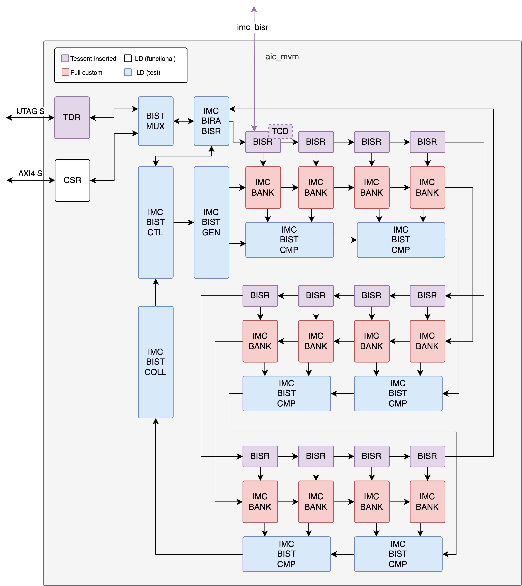
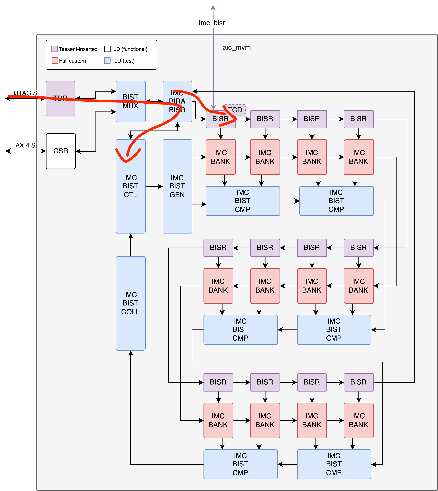
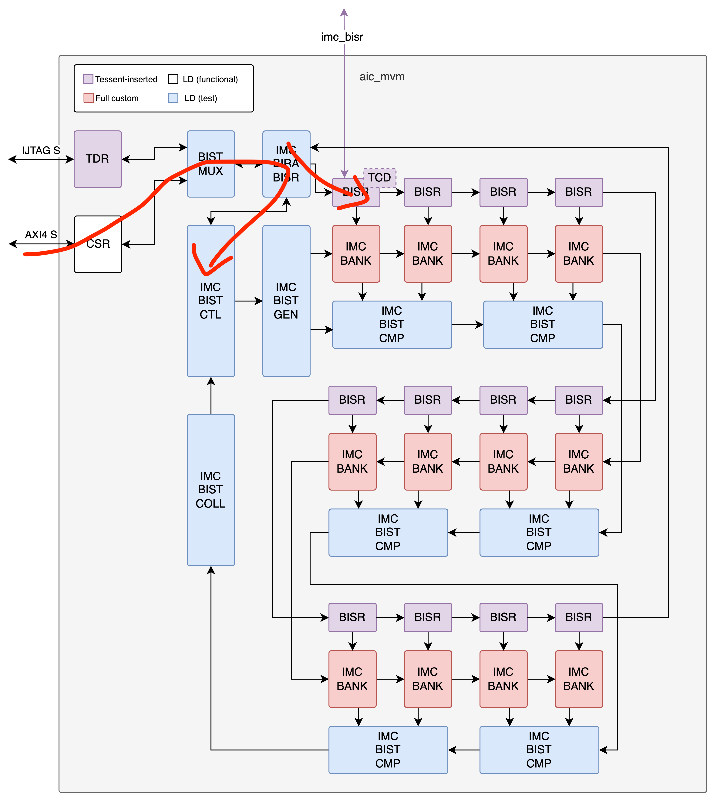

# IMC Repair

## Introduction

This document describes the IMC BIRA and BISR functionality in Europa. It also describes the changes done to IMC BIST with regards to Triton.

### Overview

There are three key elements to the design:

1. **BIRA-BISR Controller:** An IMC BIRA / BISR controller is added, as a third control source for the IMC BIST controller. This BIRA / BISR controller will implement a simple algorithm to run and retry IMC BIST until a feasible repair setting is found.
2. **Repair Hooks:** After IMC BIRA / BISR controller is done, compressed repair settings are shifted out serially to repair hooks in the IMC bank wrapper. The repair hooks translate the 6-bit compressed repair setting into the 32-bit IMC BIST decompressed repair setting. These repair hooks could have a Tessent memlib model describing repair behavior to be stitched into the Europa repair chain.
3. **Redundant Column Muxes:** The IMC bank wrapper implements logic to mux and demux data to and from the redundant 32nd IMC column column.

For more information, check https://git.axelera.ai/prod/europa/-/issues/628 .

#### Block Diagram

The IMC BIST + BISR solution is structured as follows:



This highlights the interoperability of the feature across LD functional, LD for test, and DFT-inserted design elements.

!!! note "Number of IMC Banks is not representative"

    Only 12 IMC Banks are represented to keep the diagram smaller. The Europa project actually implements an MVM with 16 IMC banks. The structure scales trivially to any number of IMC Banks: 1 BISR hook per IMC bank and 1 IMC BIST comparator on each pair of banks.

## Functional Description

There are three key usecases for 

### 1. Repair data creation and storage triggered by JTAG

Used in ATE for device screening and eFuse setting generation.

1. JTAG triggers a start of the IMC BIRA controller
2. BIRA controller takes control of the BISR chain
3. IMC BIRA controller iterates with IMC BIST controller until final repair setting is found
4. BIRA controller releases control of the BISR chain
5. BISR chain is shifted out to eFuse block through IMC BISR interface by using Tessent-generated PDL of toplevel eFuse controller



### 2. Repair data creation triggered by CSR

Used for infield test and debug. 

1. CPU triggers a start of the IMC BIRA controller through CSR
2. BIRA controller takes control of the BISR chain
3. IMC BIRA controller iterates with IMC BIST controller until final repair setting is found
4. BIRA controller releases control of the BISR chain
5. BISR chain might be shiftable out to eFuse block through Tessent infield controller. Dependant on toplevel architecture.



### 3. Autonomous repair mode

Triggered during boot process.

1. Toplevel repair controller triggers repair setting movement from eFuse storage to the repair chain through the IMC BISR interface.


## Block definitions

### Global definitions

::: hw/ip/mvm/default/rtl/pkg/imc_bist_pkg.sv:imc_bist_pkg.compressed_repair_t
::: hw/ip/mvm/default/rtl/pkg/imc_bist_pkg.sv:imc_bist_pkg.uncompressed_repair_t

### BIRA-BISR Controller

The BIRA controller, instantiated in `mvm_imc_acc` and named `imc_bira_bisr` is defined as follows:

::: hw/ip/mvm/default/rtl/imc_bist/imc_bira_bisr.sv:imc_bira_bisr

#### BIRA subsystem

BIRA subsystem, `imc_bira`, communicates with IMC BIST MUX upstream, IMC BIST CTL downstream, and IMC BISR subsystem internally.

::: hw/ip/mvm/default/rtl/imc_bist/imc_bira.sv:imc_bira

It implements a FSM defined as such:

Summary of states:

| State | Description |
| ----- | ----------- |
| `BYPASS` | Mode forced if `IMC_BIST_CFG.BIRA_MODE` is 0. Disables all BIRA controller functionality and forwards BIST CTL interface directly to BIST MUX |
| `IDLE` | `IMC_BIST_CFG.BIRA_MODE` is not 0, but no IMC BIST CMD has been received. Forward idle interface in both directions. |
| `RUNNING_MBIST` | MBIST test is running with latest repair settings. Waiting on DONE from IMC BIST CTL. |
| `REPAIR_MBIST` | Apply repair settings generated from MBIST result. Hold repair request interface and return to `RUNNING_MBIST` when ack-ed. |
| `RUNNING_CBIST` | CBIST test is running with latest repair settings. Triggered after MBIST test passes. Waiting on DONE from IMC BIST CTL. |
| `REPAIR_CBIST` | Apply repair settings generated from CBIST result. Hold repair request interface and return to `RUNNING_MBIST` when ack-ed. |
| `DONE` | BIRA algorithm ran and finished. |

Summary of transitions:

| From | To | Condition | Actions |
| ---- | -- | --------- | ------- |
| `*` | `BYPASS` | `IMC_BIST_CFG.BIRA_MODE == 0` | Synchronous clear internal logic |
| `BYPASS` | `IDLE` | `IMC_BIST_CFG.BIRA_MODE != 0` | Synchronous clear internal logic |
| `IDLE` | `RUNNING_MBIST` | `\|IMC_BIST_CMD.START_* & IMC_BIST_CFG.BIRA_MODE[0]` | Start MBIST<br/>Assert `IMC_BIST_STATUS.BUSY` |
| `IDLE` | `RUNNING_CBIST` | `\|IMC_BIST_CMD.START_* & ~IMC_BIST_CFG.BIRA_MODE[0]` | Start CBIST<br/>Assert `IMC_BIST_STATUS.BUSY` |
| `RUNNING_MBIST` | `REPAIR_MBIST` | `IMC_BIST_STATUS.DONE & ~IMC_BIST_STATUS.PASS` | Assert repair request interface<br/>Assert `IMC_BIST_STATUS.REPAIR_NEEDED` |
| `RUNNING_MBIST` | `RUNNING_CBIST` | `IMC_BIST_STATUS.DONE & IMC_BIST_STATUS.PASS & IMC_BIST_CFG.BIRA_MODE[1]` | Start CBIST |
| `RUNNING_MBIST` | `DONE` | `IMC_BIST_STATUS.DONE & IMC_BIST_STATUS.PASS & ~IMC_BIST_CFG.BIRA_MODE[1]` | Assert status interface (PASS) |
| `REPAIR_MBIST` | `RUNNING_MBIST` | `imc_repair_req_ack == 1` | Start MBIST <br/> Deassert repair request interface |
| `REPAIR_MBIST` | `DONE` | `imc_repair_req_nack == 1` | Assert status interface (FAIL) |
| `RUNNING_CBIST` | `REPAIR_CBIST` | `IMC_BIST_STATUS.DONE & ~IMC_BIST_STATUS.PASS` | Assert repair request interface<br/>Assert `IMC_BIST_STATUS.REPAIR_NEEDED` |
| `RUNNING_CBIST` | `DONE` | `IMC_BIST_STATUS.DONE & IMC_BIST_STATUS.PASS` | Assert status interface (PASS) |
| `REPAIR_CBIST` | `RUNNING_CBIST` | `imc_repair_req_ack == 1` | Start CBIST <br/> Deassert repair request interface |
| `REPAIR_CBIST` | `DONE` | `imc_repair_req_nack == 1` | Assert status interface (FAIL) |

#### BISR subsystem

The BISR subsystem, `imc_bisr`, communicates is a slave to the BIRA controller and communicates with the BISR hooks downstream.

::: hw/ip/mvm/default/rtl/imc_bist/imc_bisr.sv:imc_bisr

It communicates with the BIRA controller with a defined repair request interface:

| Signal Source  | Signal Type | Signal Name | Description |
| -------------- | ----------- | ----------- | ----------- |
| birA | `logic` | `imc_repair_req` | Request enable |
| birA | `logic [3:0]` | `imc_repair_req_bank0` | 1st bank to repair (0 to 15) |
| birA | `logic [4:0]` | `imc_repair_req_col0` | 1st column to repair (0 to 31) |
| birA | `logic [3:0]` | `imc_repair_req_bank1` | 2nd bank to repair (0 to 15) |
| birA | `logic [4:0]` | `imc_repair_req_col1` | 2nd column to repair (0 to 31) |
| bisR | `logic` | `imc_repair_req_ack` | Setting applied successfully |
| bisR | `logic` | `imc_repair_req_nack` | Failed to apply setting (attempted to rewrite existing or timeout) |

It implements a sub-state machine with states:

| State | Description |
| ----- | ----------- |
| `IDLE` | Reset value |
| `APPLY` | Apply repair setting internally |
| `SHIFT` | Shift repair settings to repair hooks |

And transitions:

| From | To | Condition | Actions |
| ---- | -- | --------- | ------- |
| `IDLE` | `APPLY` | `imc_repair_req == 1` | Latch request data |
| `APPLY` | `IDLE` | `exceeded_num_repair_attempts == 1` | Assert `imc_repair_req_nack` |
| `APPLY` | `IDLE` | `exceeded_num_repair_attempts == 0 && column_already_repaired == 1` | Assert `imc_repair_req_nack` |
| `APPLY` | `SHIFT` | `exceeded_num_repair_attempts == 0 && column_already_repaired == 0` | Latch output data register<br/>Clear `num_shifted_cycles` |
| `SHIFT` | `IDLE` | `num_shifted_cycles == $bits(compressed_repair_t)*16` | Assert `imc_repair_req_ack`<br/>Assert `o_imc_bisr_ue`<br/>Increment `num_repair_attempts` |

Ack-Nack protocol rules:

1. If a `imc_repair_req` is received but `IMC_BIST_CFG.MAX_REPAIR_ATTEMPTS` repair attempts have already been performed, `exceeded_num_repair_attempts` is asserted and `imc_repair_req_nack` is pulsed (Failure)
2. If a `imc_repair_req` is received to a bank that already has a repair setting with LSB column set to 1, `column_already_repaired` is asserted and `imc_repair_req_nack` is pulsed (Failure).
3. If a `imc_repair_req` is received to a bank that does not have a repair setting, the setting is applied and shifted and `imc_repair_req_ack` is pulsed (Success).
4. If a `imc_repair_req` is received to a bank that already has a repair setting with LSB column set to 0, the LSB column is flipped to 1 and repair is reattempted (check section "Remapping of IMC columns"), and `imc_repair_req_ack` is pulsed (Success).

Remapping of IMC columns:

IMC BIST will report a failure in range `{[31:0]}`. Columns `{[31:16]}` belong to `wrapper[1]` while columns `{[15:0]}` belong to `wrapper[0]`. This means that the 4-bit column range is ambiguous as the 4-bit banks have 32 columns while repair information is on a range of 16 columns. The LSB is assumed 0 on first repair attempt and 1 on second repair attempt.

### Repair Hooks

The repair hooks, instantiated in `mvm_imc_bank_wrapper` and named `imc_bisr_hook`, is defined as such:

::: hw/ip/mvm/default/rtl/imc_bist/imc_bisr_hook.sv:imc_bisr_hook

The repair hook implements a shift register to daisy chain to/from the hooks in neighboring banks, and repair setting decompression logic.

### Repair Column Muxes

Repair column muxes are implemented on `mvm_imc_bank_combiner` with functionality:

```
always_comb begin
  foreach(write_values[i])
    if(~compressed_repair_setting.repair_en)             write_values[i] = i_write_values[i];
    else begin
           if(i >  compressed_repair_setting.repair_col) write_values[i] = i_write_values[i-1];
      else if(i == compressed_repair_setting.repair_col) write_values[i] = '0;
      else                                               write_values[i] = i_write_values[i];
    end
end
```

```
always_comb begin
  foreach(imc_bank_compute_out[i,j])
    if(~compressed_repair_setting.repair_en)              imc_bank_compute_out[i][j] = compute_out[i*2+j];
    else begin
      if((i*2+j) >= compressed_repair_setting.repair_col) imc_bank_compute_out[i][j] = compute_out[i*2+j+1];
      else                                                imc_bank_compute_out[i][j] = compute_out[i*2+j];
    end
end
```

### Other Changes

#### IMC BIST Mux


The JTAG/CSR mux/demux logic is removed from the IMC BIST CTL and moved to a dedicated module. This is to allow inserting the IMC BIRA/BISR controller on the muxed interface line, before the IMC BIST CTL.

The BIST mux, instantiated in `mvm_imc_acc` and named `imc_bist_intf_mux` is defined as such:

::: hw/ip/mvm/default/rtl/imc_bist/imc_bist_intf_mux.sv:imc_bist_intf_mux

The mux connects selects either the CSR or the JTAG interface depending on the value of `i_regcsr.imc_bist_cfg.csr_sel.q` (select CSR interface, active high, reset value 0).

#### CSR

The following CSR/TDR changes are implemented:

- `IMC_BIST_CFG.BIRA_MODE` (2-bit) added, to enable BIRA controller mode (reset value = 0)
- `IMC_BIST_CFG.MAX_REPAIR_ATTEMPTS` (5-bit) added, to control maximum number of repair attempts (reset value = 8)
- `IMC_BIST_STATUS.REPAIR_NEEDED` (1-bit) added, to report that device fails BIST if no repair is attempted.
- `IMC_BIST_STATUS.ERROR_CYCLE` increased to 24-bits

`BIRA_MODE` is defined as such:

| Value   | Description                                       |
| ------- | ------------------------------------------------- |
| `2'b00` | BIRA controller disabled                          |
| `2'b01` | BIRA controller enabled, run MBIST only           |
| `2'b10` | BIRA controller enabled, run CBIST only           |
| `2'b11` | BIRA controller enabled, run MBIST and then CBIST |

### Testcases

List of implemented testcases:

| Testname | Keywords | Description | Run instructions | Owner |
| -------- | -------- | ----------- | ---------------- | ----- |
| `ai_core_mvm_bist_no_error_test` (MBIST) | UVM, BIST, CSR | Trigger MBIST through CSR, no fault injection. | `cd hw/ip/mvm/default/dv/sim` <br/> `make run_vsim TESTNAME=ai_core_mvm_bist_no_error_test PLUSARGS="+MBIST"` | Timir Soni |
| `ai_core_mvm_bist_no_error_test` (CBIST) | UVM, BIST, CSR | Trigger CBIST through CSR, no fault injection. | `cd hw/ip/mvm/default/dv/sim` <br/> `make run_vsim TESTNAME=ai_core_mvm_bist_no_error_test PLUSARGS="+CBIST"` | Timir Soni |
| `ai_core_mvm_bist_error_test` (MBIST) | UVM, BIST, CSR | Trigger MBIST through CSR, 1 fault injected. Repair not attempted. | `cd hw/ip/mvm/default/dv/sim` <br/> `make run_vsim TESTNAME=ai_core_mvm_bist_error_test PLUSARGS="+MBIST"` | Timir Soni |
| `ai_core_mvm_bist_error_test` (CBIST) | UVM, BIST, CSR | Trigger CBIST through CSR, 1 fault injected. Repair not attempted. | `cd hw/ip/mvm/default/dv/sim` <br/> `make run_vsim TESTNAME=ai_core_mvm_bist_error_test PLUSARGS="+CBIST"` | Timir Soni |
| `ai_core_mvm_bist_error_test` (MBIST repair) | UVM, BIST, BIRA, BISR, CSR | Trigger MBIST through CSR, 1 fault injected. Repair attempted. | Not directly available. Run `ai_core_mvm_bist_error_test` with testbench modification found in *Verification procedures* below. | -- |
| `ai_core_mvm_bist_error_test` (CBIST repair) | UVM, BIST, BIRA, BISR, CSR | Trigger CBIST through CSR, 1 fault injected. Repair attempted. | Not directly available. Run `ai_core_mvm_bist_error_test` with testbench modification found in *Verification procedures* below. | -- |
| `ai_core_mvm_bist_multi_error_repairable_test` (Prod repair) | UVM, BIST, BIRA, BISR, CSR | Trigger MBIST+CBIST through CSR, multiple faults injected with repairable\* signature. Repair attempted. | Not available. | -- |
| `ai_core_mvm_bist_multi_error_unrepairable_test` (Prod repair) | UVM, BIST, BIRA, BISR, CSR | Trigger MBIST+CBIST through CSR, multiple faults injected with unrepairable\* signature. Repair attempted. | Not available. | -- |
| `test_imc_mbist` (MBIST) | Tessent, BIST, IJTAG | Trigger MBIST through JTAG, no fault injection. Repair not attempted. | `cd hw/impl/europa/blocks/aic_mid/sim-questa` <br/> `make run_vsim SIM_FLOW_CONFIG=simulation_config.dft_tb.mk PATTERN_NAME=test_imc_mbist` | Tiago Campos |
| `test_imc_cbist` (CBIST) | Tessent, BIST, IJTAG | Trigger MBIST through JTAG, no fault injection. Repair not attempted. | `cd hw/impl/europa/blocks/aic_mid/sim-questa` <br/> `make run_vsim SIM_FLOW_CONFIG=simulation_config.dft_tb.mk PATTERN_NAME=test_imc_cbist` | Tiago Campos |
| `test_imc_mbist_bira_mode` (MBIST repair) | Tessent, BIST, BIRA, BISR, IJTAG | Trigger MBIST through JTAG, no fault injection. Repair attempted. | `cd hw/impl/europa/blocks/aic_mid/sim-questa` <br/> `make run_vsim SIM_FLOW_CONFIG=simulation_config.dft_tb.mk PATTERN_NAME=test_imc_mbist_bira_mode` | Tiago Campos |
| `test_imc_cbist_bira_mode` (CBIST repair) | Tessent, BIST, BIRA, BISR, IJTAG | Trigger CBIST through JTAG, no fault injection. Repair attempted. | `cd hw/impl/europa/blocks/aic_mid/sim-questa` <br/> `make run_vsim SIM_FLOW_CONFIG=simulation_config.dft_tb.mk PATTERN_NAME=test_imc_cbist_bira_mode` | Tiago Campos |
| `test_imc_cbist_bira_bisr_rotate` (Prod repair) | Tessent, BIST, BIRA, BISR, IJTAG, Chain access | Trigger MBIST+CBIST through JTAG, no fault injection. Repair attempted. Repair chain unloaded. | `cd hw/impl/europa/blocks/aic_mid/sim-questa` <br/> `make run_vsim SIM_FLOW_CONFIG=simulation_config.dft_tb.mk PATTERN_NAME=test_imc_cbist_bira_bisr_rotate` | Tiago Campos |

\* The fault scheme is only repairable if all of these conditions are observed simultaneously:

- There is at most 1 fault per IMC bank macro, and the fault affects the result of a single column
- The total number of faults does not exceed `IMC_BIST_CFG.MAX_REPAIR_ATTEMPTS`
- All faults are detectable by MBIST or CBIST algorithm

#### To-do: updates to current testcases from Triton to Europa

- [TO-DO] Testcases with no error injection must expect `REPAIR_NEEDED == 0`.

#### To-do: new verification requirements in Europa

New repair testcases for europa:

- [TO-DO] `multiple_bank_repairable_test` `<GOOD_TO_HAVE>`: BIRA controller is enabled, 2 to `IMC_BIST_CFG.MAX_REPAIR_ATTEMPTS/2` column faults are injected (never more than 1 per bank,wrapper combination). BIST must PASS with `REPAIR_NEEDED == 1`.
- [TO-DO] `single_bank_unrepairable_test` `<MUST_HAVE>`: BIRA controller is enabled, more than 1 column faults are injected in the same bank,wrapper. BIST must FAIL with `REPAIR_NEEDED == 1`.
- [TO-DO] `multiple_bank_unrepairable_test` `<GOOD_TO_HAVE>`: BIRA controller is enabled and more than `IMC_BIST_CFG.MAX_REPAIR_ATTEMPTS` are injected. BIST must FAIL with `REPAIR_NEEDED == 1`

#### Verification procedures

Start MBIST in BIRA mode:

```
  task start_imc_mbist;
    mvm_if.aic_csr_reg2hw.imc_bist_cfg = '{
      csr_sel: 1'b1,
      bira_mode: 2'b01,
      max_repair_attempts: 'd7,
      default: '0
    };
    repeat(15) @(posedge mvm_if.mvm_int_clk);
    mvm_if.aic_csr_reg2hw.imc_bist_cmd = '{
      mbist_start: 1'b1,
      default: '0
    };
  endtask
```

### Design To-Do and Limitations

The following specification items are still to be clarified:

- [TO-DO] The original requirements specification (https://git.axelera.ai/prod/europa/-/issues/628) states that repair settings must be controllable and observable through CSR. This will be implemented at later stage if still required.
