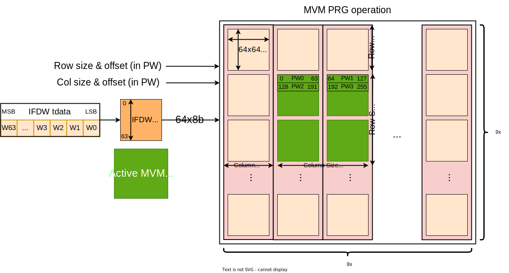

# MVM

This document extracts the specifications from the MVM requirements
specifications. Further, it describes the architectural requirements and
design of the MVM IP. It provides information regarding the possible
configurations and communication protocols as well as details regarding
the microarchitecture of the blocks. Finally, it highlights MVM specific
items in the programming flow, and provides a small example program to
run a simple operation on the MVM.

## Table of Content

- [MVM](#mvm)
  - [Table of Content](#table-of-content)
  - [Introduction](#introduction)
    - [Abbreviations](#abbreviations)
    - [Overview](#overview)
    - [System Diagram](#system-diagram)
  - [Functional Description](#functional-description)
    - [Internal Operation](#internal-operation)
    - [Programming Operation (PRG)](#programming-operation-prg)
    - [Matrix-Vector-Multiplication Execution (EXE)](#matrix-vector-multiplication-execution-exe)
    - [Multiple Loaded Contexts](#multiple-loaded-contexts)
    - [Bypass operation (EXE)](#bypass-operation-exe)
    - [Token \& MVM](#token--mvm)
    - [IMC BIST \& Repair](#imc-bist--repair)
  - [Integration Specifics](#integration-specifics)
    - [DFT considerations](#dft-considerations)
    - [IO and Interfaces](#io-and-interfaces)
      - [Clocks and Resets](#clocks-and-resets)
      - [Observability signals](#observability-signals)
      - [Interrupts](#interrupts)
    - [CSR Details](#csr-details)
    - [Memory Details](#memory-details)
  - [Verification hints](#verification-hints)
    - [Performance Requirements](#performance-requirements)
  - [Physical design guidance](#physical-design-guidance)
    - [Floorplanning considerations](#floorplanning-considerations)
    - [Timing Exceptions](#timing-exceptions)

## Introduction

The MVM subsystem provides the functionality to perform
matrix-vector-multiplications at very high-throughput using the
full-custom in-memory compute banks (IMC\_backs). An input vector $u$ is
multiplied with a matrix *A*, resulting in an output vector $t$:

$t = Au$

### Abbreviations

| Abbreviations | Meaning                                                   |
| ------------- | --------------------------------------------------------- |
| CSR           | Control and Status Register                               |
| MVM           | Matrix Vector Multiplication                              |
| IMC           | In-Memory Compute                                         |
| IAU           | Integer Arithmetic Unit                                   |
| EXE           | Execute (also referred to as Compute)                     |
| PRG           | Programming (also referred to as Weight Loading)          |
| WS            | Weight Set (refers to set of stored values in IMC banks)  |
| DP            | Data Path                                                 |
| LP            | Low Performance (refers to the type of axi bus HP or LP)  |
| HP            | High Performance (refers to the type of axi bus HP or LP) |
| PW            | Pixel word                                                |

### Overview

To perform this operation, the matrix coefficients $A$ (stationary
operands) are first preloaded into the memory of the in-memory compute
banks. Then the input vector (non-stationary operand) is applied to the
MVM input. Using compute-elements integrated into the memory banks
(IMC\_banks), combined with additional RTL logic, the MVM computes the
result vector $t$, which presents itself at the output of the MVM.

The maximal size of the matrix $A$ is 576x512, which implies that the
maximal size of the input is 576 elements and the output vector is 512 elements.
The MVM can internally store four sets of 576x512 weights/coefficients, while only
one set can be active for computation at a time. The default numeric
format for the input vector and coefficients/weights is int8, while the
output vector is int28 to guarantee full precision computations.

The MVM has two AXI input streams: one for preloading
coefficients/weights and one for applying the input vector $u$. Further,
it has one AXI output stream for the result vector $t$, as well as a
programming interface to control the operation of the MVM.

The MVM subsystem can perform two operations:

- PRG: programming of coefficients/weights into the internal memory
    banks, and

- EXE: performing matrix-vector-multiplications

Both operations are independent and can occur concurrently, as long as
programming and execute takes place on different weight/coefficient sets
of the four available sets. It is up to the programmer to guarantee this
condition[1]. The MVM has two independent control interfaces for both
operations.

The mvm has to ability to artificially lower the power consumption of
the imc\_banks. This is required to deal with any potential
power/thermal related issues.

### System Diagram

<!--
TODO: This needs a better diagram
-->

## Functional Description

### Internal Operation

<!--
TODO: update this according to the new IMC_bank
-->

Internally, the IMC\_bank performs its operation in a bit-serial
fashion, which means it takes 8 cycles to perform a matrix vector
multiplication. Only after the computation has been completed the next
computation can start. This means a 576-element input vector can be
presented at the IMC\_bank input every 8 cycles, and a 512-element
output vector presents itself at the IMC\_bank output every 8 cycles.
Due to the bit-serial nature of the computation, the number of cycles it
takes to perform the operation is independent of the matrix size – it is
always 8 cycles for an int8 operation. Additionally, the IMC\_banks have
an internal pipeline delay of 6 cycles. Therefore, after starting the
first computation, it takes 8 + 6 cycles before the first outputs are
produced. From then on, every 8 cycles represent the bit-serial result
of an int8 set of input elements. The handling from int8 to bit-serial
and back to int26 is done internally in the MVM logic that surrounds the
IMC\_bank.

Due to the interval of 8 cycles between computations, input and output
vectors are *not* provided in a full parallel manner of 576 int8/ -> 512 int26
values to the MVM, but in a sequential manner, where in every clock
cycle only 64 of the 512 vector elements are transferred; always
starting with the lowest 64 elements (0-63) before processing with the
higher elements. Internally, a parallel to bit-serial conversion stacks
subsequent sets of 64 vectors on top of each other up to a total of 512
vectors which are then processed serially over 8 cycles. This process is
fully detailed in section 4.1

A vector of 64 int8 elements we call a PWORD (long PWORDi8, short PW). A
PWORD is 512b long, and represent the basic word of our architecture.
All our main data-busses and data-streams are 512b wide and all our
vector-units can process 64 elements in parallel. To keep the
architecture complexity simple and efficient, we strictly enforce
PWORD-alignment throughout our architecture.

This alignment constraint to 64x elements is also visible in the
internal structure of the MVM as well as its programming model. Our
576x512 computational array is divided in 9x8 slices of 64x64 elements.
Both loading weights/coefficients into the array, as well as performing
computations are always controlled with a granularity of those 64x64
element blocks, as explained in detail further below.

### Programming Operation (PRG)

To load the stationary operands (weights/coefficients) into the internal
memory banks, the weight/coefficients to store are presented as a linear
AXI-stream (IFDW input) to the MVM. The MVM receives a programming
command, indicating where in the array, and in which weight set, the content of
the stream should be stored. Programming always happens on a
granularity of a 64x64 block, where with one command a rectangular area
with size being a multiple of 64 and a starting offset being a multiple
of 64 can be programmed in one of the four set of 576x512 in size.

The following figure illustrates the programming flow

The **programming command** contains the following information (besides
the header):

- prog: which includes the program mode (UuT, TUu, or UTu) and broadcast
enable used by Double Input BandWidth simple mode operation
- a\_s: weight set id (0-3), in which set the values should be stored
- a\_t\_pw & a\_u\_pw: (0-7), starting offset of the rectangle to
    program
- wb\_t\_pw & wb\_u\_pw: (1-9, mapped to 0-8), size of the rectangle
    in PWORD to program

Alignment is enforced implicitly by providing the offset and size
information of the rectangle in multiples of pw (x64).

The weight input feeder (IFDW) has to provide the data to program in the
correct ordering over an axi stream to the MVM. The MVM reads one PW per
transaction and stores it into the array. Programming depends on the skin
defined by the prog fields which can be UuT, TUu, or UTu:
- UuT ordering: The first word is placed at the origin of the
rectangle to program, indicated by the offsets a\_t\_pw and a\_u\_pw.
The second PW is placed in the 64 block right thereof along the output
direction (next column). Once the size of the rectangle along t (wb\_t\_pw)
to program is reached, the next row is programed.
- TUu ordering: Similar to UuT, the first word is placed at the origin of the
rectangle to program, indicated by the offsets a\_t\_pw and a\_u\_pw.
The second PW is placed in the next row thereof along the input
direction. Once the size of the rectangle along t (wb\_u\_pw)
to program is reached, the next column is programed.
- UTu ordering: Combines the previous two operations. The first word is placed
at the origin of the rectangle to program, indicated by the offsets a\_t\_pw
and a\_u\_pw. The next PWs will be placed in order along the rows until reach
the block limit (multiple of 64). Once reached, the program pointer moves to the
first row valid of the correct block in the next column until reach the last column.
Then moves to the first row in the next block in the first valid column.

<!--TODO: adding images to explain this better -->

When all the rows and columns have been programmed and the last pw in the
column is reached, the MVM expects the AXI stream packet to be closed,
i.e., the TLAST bit is expected to be asserted.
Otherwise, an alignment error will be triggered.

The programming CMD is specified in detail in paragraph 2.10.2

### Matrix-Vector-Multiplication Execution (EXE)

When performing matrix-vector-multiplication we can use the entire
576x512 array or use just a subset of the array. The active region used
for computation is again specified by a rectangle, which must adhere to
the same 64x64 alignment constraints as previously for programming. Only
one set of coefficient/weights is active for computation at a time.

Inputs are provided over an AXI-stream from the input feeder (IFD0). The
input feeder provides a series of the input
vectors $u_1, …, u_N$. The MVM multiples the
input vectors with the coefficients and produces a series of output
vectors $t_1, …, t_M$, which are pushed to the
output AXI-stream going to the IAU block. In the basic operation, all
input vectors have the same size and are multiplied by the same matrix,
resulting in output vectors all having the same size. However, depending
on the shape of matrix (i.e. utilized area) the number of produces output
vectors $M$ might differ from the number of input vectors $N$.
If an input vector is larger than 64 element (aka larger than one PW),
the vector is sent sequentially over the streams in pieces of 64 elements
(multiple PWs), starting with the lowest elements.

The following figure illustrates the programming flow:

The operation an MVM performs on a single vector is specified in an
**MVM** **instruction**. This instruction has the same format as the
programming command and contains:

- a\_s: weight set id (0-3), from which weigh set should be used for
    computation

- a\_t\_pw (0-7) & a\_u\_pw (0-8): starting offset of the active rectangle
    used for computation

- wb\_t\_pw (1-8, **mapped to 0-7**) & wb\_u\_pw (1-9, **mapped to 0-8**):
size of the active rectangle used for computation

Alignment is enforced implicitly by providing the offset and size
information of the rectangle multiplied.

The input feeder (IFD0) provides the input vector *u**i* in
the correct ordering starting with the lowermost PWORD (lowermost 64
values). The input demux applies this pw to the lowermost index of the
rectangle (a\_u\_pw) (in the picture the lowermost pw is on top). The 64
values in the PWORD will then be distributed to the corresponding 64
rows of the in-memory compute array. The next pw (if any) will be
distributed on the next 64 rows. Once the entire input vector
*u**i* has been applied, i.e., all wb\_u\_pw PWORDs, the
bit-serial computation starts. After 8 (serial op) + 6 (pipe delay)
cycles the corresponding output vector *t**i* can be read out
over the columns of the array. The output demux starts again with the
lowermost PWORD at (a\_t\_pw), and pushes it on the output stream. Once
all wb\_t\_pw PWORS belonging to the output vector *t**i*
have been pushed to the stream, the execution of the MVM instruction is
completed.

In the basic operation, we want to process a series of *N* vectors with
the MVM array. After preloading the weights into the array (see previous
section), we store the corresponding instruction (just one instruction
in this case) into the Descriptor/Instruction memory of the MVM. This
memory is accessible over the configuration/programming AXI interface.
Afterward we can issue an **MVM execution** **command**. This command
contains (besides the header):

- loop\_iter: number of iterations (which is *N* equal to the number of vectors to process in the basic operation)
- loop\_start: pointer to the first instruction to be used from in the instruction
- loop\_len: number of instructions to execute per iteration (1 for the basic operation)

With one command we can therefore trigger the processing of a series of
*N* input vectors, producing *N* output vectors. Note that given
input/output vectors can consist out of a different number of PWORDs,
the input/output streams do not need to have the same length.

The MVM expect the TLAST signal to be asserted on the input stream when
the last PWORD of the last input vector is read. The programmer must
assure this by setting up the Input feeder (IFD0) correctly. A violation
will trigger an IRQ error. The MVM itself will close the stream packet (aka
assert TLAST) when the last PWORD of the last output vector in the
series is pushed to the output stream.

The MVM instructions are specified in paragraph 2.10.5.

The MVM commands are specified in paragraph 2.10.1

### Multiple Loaded Contexts

Note that multiple matrixes and multiple instruction sequences can be
concurrently loaded into the MVM and triggered by sending the
appropriate commands to the MVM. This allows fast context switching
between computations. This is required to implement more complex
execution schemes such as depth-first processing, where two or more
matrix-vector-multiplication operations are alternated within relatively
few cycles.

### Bypass operation (EXE)

If the MVM is not used it can perform a bypass operation. In this case,
the MVM unit will just forward one stream packet from the AXI stream
input (IFD0) to the AXI stream output. Values will be properly signed
extended. To trigger this operation, an **MVM execution command**, in
which the header cmd_format is set to bypass needs to be send. No further
payload has to be provided.

### Token & MVM

The MVM is connected to the token network. The token network provides a
means to resolve all WAR and RAW data hazard on contested resources. The
internal MVM memory is a contested resource between the two independent
and concurrent operation modes for PRG and EXE.

1. When programming the array, we need to make sure that the EXE does
    not start before the programming has finished (RAW-Hazard)

2. When programming the array, we need to make sure that we are not
    overwriting coefficients/weights that are still used by an ongoing
    EXE (WAR-Hazard)

While this can be perfectly solved in software by not issuing commands
susceptible to hazard without manual checking the execution of the
contending previous command using polling, we can also leverage the
token network to resolve those hazards in hardware. This will reduce the
control load for the firmware.

This is done by using the token fields in the header to either mark a
command to stall its execution until a token from a certain unit has
been received, and/or mark a command to send a token to a unit when the
execution has been completed. Since the MVM memory is only contested
between the PRG and the EXE, only the token channels between the command
block between those units have been instantiated for those block
(besides the SW token channel, which is always present). See
[TokenMGR](https://axeleraai.sharepoint.com/:w:/s/AXELERAAI-ResearchandDevelopment/EVzaWTPYlfNCseuJF--wrxMBKPmuLaEWutU1uN_vstGFxA)
for more details.

### IMC BIST & Repair

MVM includes a system to self-check and self-repair any faulty IMC Banks. See more information here:

- [IMC BIST specification](imc_bist.md)
- [IMC Repair specification](imc_repair.md)

## Integration Specifics

Short description of integration quirks if any.

### DFT considerations

Information about special structures, isolations etc.

### IO and Interfaces

Give a list of IO and Interfaces to the design.

Details of all the standardised protocol interfaces and their supported feature set.

Example timing diagrams of non-standard (in-house) protocols.

#### Clocks and Resets

List clocks, resets, and draw out their networks.

#### Observability signals

List observable signals and their controls, programming etc

#### Interrupts

List interrupts sent or received by this block, their intended use and information about masking.

### CSR Details

Indicate this blocks place in the global memory map. 

Specify the size this IP occupies in global memory map.

Insert a table of CSR and internal memory map.

### Memory Details

- Sizes
- Groupings

## Verification hints

Microarchitecturally interesting verification corners.

### Performance Requirements

List all measurable performance requirements for verification.

<!--- As explained in prod/europa#907 --->

The list must include all of the below at the minimum.

- Start-up Latency
- Response Latency
- Serialization Throughput
- B2B Throughput
- Max Outstanding

## Physical design guidance

Describe expected difficult paths, mutually exclusive circuitry (for clock gating) etc.

### Floorplanning considerations

Large Buses connected to which sub blocks

Hard placement requirements for any macros

Proximity (or regioning) ideas

### Timing Exceptions

If your constraints need an exception, draw the logic, the named cells and the exception that falls out.

