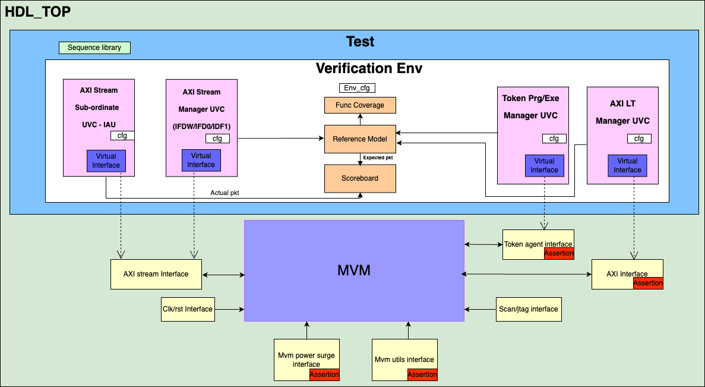

# MVM Verification Specification

## Introduction
The MVM subsystem is part of the AI engine core. It receives its data inputs from IFDW, IFD1 and IFD0 which reside in the ai_core_ls subsys. These blocks provide a stream of PWs into the L1 subsystem. The MVM output PW stream flows into the IAU. Furthermore, the MVM connects to the LP configuration AXI bus. From LP AXI bus, it receives data/instructions for its internal cmdBlocks and swdp_cmd_fifos, and CSR reads/writes. Besides, the MVM token signals are connected to the token manager ports. 

The MVM subsystem provides the functionality to perform matrix-vector-multiplications at very high-throughput using the full-custom in-memory compute banks (IMC_banks)

### Overview
This is the verification specification document for ai_core_mvm  testbench for the Europa project.


 - This work package belong to MVM sub-system.
 - MVM receives input from ai_core_ls subsys, perform matrix multipilcation and passes output to iau.
 - What are the high level use-cases? (need to update)


### Ownership
Who to contact for information

|  Team              | Contact         |
| ------------------ | --------------- |
| ***Architecture*** | roel.uytterhoeven@axelera.ai|
| ***Design***       | manuel.oliveira@axelera.ai|
| ***Verification*** | timir.soni@axelera.ai , prashanthi.chapala@axelera.ai|

### Reference
Where to find the design documentation

| Team               | Specification |
| ------------------ | ------------- |
| ***Architecture*** |[Arch Spec](https://axeleraai.atlassian.net/wiki/spaces/archrd/pages/384008429/AI-CORE-MVM#Requirements)|
| ***Design***       |[Block Spec](../../../docs/index.md)|

### Project Planning and Tracking
Where to find project plans and trackers

|   | Link |
| - | ---- |
| ***Plan*** |[Gitlab Issues Board](https://git.axelera.ai/ai-dv-team/dv-europa-planning/AIC-MVM)|
| ***Issues*** |[Gitlab Open Issues](https://git.axelera.ai/prod/europa/-/issues/?sort=title_desc&state=opened&label_name%5B%5D=block%3Aaic%3Amvm&author_username=timir.soni&first_page_size=20)|

## Block Level Testbenches

### Testbench 1
#### Overview
MVM verification environment is UVM based and coveres the sonstrained random test-vectors generation, checkers, assertions, connectivity checks and coverage

#### Diagram



 UVC contain the driver, sequencer and monitor. In the MVM verification environment
- Synopsys AXI LP UVC is used for LP interface, hence the UVC implementation for VIP is Synopsys dependant. AXI LP UVC’s generate the input traffic to/from MVM bus to configure the CSR, PRG/EXE, commands etc.
- Synopsys AXI streams UVC with data option are used for IFDW and IFD0 interface, hence the UVC implementation for VIP is Synopsys dependant. AXI streams UVC’s generate the Input stream to IFDW/IFD0 based on CSR, programming, executions and command etc.
- Ref model collects data from AXI LP monitor which includes CSR/PRG/EXE/Cmd etc. packets. It collects data from AXI stream monitor. Calculate the Matrix vector multiplication and send the expectation packet to AXI stream scoreboard.
- AXI stream scoreboard is used to compare the expectation packet received from ref model and Actual data received from AXI stream AIU monitor. AXI stream scoreboard can be reused.
- RAL verify the CSR block with reusable UVM test sequences and use define testcase.
- 
#### How to Run
How to check out and run..?

```
git clone git@git.axelera.ai:prod/europa.git
git fetch
git pull
source .env-default-modules
cd hw/ip/mvm/default/dv/sim
source setup_env.sh
make -C sim clean
make -C sim run_vcs VCS_DUMP_TYPE=fsdb
```
#### Regressions
Which regressions to run

| Regression | Description | Source | Link |
| ---------- | ----------- | ------ | ---- |
| regression | description | [Link to Source]() | [Last CI Run](https://git.axelera.ai/prod/europa/-/jobs/1076819)|

#### Metrics / Coverage Plan
VPlan / Verification IQ excel / csv file

| Name         | Type        | Req_id | Description | Measure | Source | Coverpoints if applicable |
| ----------   | ----------- | -------| ----------- | ------- | ------ | ------------------------- |
|Register Access Layer| UVM |MVM_RAL | Access the register field in MVM for default por read and bit bash test | test.percent_pass | mvm_ral_*test  |     
|Regiser Access Layer| UVM| MVM_REG | Negative testing: Write to read only register | Group | mvm_reg_wr_to_rd_only_reg_test  mvm_reg_wr_to_rd_only_reg_cg | mvm_wr_to_rd_only_register |
|Register and memory unmapped access | UVM | MVM_REG_OTHER_MAP_UNMAPPED_ACCESS  | Negative testing: Access the Unmapped register access and other map access | Group | mvm_unmapped_access_test mvm_unmapped_access_cg | mvm_unmapped_exe_csr_access mvm_unmapped_exe_cmd_fifo mvm_unmapped_exe_swdp_cmd_fifo mvm_unmapped_qcmd_desc_mem mvm_unmapped_prg_csr_access mvm_unmapped_prg_cmd_fifo mvm_unmapped_prg_swdp_cmd_fifo |
|Random matrix calculation | UVM | MVM_RAND_ACCESS | Perform the randomly select matrix and calculate  and compare data (Supporting int8 as well as int16 weight input) | Group | mvm_rand_matrix_mult_test mvm_rand_matrix_mult_cg |A_s A_u_pw A_t_pw Wb_u_pw Wb_t_pw A_s A_u_pw A_t_pw Wb_u_pw Wb_t_pw loop_len loop_ptr loop_iter b2b_non_b2b_transfer ifdw_valid_high_low_longer_time_dist ifd0_valid_high_low_longer_time_dist iau_backpressure_high_low_longer_time_dist power_supply_drop_mitigation_assertion mvm_qcmd_multi_load_cmd mvm_qcmd_overflow mvm_qcmd_full mvm_concurrent_desc_mem_with_other_operation
|Concurrent IFDW IFD0 | UVM | MVM_CONCURRENT_IFDW_IFD0 |IFDW and IFD0 execute parrallel with differet sets  and compare data (Supporting int8 as well as int16 weight input) |Group |mvm_concurrent_prg_exe_rand_matrix_mult_test mvm_concurrent_prg_exe_rand_matrix_mult_cg | mvm_concurrent_ifdw_ifd0 |
|Matrix calculation with CSR select | UVM | MVM_CSR_MATRIX_CALCULATE |Configure csr valid random and perform matrix calculation and compare data (Supporting int8 as well as int16 weight input) | Group | mvm_concurrent_prg_exe_rand_matrix_mult_cg |mvm_matrix_calculation_with_*_csr_select |
|Axi attributes and Protocol checks| UVM | MVM_AXI_ATTRIBUTES_PROTOCOL_CHECK |Random generate axi attributes and verify protocol checksGroupmvm_axi_rnd_test mvm_axi_rnd_discr_test mvm_axi_attributes_cg | inbuild_synposys_cp |
|Data bypass |UVM |MVM_DATA_BYPASS_WITH_NORMAL_PATH | Verify the bypass datapath with mix of normal datapath and compare data |Group |mvm_datapath_bypass_test mvm_datapath_bypass_cg | mvm_datapath_bypass mvm_datapath_bypass_normal_datapath |
|Interrupts | UVM |MVM_IRQ | Verify the all Irq's and check status and disable the interrupt |Group |ai_core_irq_test  mvm_irq_cg |mvm_err_ifd0_dpcmd_unaligned_tlast mvm_err_ifdw_dpcmd_unaligned_tlast mvm_err_bypass_when_dp_not_idle mvm_err_concurrent_exe_prg_on_ws mvm_err_exe_inp_offset_size_overflow mvm_err_exe_oup_offset_size_overflow mvm_err_prg_row_offset_size_overflow mvm_err_prg_col_offset_size_overflow mvm_exe_cmdblk_cmd_dropped mvm_exe_swdp_cmd_dropped mvm_prg_cmdblk_cmd_dropped mvm_prg_swdp_cmd_dropped mvm_err_exe_illegal_loop_iter mvm_err_exe_illegal_loop_len mvm_err_exe_qcmd_mem_addr_overflow mvm_err_exe_illegal_cmd_opcode mvm_err_exe_illegal_loop_start mvm_err_prg_illegal_cmd_opcode mvm_err_prg_illegal_weight_set mvm_dbg_sw_interrupt |
|Token | UVM |MVM_TOKEN |Verify the Token and sw token for PRG/EXE Sequences | Group | ai_core_mvm_random_matrix_multiplication_token_test mvm_exe_prg_token_cg |mvm_token_exe_prg |
|Command unpacking | UVM |MVM_CMD_UNPACKING | Verify the command unpacking |Group | mvm_command_unpacking_test mvm_command_unpacking_cg | mvm_command_unpacking |
|Test mode verification | UVM | MVM_TM |Verify the test mode |Group | mvm_test_mode_test mvm_test_mode_cgmvm_test_mode |
|BIST verification |UVM | MVM_MBIST | MVM_CBIST | Verify the Bist mode with and without error (Supporting int8 as well as int16 weight input) | Group |mvm_bist_mode_test mvm_bist_mode_cg |mvm_bist_mode | 
|Clock Divider | UVM |MVM_CLK_DIV (not supported by design yet) | Verify clock divider logic (#1521) | Group | mvm_*test | mvm_clk_div_cg | mvm_clk_div_mode | 
|Power surge verification |UVM | MVM_PWR_SURGE (not supported by design yet) | Verify the smooth out the current consumption curve of the MVM  when the unit is starting or stalled back - and also when it is operation is at a utilization < 100% (#985) |Group |mvm_power_surge_test mvm_power*cg | mvm_power_mode |
|MVM util limiter | UVM | MVM_UTILS_LIMITER (not supported by design yet) Sets the desired utilisation limit 7 bit value and enables or activates the limiting and sets the exponential averaging factor on the util filtering 8bit value and check 7bit output of the average util value are always valid when the filter is active(#2723) | Group |mvm_util_limiter_test | mvm_util_limiter*cg | mvm_util_limiter_mode | 
|MVM  Bandwidth | UVM | MVM Double Input BW | Perform all above mentioned operation with two inputs (IFD0 and newly introduced IFD1 resulting in double input bandwidth) and verify simple and advance mode | Group | mvm_double_bw_test mvm_double*cg |mvm_double_bw |
|MVM ICDF stimulus |UVM | Mvm icdf stimulus test | Utilising the ICDF stimulus passed by Architecture team and verify it |Group | mvm_icdf*stimulus_test |TBD | 
|MVM Observation |UVM | AI_CORE_MVM_OBS | Check the observation signals |Group |TBD

## MVM Test-cases
  The test-cases for verifying the MVM are listed in the following sections. This section lists the test-cases that target AXI features verification. 
  - The sequences used are picked up from the provided Synopsys AXI VIP sequence library. 
-  Most of are user-defined customization is added to the sequences and transactions to align with MVM Module requirements/constraints. All tests have the capability to send a defined number of sequences.
 ### Register testcase
This section lists the test-cases that target AXI features verification. 
- The sequences used are picked up from the provided Synopsys AXI VIP sequence library. 
 - Most of are user-defined customization is added to the sequences and transactions to align with MVM Module requirements/constraints.
 - All tests have the capability to send a defined number of sequences.

#### Registers Hardware Reset Values Test-case
- Description: This test verifies reset values for MVM CSR blocks
- Strategy: Following the reset and, this test-case employs UVM built-in “uvm_reg_hw_reset_seq” to send read transactions to all the registers in the CSR block of MVM Sub-System
- Target: AXI VIP’s implicit RAL predictor will ensure that there is no mismatch between the reset values of RAL registers and the DUT
Test Name: ai_core_mvm_ral_hw_rst_test

#### Registers Bit-Bash Test-case Description: 
- Description:This test verifies bit-bash operation for all registers of all MVM CSR blocks
- Strategy: Following the reset, this test-case employs UVM built-in “uvm_reg_hw_reset_seq” to perform bit-bash on all the registers in the CSR blocks of MVM Sub-System
- Target: Verify the implementation of registers by attempting to write 1’s and 0’s to every bit in it, via every address map in which the register is mapped, making sure that the resulting value matches the mirrored value. AXI VIP’s implicit RAL predictor will ensure that there is no mismatch detected between the written and read-back values
- Test Name: ai_core_mvm_ral_bit_bash_test

#### Registers Single Write/Read Test-case
- Description: This test verifies write and read to one register from MVM CSR blocks
- Strategy: Following the reset, this test-case employs user defined “ral_access_single_write_read_seq” to send read followed by write transaction to one register from CSR blocks of MVM Sub-System
- Target: An in-house built data-integrity checker will ensure that there is no mismatch between the written and read back values
- Test Name: ai_core_mvm_ral_single_wrrd_test

#### Registers Full RAL Write/Read Test-case
- Description: This test verifies write and read to all register of MVM CSR blocks through the RAL models
- Strategy: Following the reset, this test-case employs user defined “mvm_reg_wr_rd_seq” to send write followed by read transactions to all registers of CSR blocks of MVM sub-System through the RAL
- Target: An in-house data-integrity checker will ensure that there is no mismatch between the written and read back values
- Test Name: ai_core_mvm_ral_wrrd_test

#### Registers Unmapped address access Test-case
- Description: This test verifies write and read to unmapped address access from MVM CSR blocks
- Strategy: Following the reset, this test-case employs user defined “mvm_reg_unmapped_address_access_seq”. Write/Read to unmapped address access and check the response. Its direct test for CSR blocks of MVM Sub-System
- Target: An in-house built data-integrity checker will ensure that there is no mismatch between the written and read back values
- Test Name: ai_core_mvm_reg_unmapped_address_access_test

#### Registers burst access Test-case
- Description: This test verifies write and read to burst access from MVM CSR blocks
- Strategy: Following the reset, this test-case employs user defined “mvm_reg_burst_seq”. Write/Read to INCR burst access and check the response. Its direct test for CSR blocks of MVM Sub-System
- Target: An in-house built data-integrity checker will ensure that there is no mismatch between the written and read back values
- Test Name: ai_core_mvm_reg_burst_access_test

#### Registers burst access with boundary crossing Test-case
- Description: This test verifies write and read to burst access with boundary crossing from MVM CSR blocks
- Strategy: Following the reset, this test-case employs user defined “mvm_reg_burst_with_crossing_boundary_seq”. Write/Read to INCR burst access and crossing the boundary. Its direct test for CSR blocks of MVM Sub-System
- Target: An in-house built data-integrity checker will ensure that there is no mismatch between the written and read back values
- Test Name: mvm_reg_burst_with_crossing_boundary_test

#### Registers narrow transfer Test-case
- Description: This test verifies write and read with data width size < 64bits from MVM CSR blocks Confidential Page 28
- Strategy: Following the reset, this test-case employs user defined “mvm_reg_narrow_transfer_seq”. Write/Read access with size 32/16/8 bits. Its direct test for CSR blocks of MVM Sub-System
- Target: An in-house built data-integrity checker will ensure that there is no mismatch between the written and read back values
- Test Name: ai_core_mvm_reg_narrow_access_test

### MVM use-cases
Test suit responsible for basic data flow + b2b + no b2b + stress + back pressure + negative test
#### MVM Use-case: Basic Flow
- Description: This test verifies matrix multiplication operations by using selective input feeders and weights/coefficients
- Strategy: Following the reset, perform the programming flow in below:
1. Set CSR PRG cmd block and CSR EXE cmd block
2. Configure the Programming command (Header+ program command) as 64x64 matrix
3. Transfer data to IFDW
4. Wait for CSR to complete the transfer
5. Load EXE DPcmd instruction in QCMD mem 64x64 matrix
6. Configure the executing command (Header+ execute command)
7. Transfer data to IFD0
8. Wait for CSR to complete the transfer
- Target: Ref model expectation data should match with actual data received from IAU in MVM scoreboard. There should be no checker failures reported over by the AXI VIP and MVM scoreboard
- Test Name: mvm_basic_test

#### MVM Use-case: Random matrix selection
Description: This test verifies matrix multiplication operations by using selective random matrix
Strategy: Following the reset, perform the programming flow in below:
1. Set CSR PRG cmd block
2. Set CSR EXE cmd block
3. Configure the Programming command (Header+ program command) - select 576x512 matrix for 4 times or partial selection of matrix
4. Transfer data to IFDW (576x512 for 4 times)
5. Wait for CSR to complete the transfer
6. Load EXE DPcmd instruction in QCMD mem: Random selection
7. Configure the executing command (Header+ execute command): Random selection
8. Transfer data to IFD0
9. Wait for CSR to complete the transfer
10. Repeat 6-9 for 100 times
- Target: Ref model expectation data should match with actual data received from IAU in MVM scoreboard. There should be no checker failures reported over by the AXI VIP and MVM scoreboard
- Test Name: mvm_random_test

#### MVM Use-case: b2b matrix selection
- Description: This test verifies matrix multiplication operations by using selective b2b random matrix
- Strategy: Following the reset, perform the programming flow in below:
1. Set CSR PRG cmd block
2. Set CSR EXE cmd block
3. Configure the Programming command (Header+ program command) - select 576x512 matrix for 4 times
4. Transfer data to IFDW (576x512 for 4 times)
5. Wait for CSR to complete the transfer
6. Load EXE DPcmd instruction in QCMD mem: Random selection (no delay)
7. Configure the executing command (Header+ execute command): Random selection (no delay)
8. Transfer data to IFD0
9. Wait for CSR to complete the transfer
10. Repeat 6-9 for 100 times

- Target: Ref model expectation data should match with actual data received from IAU in MVM scoreboard. There should be no checker failures reported over by the AXI VIP and MVM scoreboard
- Test Name: mvm_b2b_matrix_test

#### MVM Use-case: Concurrent stream data transfer at IFDW and IFD0
- Description: This test verifies matrix multiplication Concurrent stream data transfer at IFDW and IFD0
Strategy: Following the reset, perform the programming flow in below:
1. Programming follows the section 4.2.2 but stream transfer/command changes below
2. Concurrency for IFDW and IFD0
a) Concurrency for prg and exe with different weight sets
b) No Concurrency for prg and exe on same weight sets
- Target: Ref model expectation data should match with actual data received from IAU in MVM scoreboard. There should be no checker failures reported over by the AXI VIP and MVM scoreboard
- Test Name: mvm_concurrency_valid_stream_test

#### MVM Use-case: Concurrent stream data transfer at IFDW and IFD0 (negative test)
- Description: This test verifies matrix multiplication Concurrent stream data transfer at IFDW and IFD0 with random selection of exe and prg selection
- Strategy: Following the reset, perform the programming flow in below:
1. Programming follows the section 4.2.2 but stream transfer/command changes below
2. Concurrency for IFDW and IFD0
3. Concurrency: Prg and exe of same weight sets, negative test, more valid for IRQ, we will cover more detail in IRQ testing)
- Target: Ref model expectation data should match with actual data received from IAU in MVM scoreboard. There should be no checker failures reported over by the AXI VIP and MVM scoreboard
- Test Name: mvm_concurrency_no_valid_stream_test

#### MVM Use-case: Concurrent stream with backpressure + b2b + No b2b
- Description: This test verifies matrix multiplication Concurrent stream data transfer at IFDW and IFD0
- Strategy: Following the reset, perform the programming flow in below:
1. Programming follows the section 4.2.2 but stream transfer/command changes below
2. Back pressure at IFDW and IFD0 and IAU
3. Send b2b data and add random delay (Mix flavour to avoid 100% b2b)
- Target: Ref model expectation data should match with actual data received from IAU in MVM scoreboard. There should be no checker failures reported over by the AXI VIP and MVM scoreboard
- Test Name:   mvm_concurrency_valid_stream_b2b_backpressure_test

### AXI4 LP Interface – Test-cases
Describe the PRG/EXE/Command Axi attributes
4.3.1 MVM: Random PRG
Description: This test verifies matrix multiplication operations with random selection of Axi attributes
Strategy: Following the reset, perform the programming flow in below:
1. Set CSR PRG cmd block
2. Set CSR EXE cmd block
3. Configure the Programming command (Header+ program command) - Random command
a) Random selection of FIXED, INCR are valid and no WRAP
b) Random selection of Size <=2 Is this valid
c) Multiple outstanding
d) Normal response, decode Error, Slave error, No support Exclusive response
4. Transfer data to IFDW
5. Wait for CSR to complete the transfer (Step repeat from 3 to 5 for 4 times to cover all weight sets)
6. Load EXE DPcmd instruction in QCMD mem: Random selection in programming range
7. Configure the executing command (Header+ execute command): Random selection in programming range
8. Transfer data to IFD0
9. Wait for CSR to complete the transfer
10. Repeat 6-9 for 100 times
- Target: Ref model expectation data should match with actual data received from IAU in MVM scoreboard. There should be no checker failures reported over by the AXI VIP and MVM scoreboard
- Test Name: mvm_random_prg_test

#### MVM: Random QCMD
- Description: This test verifies matrix multiplication operations with random selection of Axi attributes
- Strategy: Following the reset, perform the programming flow in below:
1. Set CSR PRG cmd block
2. Set CSR EXE cmd block
3. Configure the Programming command (Header+ program command) - Random command
4. Transfer data to IFDW
5. Wait for CSR to complete the transfer (Step repeat from 3 to 5 for 4 times to cover all weight sets)
6. Load EXE DPcmd instruction in QCMD mem: Random selection
a) Random selection of FIXED, INCR are valid and no WRAP
b) Random selection of Size <=2 Is this valid
c) Multiple outstanding
d) Normal response, decode Error, Slave error, No support Exclusive response
7. Configure the executing command (Header+ execute command): Random selection
8. Transfer data to IFD0
9. Wait for CSR to complete the transfer
10. Repeat 6-9 for 10 times
- Target: Ref model expectation data should match with actual data received from IAU in MVM scoreboard. There should be no checker failures reported over by the AXI VIP and MVM scoreboard
- Test Name: mvm_random_cmd_test

#### MVM: Random EXE
- Description: This test verifies matrix multiplication operations with random selection of Axi attributes
Strategy: Following the reset, perform the programming flow in below:
1. Set CSR PRG cmd block
2. Set CSR EXE cmd block
3. Configure the Programming command (Header+ program command) - Random command
4. Transfer data to IFDW
5. Wait for CSR to complete the transfer (Step reapeat from 3 to 5 for 4 times to cover all weight sets)
6. Load EXE DPcmd instruction in QCMD mem: Random selection
7. Configure the executing command (Header+ execute command): Random selection
a) Random selection of FIXED, INCR are valid and no WRAP
b) Random selection of Size <=2 Is this valid
c) Multiple outstanding
d) Normal response, decode Error, Slave error, No support Exclusive response
8. Transfer data to IFD0
9. Wait for CSR to complete the transfer
10. Repeat 6-9 for 10 times
- Target: Ref model expectation data should match with actual data received from IAU in MVM scoreboard. There should be no checker failures reported over by the AXI VIP and MVM scoreboard
- Test Name: mvm_random_exe_test

#### MVM: Random PRG/QCMD/EXE
Description: This test verifies matrix multiplication operations with random selection of Axi attributes
Strategy: Following the reset, perform the programming flow in below:
1. Set CSR PRG cmd block
2. Set CSR EXE cmd block
3. Configure the Programming command (Header+ program com mand) - Random command
a) Random selection of FIXED, INCR are valid and no WRAP
b) Random selection of Size <=2 Is this valid
c) Multiple outstanding
d) Normal response, decode Error, Slave error, No support Exclusive response
4. Transfer data to IFDW
5. Wait for CSR to complete the transfer (Step repeat from 3 to 5 for 4 times to cover all weight sets)
6. Load EXE DPcmd instruction in QCMD mem: Random selection
a) Random selection of FIXED, INCR are valid and no WRAP
b) Random selection of Size <=2 Is this valid
c) Multiple outstanding
d) Normal response, decode Error, Slave error, No support Exclusive response
7. Configure the executing command (Header+ execute command): Random selection
a) Random selection of FIXED, INCR are valid and no WRAP
b) Random selection of Size <=2 Is this valid
c) Multiple outstanding
d) Normal response, decode Error, Slave error, No support Exclusive response
8. Transfer data to IFD0
9. Wait for CSR to complete the transfer
10. Repeat 6-9 for 10 times
Target: Ref model expectation data should match with actual data received from IAU in MVM scoreboard. There should be no checker failures reported over by the AXI VIP and MVM scoreboard
Test Name: mvm_random_prg_qcmd_exe_test

#### MVM : Random PRG/QCMD/EXE (Négative)
Description: This test verifies matrix multiplication operations with random selection of Axi attributes with no valid prg/exe/qcmd sequence
Strategy: Following the reset, perform the programming flow in below:
1. Set CSR PRG cmd block
2. Set CSR EXE cmd block
3. Configure the Programming command (Header+ program command) - Random command
a) Random selection of FIXED, INCR are valid and no WRAP
b) Random selection of Size <=2 Is this valid
c) Multiple outstanding
d) Normal response, decode Error, Slave error, No support Exclusive response
4. Transfer data to IFDW
5. Wait for CSR to complete the transfer (Step repeat from 3 to 5 for 4 times to cover all weight sets)
6. Load EXE DPcmd instruction in QCMD mem: Random selection
Confidential Page 33
MVM Verification Plan 26.03.2024
a) Random selection of FIXED, INCR are valid and no WRAP
b) Random selection of Size <=2 Is this valid
c) Multiple outstanding
d) Normal response, decode Error, Slave error, No support Exclusive response
7. Configure the executing command (Header+ execute command): Random selection
a) Random selection of FIXED, INCR are valid and no WRAP
b) Random selection of Size <=2 Is this valid
c) Multiple outstanding
d) Normal response, decode Error, Slave error, No support Exclusive response
8. Transfer data to IFD0
9. Wait for CSR to complete the transfer
10. Repeat 6-9 for 10 times
- Target: Ref model expectation data should match with actual data received from IAU in MVM scoreboard. There should be no checker failures reported over by the AXI VIP and MVM scoreboard
- Test Name: mvm_random_prg_qcmd_exe_negative_test

### MVM Bypass modes
#### MVM Data path bypass 
##### MVM bypass: Sign_extend with EXE command

- Description: This test verifies bypass mode for exe dp cmd
Strategy: Following the reset, perform the programming flow in below:
1. Set CSR PRG cmd block
2. Set CSR EXE cmd block
3. Configure the executing command (Header+ execute command) with bypass mode
4. Transfer data to IFD0
5. Wait for CSR to complete the transfer
- Target: Ref model expectation data should match with actual data received from IAU in MVM scoreboard. There should be no checker failures reported over by the AXI VIP and MVM scoreboard
- Test Name: mvm_bypass_sign_extends_exe_cmd_test

### MVM IRQ
#### MVM irq
- Description: This test verifies interrupts
- Strategy: Following the reset, perform the programming flow in below:
1. Generate the DBG_SW_INTERRUPT and check the assertion
2. Generate the ERR_PRG_ILLEGAL_WEIGHT_SET and check the assertion
3. Generate the ERR_PRG_ILLEGAL_CMD_OPCODE and check the assertion
4. Generate the ERR_EXE_ILLEGAL_QCMD_PTR and check the assertion
5. Generate the ERR_EXE_ILLEGAL_CMD_OPCODE and check the assertion
6. Generate the ERR_EXE_QCMD_MEM_ADDR_OVERFLOW and check the assertion
7. Generate the ERR_EXE_ILLEGAL_QCMD_LEN and check the assertion
8. Generate the ERR_EXE_ILLEGAL_QCMD_ITER and check the assertion
9. Generate the PRG_SWDP_CMD_DROPPED and check the assertion
10. Generate the PRG_CMDBLK_CMD_DROPPED and check the assertion
11. Generate the EXE_SWDP_CMD_DROPPED and check the assertion
12. Generate the EXE_CMDBLK_CMD_DROPPED and check the assertion
13. Generate the ERR_PRG_COL_OFFSET_SIZE_OVERFLOW and check the assertion
14. Generate the ERR_PRG_ROW_OFFSET_SIZE_OVERFLOW and check the assertion
15. Generate the ERR_EXE_OUP_OFFSET_SIZE_OVERFLOW and check the assertion
16. Generate the ERR_EXE_INP_OFFSET_SIZE_OVERFLOW and check the assertion
17. Generate the ERR_CONCURRENT_EXE_PRG_ON_WS and check the assertion
18. Generate the ERR_BYPASS_WHEN_DP_NOT_IDLE and check the assertion
19. Generate the ERR_IFDW_DPCMD_UNALIGNED_TLAST and check the assertion
20. Generate the ERR_IFD0_DPCMD_UNALIGNED_TLAST and check the assertion
- Target: Ref model expectation data should match with actual data received from IAU in MVM scoreboard. There should be no checker failures reported over by the AXI VIP and MVM scoreboard. Check the assertion checks.
- Test Name: mvm_irq_test

### MVM stress reset
#### MVM stress reset
- Description: This test verifies behaviour of reset
- Strategy: Following the reset, perform the programming flow in below:
1. Pick the any random and complex tectcase and provide reset in middle of transaction to check the DUT behaviour
- Target: Ref model expectation data should match with actual data received from IAU in MVM scoreboard. There should be no checker failures reported over by the AXI VIP and MVM scoreboard
- Test Name: mvm_stress_reset_test

### MVM clock gating
#### MVM clock gating
- Description: This test verifies behaviour of clock gating
Strategy: Following the reset, perform the programming flow in below:
1. Pick the any random and complex tectcase and provide enable clock gating by configure the CSR register in middle of transaction to check the DUT behaviour
- Target: Ref model expectation data should match with actual data received from IAU in MVM scoreboard. There should be no checker failures reported over by the AXI VIP and MVM scoreboard
- Test Name: mvm_clok_gating_test

### MVM Double input Bandwidth
#### MVM DIBW Prgmode and simple mode with input precision 0
- Description: This test verifies the behaviour of prg mode for the DIBW
Strategy: Write after reset perform the programming flow as below:
1. Set CSR PRG cmd block cmd block with prg mode 0
2. Set CSR EXE cmd block with simple mode and input precision 0
3. Configure the Programming command (Header+ program command) - select 576x512 matrix for 4 times or partial selection of matrix
4. Transfer data to IFDW (576x512 for 4 times)
5. Wait for CSR to complete the transfer
6. Load EXE DPcmd instruction in QCMD mem: Random selection
7. Configure the executing command (Header+ execute command): Random selection
8. Transfer data to IFD0
9. Wait for CSR to complete the transfer
- Target: Ref model expectation data should match with actual data received from IAU in MVM scoreboard. There should be no checker failures reported over by the AXI VIP and MVM scoreboard
- Test Name: ai_core_mvm_dibw_simple_prg_mode_0_directed_matrix_multiplication test_int8

#### DIBW Prgmode and simple mode with input precision 0
Strategy: Write after reset perform the programming flow as below:
1. Set CSR PRG cmd block with prg mode 1
2. Set CSR EXE cmd block with simple mode and input precision 0
3. Configure the Programming command (Header+ program command) - select 576x512 matrix for 4 times or partial selection of matrix
4. Transfer data to IFDW (576x512 for 4 times)
5. Wait for CSR to complete the transfer
6. Load EXE DPcmd instruction in QCMD mem: Random selection
7. Configure the executing command (Header+ execute command): Random selection
8. Transfer data to IFD0 & IFD2
9. Wait for CSR to complete the transfer
- Target: Ref model expectation data should match with actual data received from IAU in MVM scoreboard. There should be no checker failures reported over by the AXI VIP and MVM scoreboard
- Test Name: ai_core_mvm_dibw_simple_prg_mode_1_directed_matrix_multiplication test_int8

#### DIBW Prgmode and simple mode with input precision 0
Strategy: Write after reset perform the programming flow as below:
1. Set CSR PRG cmd block with prg mode 2
2. Set CSR EXE cmd block with simple mode and input precision 0
3. Configure the Programming command (Header+ program command) - select 576x512 matrix for 4 times or partial selection of matrix
4. Transfer data to IFDW (576x512 for 4 times)
5. Wait for CSR to complete the transfer
6. Load EXE DPcmd instruction in QCMD mem: Random selection
7. Configure the executing command (Header+ execute command): Random selection
8. Transfer data to IFD0
9. Wait for CSR to complete the transfer
- Target: Ref model expectation data should match with actual data received from IAU in MVM scoreboard. There should be no checker failures reported over by the AXI VIP and MVM scoreboard
- Test Name: ai_core_mvm_dibw_simple_prg_mode_2_directed_matrix_multiplication test_int8

#### DIBW Prgmode and simple mode with input precision 0
Strategy: Write after reset perform the programming flow as below:
1. Set CSR PRG cmd block with rand prg mode 
2. Set CSR EXE cmd block with simple mode and input precision 0
3. Configure the Programming command (Header+ program command) - select 576x512 matrix for 4 times or partial selection of matrix
4. Transfer data to IFDW (576x512 for 4 times)
5. Wait for CSR to complete the transfer
6. Load EXE DPcmd instruction in QCMD mem: Random selection
7. Configure the executing command (Header+ execute command): Random selection
8. Transfer data to IFD0 & IFD2
9. Wait for CSR to complete the transfer
10. Repeat 6-9 for 100 times
- Target: Ref model expectation data should match with actual data received from IAU in MVM scoreboard. There should be no checker failures reported over by the AXI VIP and MVM scoreboard
- Test Name: ai_core_mvm_dibw_simple_random_prg_mode_directed_matrix_multiplication test_int8

#### DIBW Prgmode and simple mode with input precision 1
1. Set CSR PRG cmd block cmd block with prg mode 0
2. Set CSR EXE cmd block with simple mode and input precision 1
3. Configure the Programming command (Header+ program command) - select 576x512 matrix for 4 times or partial selection of matrix
4. Transfer data to IFDW (576x512 for 4 times)
5. Wait for CSR to complete the transfer
6. Load EXE DPcmd instruction in QCMD mem: Random selection
7. Configure the executing command (Header+ execute command): Random selection
8. Transfer data to IFD0 & IFD2
9. Wait for CSR to complete the transfer
- Target: Ref model expectation data should match with actual data received from IAU in MVM scoreboard. There should be no checker failures reported over by the AXI VIP and MVM scoreboard
- Test Name: ai_core_mvm_dibw_simple_prg_mode_0_directed_matrix_multiplication test_int16

#### DIBW Prgmode and simple mode with input precision 1
Strategy: Write after reset perform the programming flow as below:
1. Set CSR PRG cmd block with prg mode 1
2. Set CSR EXE cmd block with simple mode and input precision 1
3. Configure the Programming command (Header+ program command) - select 576x512 matrix for 4 times or partial selection of matrix
4. Transfer data to IFDW (576x512 for 4 times)
5. Wait for CSR to complete the transfer
6. Load EXE DPcmd instruction in QCMD mem: Random selection
7. Configure the executing command (Header+ execute command): Random selection
8. Transfer data to IFD0 & IFD2
9. Wait for CSR to complete the transfer
- Target: Ref model expectation data should match with actual data received from IAU in MVM scoreboard. There should be no checker failures reported over by the AXI VIP and MVM scoreboard
- Test Name: ai_core_mvm_dibw_simple_prg_mode_1_directed_matrix_multiplication test_int16

#### DIBW Prgmode and simple mode with input precision 0
Strategy: Write after reset perform the programming flow as below:
1. Set CSR PRG cmd block with prg mode 2
2. Set CSR EXE cmd block with simple mode and input precision 0
3. Configure the Programming command (Header+ program command) - select 576x512 matrix for 4 times or partial selection of matrix
4. Transfer data to IFDW (576x512 for 4 times)
5. Wait for CSR to complete the transfer
6. Load EXE DPcmd instruction in QCMD mem: Random selection
7. Configure the executing command (Header+ execute command): Random selection
8. Transfer data to IFD0 & IFD2
9. Wait for CSR to complete the transfer
- Target: Ref model expectation data should match with actual data received from IAU in MVM scoreboard. There should be no checker failures reported over by the AXI VIP and MVM scoreboard
- Test Name: ai_core_mvm_dibw_simple_prg_mode_2_directed_matrix_multiplication test_int16

#### DIBW Prgmode and simple mode with input precision 1
Strategy: Write after reset perform the programming flow as below:
1. Set CSR PRG cmd block with rand prg mode 
2. Set CSR EXE cmd block with simple mode and input precision 1
3. Configure the Programming command (Header+ program command) - select 576x512 matrix for 4 times or partial selection of matrix
4. Transfer data to IFDW (576x512 for 4 times)
5. Wait for CSR to complete the transfer
6. Load EXE DPcmd instruction in QCMD mem: Random selection
7. Configure the executing command (Header+ execute command): Random selection
8. Transfer data to IFD0 & IFD2
9. Wait for CSR to complete the transfer
10. Repeat 6-9 for 100 times
- Target: Ref model expectation data should match with actual data received from IAU in MVM scoreboard. There should be no checker failures reported over by the AXI VIP and MVM scoreboard
- Test Name: ai_core_mvm_dibw_simple_random_prg_mode_directed_matrix_multiplication test_int16

#### Random matrix multiplication tests with dibw with input precision 0
Strategy: Write after reset perform the programming flow as below:
1. Set CSR PRG cmd block with rand prg mode 
2. Set CSR EXE cmd block with simple mode and input precision 1
3. Configure the Programming command (Header+ program command) - select 576x512 matrix for 4 times or partial selection of matrix
4. Transfer data to IFDW (576x512 for 4 times)
5. Wait for CSR to complete the transfer
6. Load EXE DPcmd instruction in QCMD mem: Random selection
7. Configure the executing command (Header+ execute command): Random selection
8. Transfer data to IFD0 & IFD2
9. Wait for CSR to complete the transfer
10. Repeat 6-9 for 100 times
- Target: Ref model expectation data should match with actual data received from IAU in MVM scoreboard. There should be no checker failures reported over by the AXI VIP and MVM scoreboard
- Test Name: ai_core_mvm_dibw_simple_prgmode_random_matrix_multiplication_test_int8

#### Random concurrent exe prg test with dibw with input precision 0
1. Set CSR PRG cmd block with rand prg mode 
2. Set CSR EXE cmd block with simple mode and input precision 1
3. Configure the Programming command (Header+ program command) - select 576x512 matrix for 4 times or partial selection of matrix
4. Transfer data to IFDW (576x512 for 4 times)
5. Wait for CSR to complete the transfer
6. Load EXE DPcmd instruction in QCMD mem: Random selection
7. Configure the executing command (Header+ execute command): Random selection
8. Transfer data to IFD0 & IFD2
9. Wait for CSR to complete the transfer
10. Repeat 6-9 for 100 times
- Target: Ref model expectation data should match with actual data received from IAU in MVM scoreboard. There should be no checker failures reported over by the AXI VIP and MVM scoreboard
- Test Name: ai_core_mvm_simple_prg_concurrent_prg_exe_random_matrix_multiplication_test_int8

#### Random matrix multiplication tests with dibw with input precision 1
Strategy: Write after reset perform the programming flow as below:
1. Set CSR PRG cmd block with rand prg mode 
2. Set CSR EXE cmd block with simple mode and input precision 1
3. Configure the Programming command (Header+ program command) - select 576x512 matrix for 4 times or partial selection of matrix
4. Transfer data to IFDW (576x512 for 4 times)
5. Wait for CSR to complete the transfer
6. Load EXE DPcmd instruction in QCMD mem: Random selection
7. Configure the executing command (Header+ execute command): Random selection
8. Transfer data to IFD0 & IFD2
9. Wait for CSR to complete the transfer
10. Repeat 6-9 for 100 times
- Target: Ref model expectation data should match with actual data received from IAU in MVM scoreboard. There should be no checker failures reported over by the AXI VIP and MVM scoreboard
- Test Name: ai_core_mvm_dibw_simple_prgmode_random_matrix_multiplication_test_int16

#### Random concurrent exe prg test with dibw with input precision 1
1. Set CSR PRG cmd block with rand prg mode 
2. Set CSR EXE cmd block with simple mode and input precision 1
3. Configure the Programming command (Header+ program command) - select 576x512 matrix for 4 times or partial selection of matrix
4. Transfer data to IFDW (576x512 for 4 times)
5. Wait for CSR to complete the transfer
6. Load EXE DPcmd instruction in QCMD mem: Random selection
7. Configure the executing command (Header+ execute command): Random selection
8. Transfer data to IFD0 & IFD2
9. Wait for CSR to complete the transfer
10. Repeat 6-9 for 100 times
- Target: Ref model expectation data should match with actual data received from IAU in MVM scoreboard. There should be no checker failures reported over by the AXI VIP and MVM scoreboard
- Test Name: ai_core_mvm_simple_prg_concurrent_prg_exe_random_matrix_multiplication_test_int16


## Formal Proofs
### Overview
- Need to update (TODO later)

### How To Run

```
git clone etc.
source ....
cd ...
make ...
```

#### Regressions
Which regressions to run

| Regression | Description | Source | Link |
| ---------- | ----------- | ------ | ---- |
| regression | description | [Link to Source]() | [Last CI Run]()|

#### Metrics / Coverage Plan
VPlan / Verification IQ excel / csv file

- [https://git.axelera.ai/prod/europa/-/tree/main/hw/ip/mvm/default/dv/docs/vplan?ref_type=heads]

## System Level Testcases
Tests to be run at top level / Veloce - Need to update (TODO later)

- Need to update (TODO later)

| Testcase   | Description | Source | Link |
| --------   | ----------- | ------ | ---- |
| testcase   | description | [Link to Source]()| [Last CI Run]()|

