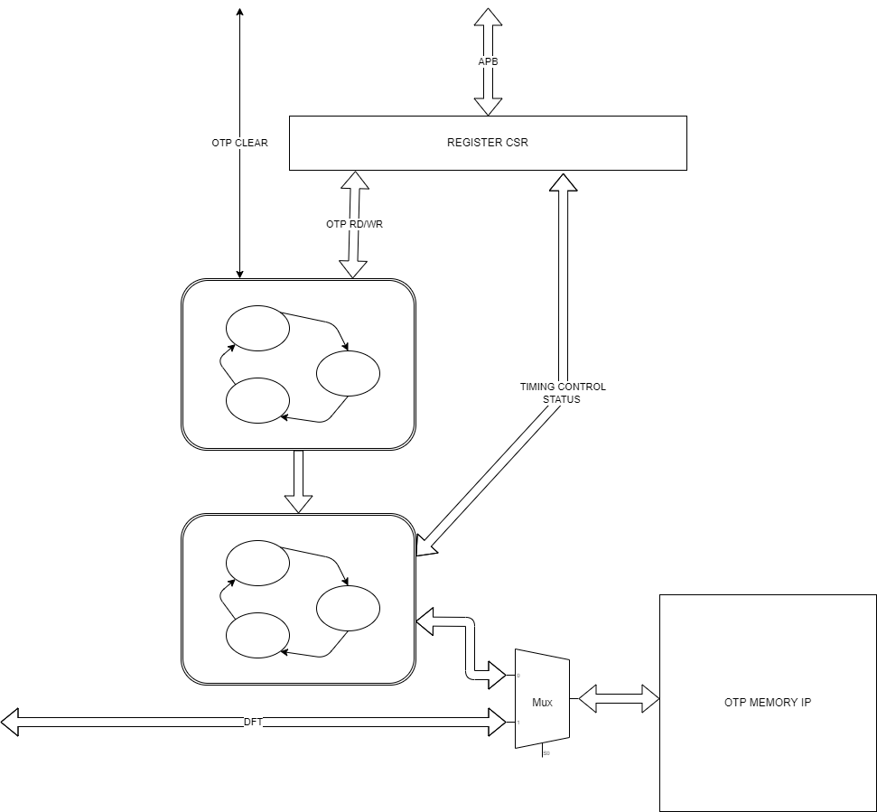
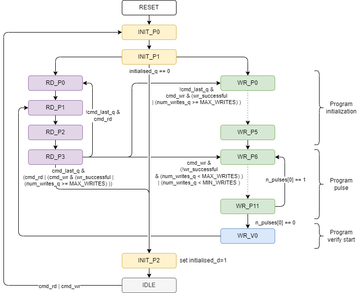
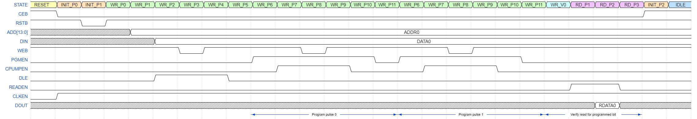

## Introduction

The OTP wrapper block handles all interfacing, DFT and security logic to integrate the Samsung One Time Programmable memory into the system controller subsystem.

The OTP memory allows the user to program (or blow) bit elements of the array to value '1'. Once blown the bit element is unable to revert back to a '0' value. State is maintained over reset and can be considered similar to a bank of on chip fuses. Unlike the fuse block, an internal charge pump is used and no external power supply is required.

System access to the OTP block is done through an APB interface.

## Functional Description

There are 4 main components to the OTP wrapper:

- OTP Memory FSM, responsible for driving the OTP memory pins
- OTP Transaction FSM : responsible for start up and higher level transactions
- APB and register block (with window for access to the OTP memory)
- The OTP Memory

### Clocks and Resets

The OTP memory is asynchronous in nature. All wrapper logic is clocked by i_clk.

A single asynchronous assert, synchronous deassert active low reset is provided to reset all wrapper logic.

### OTP Memory FSM

The FSM for driving the OTP pins is designed to be reasonably generic, in that it doesn't refer to specific OTP timing parameters. The time between pin level events is given by the t<state> fields in the register block. It is up to SW to determine those values from the algorithm described later in section (insert link here).

FSM state transition diagram is shown below.

Note: MIN_WRITES=2 represents the minimum number of write pulses in a write operation. MAX_WRITES=16 represents the maximum number of write pulses in the write operation, if the read-verify fails after MAX_WRITES write pulses, the write is considered unsuccessful, an error flag is raised and the FSM moves to the next bit to be programmed (if any).

The number of write pulses must always be a multiple of two, hence the FSM checks for num_writes_q[0]==0 before moving to the read-verify phase.

As the OTP memory is asynchronous, the bits of the state encoding directly drive OTM memory pins. Driving directly from flops Q pins mean that there will not be glitches arriving at the OTP from combinatorial logic.

| State   | CEB (10) | RSTB (9) |DLE (4)   | READEN (3) | PGMEN (0) | CPUMPEN (1) | WEB (0) | Full state encoding  |
| -----   |    :-:   |   :-:    |    :-:   |    :-:     |   :-:     |   :------:  | :-:     | :-:                  |
|RESET    | 1        | 1        | 0        | 0          | 0         | 0           | 1       | 11_0000_00001        |
|INIT_P0  | 0        | 1        | 0        | 0          | 0         | 0           | 1       | 01_0000_00001        |
|INIT_P1  | 0        | 0        | 0        | 0          | 0         | 0           | 1       | 00_0000_00001        |
|INIT_P2  | 0        | 1        | 0        | 0          | 0         | 0           | 1       | 01_0010_00001        |
|IDLE     | 1        | 1        | 0        | 0          | 0         | 0           | 1       | 11_0100_00001        |
|RD_P0    | 0        | 1        | 0        | 0          | 0         | 0           | 1       | 01_0100_00001        |
|RD_P1    | 0        | 1        | 0        | 1          | 0         | 0           | 1       | 01_0000_01001        |
|RD_P2    | 0        | 1        | 0        | 1          | 0         | 0           | 1       | 01_0010_01001        |
|RD_P3    | 0        | 1        | 0        | 0          | 0         | 0           | 1       | 01_1000_00001        |
|WR_P0    | 0        | 1        | 0        | 0          | 0         | 0           | 1       | 01_0001_00001        |
|WR_P1    | 0        | 1        | 0        | 0          | 0         | 0           | 1       | 01_0101_00001        |
|WR_P2    | 0        | 1        | 1        | 0          | 0         | 0           | 1       | 01_0011_10001        |
|WR_P3    | 0        | 1        | 1        | 0          | 0         | 0           | 0       | 01_0011_10000        |
|WR_P4    | 0        | 1        | 1        | 0          | 0         | 0           | 1       | 01_0101_10001        |
|WR_P5    | 0        | 1        | 0        | 0          | 0         | 0           | 1       | 01_0011_00001        |
|WR_P6    | 0        | 1        | 0        | 0          | 1         | 0           | 1       | 01_0001_00101        |
|WR_P7    | 0        | 1        | 0        | 0          | 1         | 1           | 1       | 01_0001_00111        |
|WR_P8    | 0        | 1        | 0        | 0          | 1         | 1           | 0       | 01_0001_00110        |
|WR_P9    | 0        | 1        | 0        | 0          | 1         | 1           | 1       | 01_0011_00111        |
|WR_P10   | 0        | 1        | 0        | 0          | 1         | 0           | 1       | 01_0011_00101        |
|WR_P11   | 0        | 1        | 0        | 0          | 0         | 0           | 1       | 01_0111_00001        |
|WR_V0    | 0        | 1        | 0        | 0          | 0         | 0           | 1       | 01_0110_00001        |

#### Initialisation (post reset)

Initialisation consists of a sequence of CEB and RSTB toggles.
This toggling is similar to the start and end of all transactions to the OTP memory.

4 states are used to initialise the OTP memory:

| State Name | Time Spent in State | Next State                |
|------------|---------------------|---------------------------|
| RESET      | 200 cycles after reset deassertion (2us @ 100MHz) | INIT_P0 (init phase 0) |
| INIT_P0    | tINIT_P0 field provides # clock cycles in INIT_P0 | INIT_P1 (init phase 1) |
| INIT_P1    | tINIT_P1 field provides # clock cycles in INIT_P1 | INIT_P2 (init phase 2) |
| INIT_P2    | tINIT_P2 field provides # clock cycles in INIT_P2 | IDLE  |

#### Read Operations

Reads to the OTP memory are 16b in size. The OTP memory FSM can be instructed to concatenate requests into multi read sequences.

<!--
{signal: [
    {name: 'STATE',     wave: '3447777777745', data: ['RESET', 'INIT_P0', 'INIT_P1', 'RD_P0', 'RD_P1', 'RD_P2', 'RD_P3', 'RD_P0', 'RD_P1', 'RD_P2', 'RD_P3', 'INIT_P2', 'IDLE']},
    {name: 'CEB',       wave: '10..........1'},
    {name: 'RSTB',      wave: '1.01.........'},
    {name: 'ADD[13:0]', wave: 'x..2...2.....', data: ['ADDR0', 'ADDR1']},
    {name: 'READEN',    wave: '0...1.0.1.0..'},
    {name: 'DOUT',      wave: 'x....2x..2x..', data: ['DATA0', 'DATA1']},
    {name: 'CLKEN',     wave: '01...........'},
    {name:'',           node: 'ABCDEFGHIJKLMN', phase:0.15},
], config: { hscale: 2.5 },
    edge: ['B<->C t_INIT_P0', 'C<->D t_INIT_P1', 'D<->E t_RD_P0', 'E<->F t_RD_P1', 'F<->G t_RD_P2', 'G<->H t_RD_P3', 'H<->I t_RD_P0', 'I<->J t_RD_P1', 'J<->K t_RD_P2', 'K<->L t_RD_P3' , 'L<->M t_INIT_P2',]
}
-->

| State Name | Time Spent in State | Next State                |
|------------|---------------------|---------------------------|
| RESET      | 200 cycles after reset deassertion (2us @ 100MHz) | INIT_P0 (init phase 0) |
| INIT_P0    | tINIT_P0 field provides # clock cycles in INIT_P0 | INIT_P1 (init phase 1) |
| INIT_P1    | tINIT_P1 field provides # clock cycles in INIT_P1 | INIT_P2 (init phase 2) |
| RD_P0      | tRD_P0   field provides # clock cycles in RD_P0   | RD_P1 (read phase 1) |
| RD_P1      | tRD_P1   field provides # clock cycles in RD_P1   | RD_P2 (read phase 2) |
| RD_P2      | tRD_P2   field provides # clock cycles in RD_P2   | RD_P3 (read phase 3) |
| RD_P3      | tRD_P3   field provides # clock cycles in RD_P3   | If last read: INIT_P2 to start ending transaction else RD_P0 for next address presentation |
| INIT_P2    | tINIT_P2 field provides # clock cycles in INIT_P2 | IDLE  |

#### Write Operations

Writes are a single bit operation. Each bit needs to be programmed a minimum of 2 times, and the number of write pulses must always be a multiple of 2. Each write cycle consists of a phase to blow the OTP and a phase to verify it has been blown. If after the second write pulse, validation fails, a second couple of write pulses are performed. Each unsuccessful OTP write is reattempted up to a maximum of 16 write pulses. If blowing is unsuccessful after 16 times, then the WRITE_ERROR is signalled and the OTP (and device) is considered broken.

<!--
{signal: [
    {name: 'STATE',     wave: '344777777777777777777688845', data: ['RESET', 'INIT_P0', 'INIT_P1', 'WR_P0', 'WR_P1', 'WR_P2', 'WR_P3', 'WR_P4', 'WR_P5', 'WR_P6', 'WR_P7', 'WR_P8', 'WR_P9', 'WR_P10', 'WR_P11', 'WR_P6', 'WR_P7', 'WR_P8', 'WR_P9', 'WR_P10', 'WR_P11', 'WR_V0', 'RD_P1', 'RD_P2', 'RD_P3','INIT_P2', 'IDLE']},
      {name: 'CEB',       wave: '10.......................1.'},
      {name: 'RSTB',      wave: '1.01.......................'},
      {name: 'ADD[13:0]', wave: 'x...2......................', data: ['ADDR0', '']},
      {name: 'DIN',       wave: 'x....2.....................', data: ['DATA0', '']},
      {name: 'WEB',       wave: '1.....01...01....01........'},
      {name: 'PGMEN',     wave: '0........1....01....0......'},
      {name: 'CPUMPEN',   wave: '0.........1..0..1..0.......'},
      {name: 'DLE',       wave: '0....1..0..................'},
      {name: 'READEN',    wave: '0.....................1.0..'},
      {name: 'CLKEN',     wave: '01.........................'},
      {name: 'DOUT',      wave: 'x......................2x..', data: ['RDATA0', 'DATA1']},
      {name:'',           node: 'ABCDEFGHIJKLMNOPQRSTUVWXYZ', phase:0.15},
  ], config: { hscale: 2 },
      edge: ['J<->P Program pulse 0', 'P<->V Program pulse 1', 'V<->Z Verify read for programmed bit']
  }
-->

| State Name | Time Spent in State | Next State                |
|------------|---------------------|---------------------------|
| RESET      | Until deactivation of reset input | INIT_P0 (init phase 0) |
| INIT_P0    | tINIT_P0 field provides # clock cycles in INIT_P0 | INIT_P1 (init phase 1) |
| INIT_P1    | tINIT_P1 field provides # clock cycles in INIT_P1 | INIT_P2 (init phase 2) |
| WR_P0      | tWR_P0   field provides # clock cycles in WR_P0   | WR_P1 (write phase 1) |
| WR_P1      | tWR_P1   field provides # clock cycles in WR_P1   | WR_P2 (write phase 2) |
| WR_P2      | tWR_P2   field provides # clock cycles in WR_P2   | WR_P3 (write phase 3) |
| WR_P3      | tWR_P3   field provides # clock cycles in WR_P3   | WR_P4 (write phase 4) |
| WR_P4      | tWR_P4   field provides # clock cycles in WR_P4   | WR_P5 (write phase 5) |
| WR_P5      | tWR_P5   field provides # clock cycles in WR_P5   | WR_P6 (write phase 6) |
| WR_P6      | tWR_P6   field provides # clock cycles in WR_P6   | WR_P7 (write phase 7) |
| WR_P7      | tWR_P7   field provides # clock cycles in WR_P7   | WR_P8 (write phase 8) |
| WR_P8      | tWR_P8   field provides # clock cycles in WR_P8   | WR_P9 (write phase 9) |
| WR_P9      | tWR_P9   field provides # clock cycles in WR_P9   | WR_P10 (write phase 10) |
| WR_P10     | tWR_P10  field provides # clock cycles in WR_P10  | WR_P11 (write phase 11) |
| WR_P11     | tWR_P11  field provides # clock cycles in WR_P11  | if number of pulses is odd WR_P6, otherwise WR_V0 (verify read start) |
| WR_V0      | tWR_V0   field provides # clock cycles in WR_V0   | RD_P0 (read phase 0) |
| RD_P0      | tRD_P0   field provides # clock cycles in RD_P0   | RD_P1 (read phase 1) |
| RD_P1      | tRD_P1   field provides # clock cycles in RD_P1   | RD_P2 (read phase 2) |
| RD_P2      | tRD_P2   field provides # clock cycles in RD_P2   | RD_P3 (read phase 3) |
| RD_P3      | tRD_P3   field provides # clock cycles in RD_P3   | If write successful: INIT_P2 to start ending transaction else WR_P6 for next write pulse |
| INIT_P2    | tINIT_P2 field provides # clock cycles in INIT_P2 | IDLE  |

### APB Register Block

The register block comprises of two parts:
1. A 16Kbit window that directly maps to the OTP memory
2. A set of registers to control timing of accesses and read status.

The interface to the chip is via an APB port.

Access to the OTP memory window are forwarded to the OTP Transaction FSM.

### OTP Transaction FSM

Post reset, the OTP Transaction FSM will wait for the OTP Memory FSM to initialise the OTP, and then immediately request reads of specific locations to retrieve the OTP values of the device LCS (Life Cycle State).

Depending on the LCS value the OTP wrapper will send out 3 signals:
- o_chip_perso
- o_chip_field_return
- o_chip_wafer_test

These signals will be used by the KSE3 JTAG command FSM to enable access to the KSE3, and to force all device TAPs to open.

#### APB Read / Write Requests

The following internal signals are used to communicate between FSMs.
In the following, an operation is either a 32-bit data read or a 1-bit data write.

From Memory FSM to Transaction FSM:
- pop_cmd: Informs the transaction FSM that a new command can be issued

From Transaction FSM to Memory FSM:
- cmd_rd: Informs the Memory FSM that it should perform a write command
- cmd_wr: Informs the Memory FSM that it should perform a read command
- cmd_addr_q: OTP memory address of the operation
- cmd_last_q: When 1, it requests the Transaction FSM to move to IDLE state after the current command. It is set on read operations and on the last programmed bit of a write operation.

Writing is a slow process. Data is written bit by bit and each bit can take multiple program / validate cycles. For this reason, the OTP transaction FSM will initiate a OTP read transaction to determine the current state of the OTP fuses. No attempt will be made to blow already blown OTP bits. To stop accidental writes, a soft lock protection mechanism is provided. When high (default state), writes are blocked from blowing OTP. In these cases, an error is returned on the APB bus.

#### Decommission Request

Decommissioning is the process by which all secret OTP state is destroyed by blowing all fuses.

This is signalled when the KSE3 sets the LCS OTP register to the chip_field_return encoding. If this is detected at boot, OTP Transaction FSM will start a sequence of blowing every fuse bit. Once this has started, it cannot be stopped without resetting the device. During the decommissioning period, all APB write requests will not be actioned. All APB reads will be responded to, with 0xFFFFFFFF. No error will be indicated and will appear as if decommission happened instantaneously.

### DFT

DFT flow has access to the OTP via TAP controllers. This path bypasses all FSMs within the wrapper and allows the TAP to directly control the OTP memory pins. This bypass mode is entered when dft_otp_test_mode_i == 1 && dft_scan_test_mode_i == 0 && dft_enable_o == 1.

Once the device has been provisioned and is secure, the debug TAP will be locked and dft_enable_o will always be 0. The debug TAP can be re-enabled by moving to the End Of Life (EOL) .

#### Re-enable DFT

Failure analysis is the process where failed in field parts are sent back to Axelera for investigation to determine the route cause of failure. Once provisioned secret information such as Keys have been blown into the OTP memory.

It is recommended that customers doing this, decommission parts to remove these secrets prior to shipment. However, the OTP wrapper must ensure that secrets cannot be accessed once DFT has been reenabled, irrespective of whether decommissioning has occured. This is achieved simply by ORing the DFT Reenable FUSE value to all 16b of the read data lines from the OTP memory.

## IO Description

<!-- {{ io_table("otp_wrapper") }} TODO: uncomment after #1725 closure -->

## Register Map

<!-- {{ field_table ( "otp_wrapper") }} TODO: uncomment after #1725 closure -->

## External References

Samsung Datasheet: /data/foundry/samsung/sf5a/ip/samsung/sf_otp_cp_a100_ln05lpe_4006000_V1.01/DOC-Common/DataSheet/samsung_foundry_otp_cp_a100_ln05lpe_v1.01_datasheet_rev1.01.pdf
