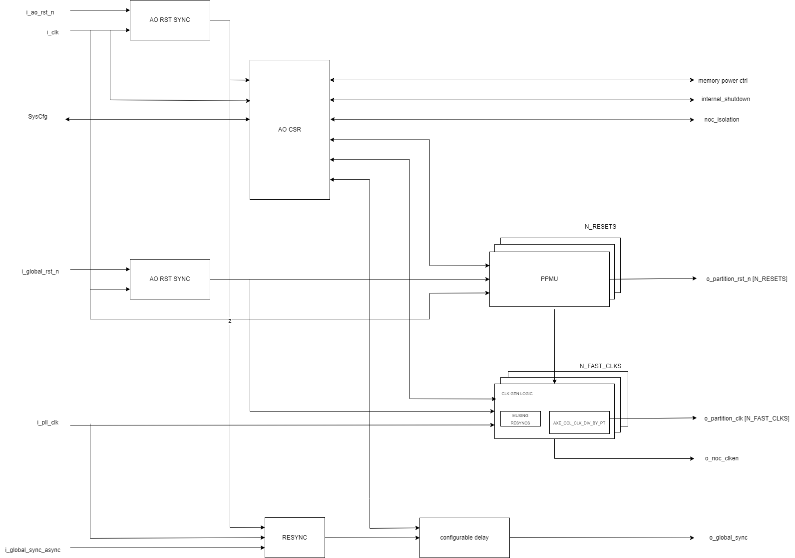
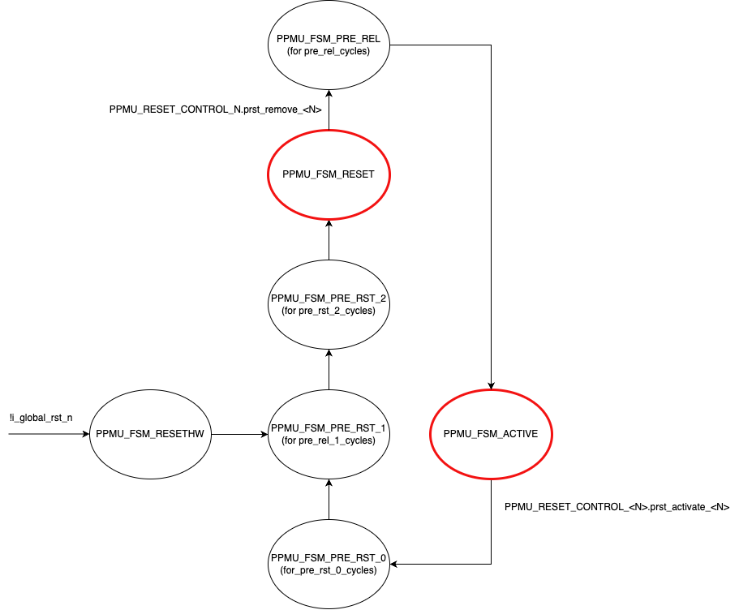
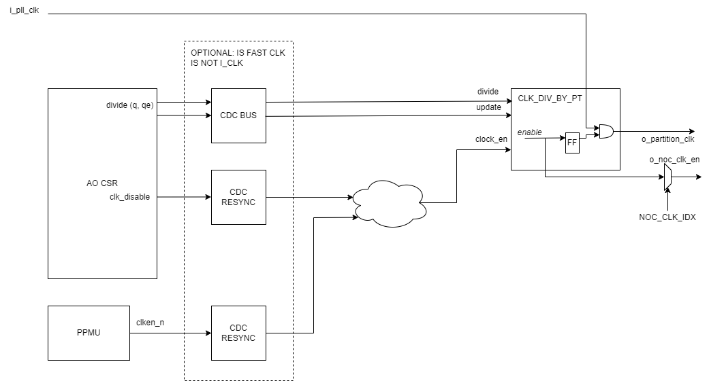
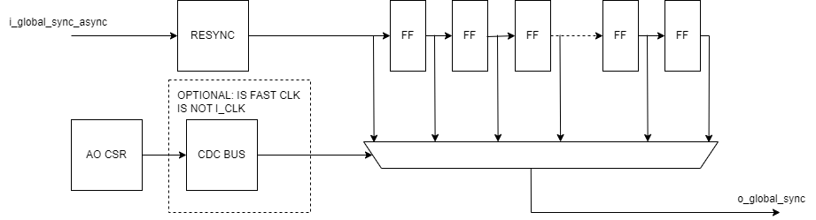

# Overview

PCTL (partition controller) is an IP to provide a unified means for partitions to be controlled, to include:

- Clock generation, gating, and pulse skipping
- Reset generation, alongside stopping of clocks to allow at speed reset removal
- Memory power down CSR
- NOC isolation CSR
- Partition Internal Shutdown Request
- Global High Precision Sync delay control

# Features

## Reset Generation

Each partition reset is generated by a PCTL PPMU (Partition Power Management Unit).

The PPMU is a state machine that is directed by SW CSR. There are two resting states: PPMU_FSM_RESET (where the partition is held in reset) and PPMU_FSM_ACTIVE (when reset has been removed and the partition is active). Two single control register allow SW to switch between these states. When SW writes to the rst_remove field, the FSM will transition from PPMU_FSM_RESET to PPMU_FSM_ACTIVE states. It will achieve this by going through PPMU_FSM_PRE_REL_0, PPMU_FSM_PRE_REL_1, and PPMU_FSM_PRE_REL_2 states. These states control the state of the reset line and clock enable for clocks identified in the CLKRST_MATRIX, in order to provide a window with no clock edges around the deassertion of reset. This allows reset to be removed while the fast clocks are running fast.

The time spent in PPMU_FSM_PRE_REL_* states is controlled directly by the AO CSR timing registers for those states.

When wanting to put the partition into the reset state, the transition from PPMU_FSM_ACTIVE to PPMU_FSM_RESET transitions through PPMU_FSM_RESETWAIT which guarantees a minimum period for which the reset will be active, again, this is controlled by a timing register within the AO CSR.

The FSM and AO CSR are synchronous to one another.

| State              | RST_N | CLKEN |
| ------------------ | ----- | ----- |
| PPMU_FSM_RESETHW   |   0   |   0   |
| PPMU_FSM_PRE_RST_0 |   1   |   0   |
| PPMU_FSM_PRE_RST_1 |   0   |   0   |
| PPMU_FSM_PRE_RST_2 |   0   |   1   |
| PPMU_FSM_RESET     |   0   |   0   |
| PPMU_FSM_PRE_REL   |   1   |   0   |
| PPMU_FSM_ACTIVE    |   1   |   1   |

## Clock Generation

Fast clocks are gated for a couple of reasons:

- Divided (edge skipped) to reduce average clock rate, consuming less power.
- Stopped entirely for periods of non use (SW controlled via AO CSR).
- Paused momentarily around the removal of reset.

Optional CDCs are inserted for instances where the AO CSR (and SysCfg bus) are not being clocked by i_pll_clk[x].

The gating logic within the clk_div_by_pt module delays the output clock enable by a cycle before gating the clock. This allows the enable to be routed to the NOC NIU and flopped locally, allowing the corresponding NOC NIU gated clock to be generated locally with easier timing.

## Memory Power Down

Register fields to provide SW access to partition memory power control and status signals.

| Signal Name | PCTL direction | Size(b) | Description       |
| ----------- | -------------- | ------- | ----------------- |
| RET         | Output         |    1    |                   |
| PDE         | Output         |    1    |                   |
| PRN         | Input          |    1    |                   |

See register definitions section.

## NOC Isolation CSR

Register fields to provide SW access to the partition's NOC NIU isolation circuitry: idle_req (from pctl to noc), idle_ack (to pctl from noc), and idle_val (to pctl from noc).

| Signal Name | PCTL direction | Size(b) | Description                                 |
| ----------- | -------------- | ------- | ------------------------------------------- |
| idle_req    | Output         |    1    | Request NOC to go into isolation            |
| idle_ack    | Input          |    1    | Request acknowledgement from NOC            |
| idle_val    | Input          |    1    | NOC status indicating partition is isolated |

See register definitions section.

## Partition Internal Shutdown Request

Register fields to allow APU to request a soft shutdown of the partition.

| Signal Name     | PCTL direction | Size(b) | Description                                               |
| --------------- | -------------- | ------- | --------------------------------------------------------- |
| shutdown_req    | Output         |    1    | APU Request partition is put into an idle state           |
| shutdown_ack    | Input          |    1    | Partition hardware acknowledgement that partition is idle |
| partition_rsp   | N/A            |    1    | Partition software acknowledgement that partition is idle |

See register definitions section.

Note that there is no hardware mechanism enforcing that only the partition can write to the partition rsp field. This field has been provided for instances where a partition CPU doesn't have gpio control to indicate an idle state.

## Global High Precision Sync Delay Control

Providing resyncing and programmable delay to the Global High Precision Sync signal.

An initial resynchronizer feeds into a cascade of delay flip flops. A mux selects the correctly delayed signal.

The mux control is from AO CSR, and an optional CDC is inserted when the AO CSR clock is not the target SYNC_CLK_IDX.

# Parameters

PCTL is configured in the following way:

| Parameter         | Description                                                                                                                                               |
| ----------------- | --------------------------------------------------------------------------------------------------------------------------------------------------------- |
| N_FAST_CLKS       | The number of PLL clocks. A Clock Divider will be isntanced for each fast clock.                                                                          |
| N_RESETS          | The number of partition resets to control. A PPMU will be instanced for each partition reset.                                                             |
| CLKRST_MATRIX     | A 2D mapping of fast clock to reset. When reset is removed all clocks indexes enabled in the matrix will be stopped.                                      |
| PLL_CLK_IS_I_CLK  | 1D vector (N_FAST_CLK-1:0) to indicate that the fast_clk[x] is the SysCfg clock - this removes resyncs between AO CSR and CLK_DIV                         |
| NOC_RST_IDX       | Indicates which reset to use to reset the NOC NIU and drive the o_noc_rst_n signal.                                                                       |
| SYNC_CLK_IDX      | Indicates which fast clock range 0 -> N_FAST_CLK-1 the global sync signal is sychronous to.                                                               |
| AUTO_RESET_REMOVE | If 1, reset removal is automatic and not driven by SW write to the AO CSR.                                                                                |

# Register Description

[CSRs](./build_reg/pctl_ao_csr_regs.md)
