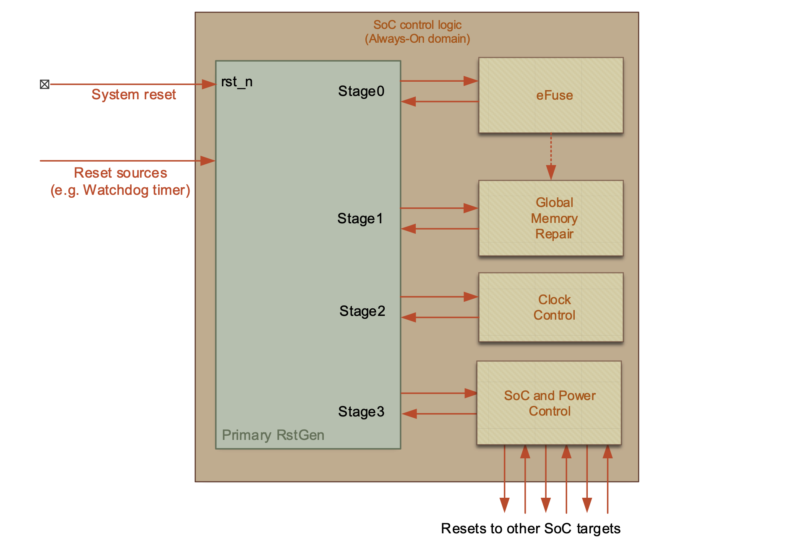
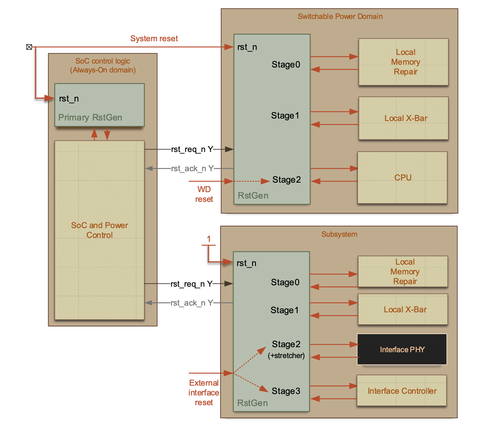
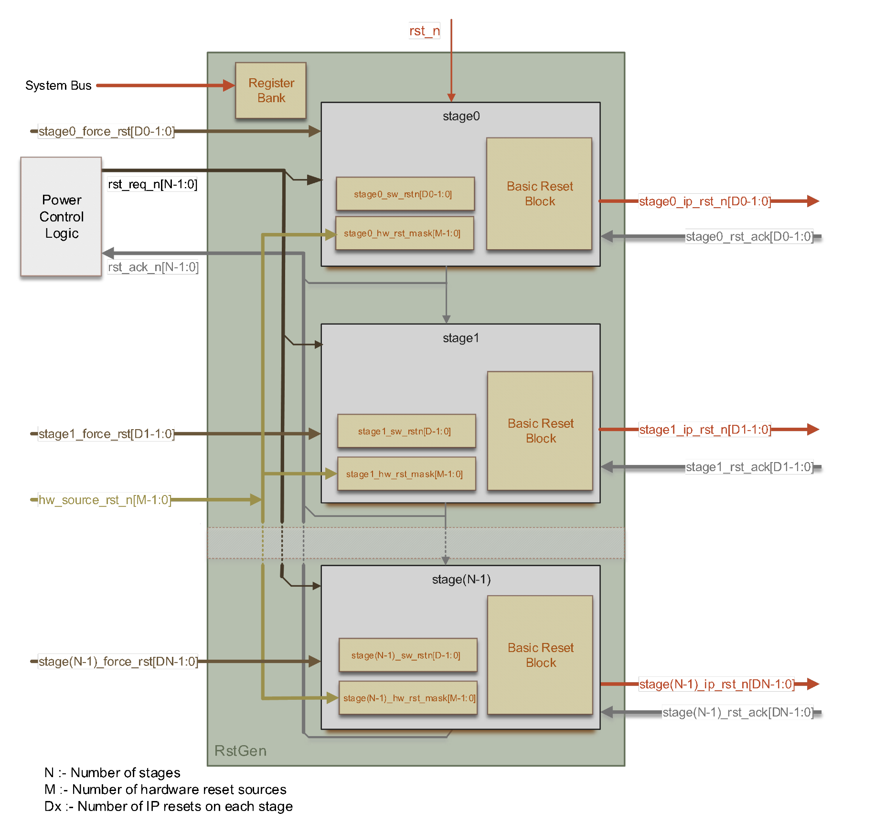
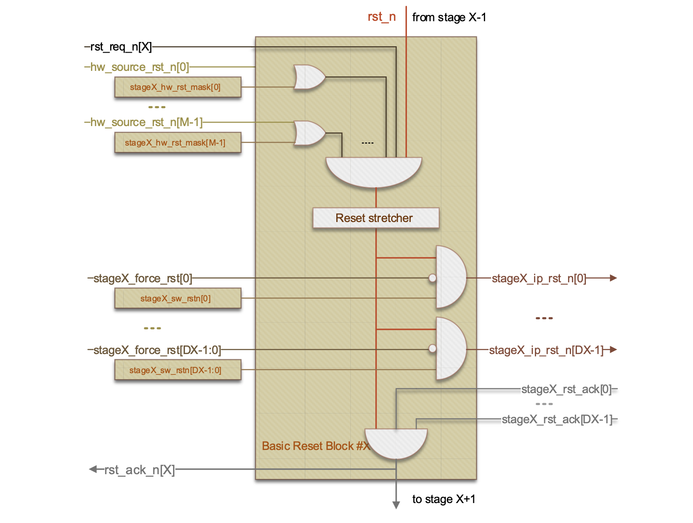
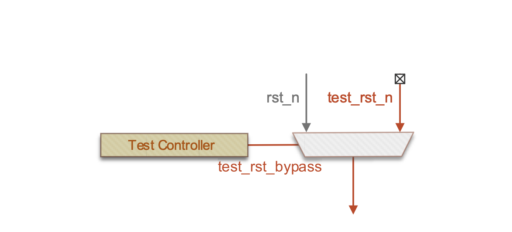

# Overview

> This IP does not synchronize the resets.

This document describes the generic Reset Generation unit (`reset_gen`) that
is responsible for coordinating on-chip reset management. The block is
intended to be lightweight and scalable so that it can be used across
any scenario. It is assumed that there would always be a single instance
of the `reset_gen` (primary `reset_gen`) attached to the SoC power control logic
in the SoC's Always-On power domain. It is further anticipated that in a
multi-power-domain SoC, there will be one instance of the `reset_gen` per
domain and that all SoC subsystems include `reset_gen` instances within them
for the purpose of generating local resets and memory-repair
provisioning.

Figure 1.1 below shows an example of the `reset_gen` that manages resets for
the main SoC control components in the Always-On power domain. This
`reset_gen` is the very first IP on the reset-chain and it takes the main
system reset source as its first input. It then stages the de-assertion of the
resets to IPs in the always-on domain that are required before any
system power-up or boot can begin. Because some of these IPs might have
a dependency on the previous IP being in a useful or valid state, the
concept of reset stages to chain these events is used. In the example
memory repair requires contents of the eFuse before it can run at cold
power-on-reset, and PLLs or other clock sources may be allowed to run to
nominal speed once the memory repair is complete.

*Figure 1.1 - Primary `reset_gen` example*

In addition to this power-on reset chaining, the `reset_gen` also supports
multiple internal reset sources from on-die hardware e.g. watchdog timer
reset.

With configurable routing of these source to any stage, it is possible
to create the concept of Cold and Warm system resets to as much a degree
of granularity as is required.

In a SoC with multiple power domains and/or subsystems, there would then
be further instantiations of `reset_gen`, configured for local reset
dependencies. In these instances, the primary reset input can be either
cascaded from the primary `reset_gen` or tied-off to '1' to leave the
remaining levels under the general control of the SoC power control
logic. An example of system with resets controlled by the SoC main power
control unit is shown in Figure 1‑2. The `reset_gen` in the Switchable power
domain in this example is used to create the local reset chain for local
memory repair controllers (which will need to run each time their
power-domain is turned on), and internal Bus/X-Bar systems, to ensure
that outstanding transactions can gate reset assertion and de-assertion,
and as a means to ensure that otherwise self-booting bus initiators,
such as CPUs, can be held in reset until the power control releases
them.

Figure 1.2 - `reset_gen` chaining example

The goal is to have a single, generically configured block which will
support the correct sequencing of reset assertions and de-assertions to
the whole system.

Events that would change the state of the resets can come from several
sources:

-   A hardware triggers. Examples include: a system reset pin, a
    watchdog timer IP, a security IP, a CPU exception flag

-   A software-driven event. i.e. A driver deciding that IP is in an
    unknown state.

-   SoC power control logic, which must manage resets in together with
    power domain voltage controls.

The diagram on Figure 1‑3 shows basic structure and the main inputs and
outputs from the `reset_gen`. The internal register bank is used for
overriding the dedicated IP resets (per stage) and for configuring the
local masking of the hardware reset sources.

Figure 1.3 - Reset Generator diagram

## Reset types in the design

### Primary Reset

The rst_n input is the primary reset input to `reset_gen`. This may be
sourced from one of:

-   System RESETN pad
-   Power-on Reset (POR) which goes high when supply rails are stable

When this active-low reset is asserted (set to '0'), irrespective of
hardware asks, all reset outputs from all stages will be asynchronously
asserted. This reset will also be the only signal used to reset the
registers within each basic reset block.

If the `reset_gen` is in a switchable power domain (i.e. it is not the
primary reset source for the SoC), resets for each level are ordinarily
under the direct control of the power control logic, and therefore rst_n
input should be tied high.

There is no reset output or acknowledge for this primary reset.

### Hardware Reset Request Sources

Each `reset_gen` may take any number of hardware reset request inputs. The
triggering of any one of the inputs may cause a reset entry from a stage
specified in a mask register, allowing software to configure how much or
how little of the SoC to be reset on that event. Examples of reset
sources are:

-   Debounced front-panel reset button (additional to power-on reset)
-   Warm system reset register
-   Cold system reset register
-   Watchdog timer
-   Security breach detected
-   PLL out of lock

Each stage contains its own hardware reset mask register which can be
configured to allow any hardware reset source to reset this and all
subsequent levels.

The reset value of this register shall be all-ones such that out of
primary reset, no hardware reset source can cause a reset cascade until
configured to do so by software.

### Power Management Reset Control

The SoC power management logic provides a parametrized number of
active-low reset request lines to each instance of `reset_gen`
(rst_req_n\[N-1:0\]).

This request bus is one-hot encoded (one per `reset_gen` stage) such that the
`reset_gen` can be moved to any stage of reset. For example, if
rst_req_n\[2\] is asserted (set to '0'), then all reset levels from
stage2 onwards will immediately be placed into reset. All request bits
above rst_req_n\[2\] are therefore ignored. On de-assertion, each
subsequent stage comes out of reset according to the acknowledgements
from the previous level.

An active-low acknowledgement (rst_ack_n\[N-1:0\]) is fed from the
"next-level" reset output of each reset stage back to the power control
logic to indicate that that stage has been placed into, or successfully
come out of reset.

### IP Reset Outputs

Each stage can support Dx dedicated, active-low reset signal outputs
which are de-asserted simultaneously during reset sequencing. It may be
enough to have a single reset for the whole domain or subsystem, or
many, for example, one individual reset per IP in that subsystem.

Associated with each IP reset output on each stage, are two further
controls which are independent of the de-assertion chain:

-   An active high force reset input which is intended for connection to
    static non-volatile device configuration (e.g. eFuse, OTP, secure
    feature management) and will permanently hold the corresponding IP
    reset permanently low to disable the attached IP.

-   A software register bit to allow direct software control of each IP.
    These registers are local to each Basic Reset Block are also
    active-low and default-on-reset to all-ones.

### Reset Stretching

In some circumstances, IPs, particularly analogue IPs, have minimum
reset assertion-time requirements. Additionally, some IPs may require a
hold-off if there is a dependency on an IP in the previous reset level;
for example, when there is no explicit digital feedback mechanism that
can be used as a reset acknowledge. In this case, a fixed delay to the
relative reset de-assertion will be required. This is essentially just a
counter which is asynchronously reset by the previous level's reset and
asserts its output when a register-defined value is reached. The reset
value of the register should be sufficiently high to make the reset
chain safe in this case and it is set by a generic parameter. A value of
"0" in the generic parameter will mean no stretcher is inserted.

The stretcher is implemented using the standard reset synchronization
component from the internal library.

## Basic Reset Block

The reset sequence on each level (SoC, power domain, subsystem) needs to
be organized as a sequence of steps: each step depends on completion of
the previous step. The concept is based around reset stage, which
represents an order of dependencies, starting at "0" (taken the primary
reset input for that stage), up to parametrized total number of stages
in that instance of `reset_gen`.

Basic Reset Block contains combinatorial gating logic for each stage of
reset, allowing the propagation from the previous reset stage to
correctly pass to all the logic connected to local IPs, wait for all the
reset acknowledgements from that stage, and pass the reset onto the next
stage. It also combines the software reset request from the register
bank, the force reset inputs, and the optional reset stretching logic.

The basic logic for each reset stage is encapsulated within a generic
Basic Reset Block, each of which has one or more dedicated, active-low
reset outputs and reset acknowledge inputs.

Until all individual resets on that stage have been acknowledged to have
been dealt with, the reset for the next stage will not be de-asserted.
Reset acknowledge signals are active high. Any unused ones should be
tied high.

Figure 1.4 - Basic Reset Block

## Signal Polarity parameters

Table 1 below contains a summary of assumed signal polarity in `reset_gen`.

**Table** **1 - Signal Polarity**

| Signal           | Width (per stage) | Polarity | Direction | Function                      |
| ---------------- | ----------------- | -------- | --------- | ----------------------------- |
| rst_n            | 1                 | Low      | Input     | Primary reset                 |
| rst_req_n        | 1                 | Low      | Input     | SoC control reset request     |
| rst_ack_n        | 1                 | Low      | Output    | SoC control reset acknowledge |
| hw_source_rst_n  | M                 | Low      | Input     | Hardware reset request        |
| stageX_force_rst | D                 | High     | Input     | Force reset                   |
| stageX_rst_ack   | D                 | Low      | Output    | IP resets                     |
| stageX_rst_ack   | D                 | High     | Input     | Acknowledge from IPs          |

## DFT Support

Every reset going to internal or external registers or flops must be DFT
bypassable. The `reset_gen` should provide an input pin tst_rst_bypass which
should allow the test controller to bypass the chaining of the resets
for scan, by giving it direct control over another `reset_gen` input pin
tst_rst_n. A standard reset bypass approach is used in the block as
shown in Figure 1‑5.

Figure 1.5 - Test Reset Bypass

## Synchronization

The `reset_gen` operates in a single clock domain and it is assumed that the
local register bank, the system bus and the clock stretcher are clocked
by the same input clock signal. Therefore, if clock stretcher is used,
all resets and reset control inputs into the stretcher should be
synchronized to that clock.

All the output IP reset signals are either asynchronous or synchronous
to this same clock signal and hence it is responsibility of the
integrator to synchronies them to the target clock domain using the
standard internal reset synchronization component. Similarly, all the
acknowledge outputs to the SoC control should be synchronized there to
the local clock.

## Memory Map

| Address                         | Register               | Access | Description                                          |
| ------------------------------- | ---------------------- | ------ | ---------------------------------------------------- |
| 0x000                           | RST_CFG[0]             | RW     | Control registers for reset stage [0].               |
| 0x004                           | RST_SW[0]              | RW     | Control registers for reset stage [0].               |
| ...                             | ...                    | ...    | ...                                                  |
| 0x000 + 0x4 * (RST_STAGE_NUM-1) | RST_CFG[RST_STAGE_NUM] | RW     | Control registers for reset stage [RST_STAGE_NUM-1]. |
| 0x004 + 0x4 * (RST_STAGE_NUM-1) | RST_SW[RST_STAGE_NUM]  | RW     | Control registers for reset stage [RST_STAGE_NUM-1]. |

## Registers

| Bits            | Field       | Access | Default            | Description                                                                                                                                     |
| --------------- | ----------- | ------ | ------------------ | ----------------------------------------------------------------------------------------------------------------------------------------------- |
| 31:28           | -           | RO     | All '0'            | Reserved. Read as all ‘0’, Write has no effect.                                                                                                 |
| 27:16           | RST_STRETCH | RW     | Parameter defined. | Output stage IPs reset stretch value. Defines reset stretching for an extra `clk_i` cycles.                                                     |
| 27:RST_SRC_NUM  | -           | RW     | Parameter defined. | Output stage IPs reset stretch value. Defines reset stretching for an extra `clk_i` cycles.                                                     |
| RST_SRC_NUM-1:0 | RST_SRC_NUM | RW     | RST_SRC_MASK       | Hardware reset sources mask. Each bit controls mask for according `rst_src_ni` signal.   1 – source is masked  0 – source is enabled. |

| Bits           | Field  | Access | Default            | Description                                                                                                                                                  |
| -------------- | ------ | ------ | ------------------ | ------------------------------------------------------------------------------------------------------------------------------------------------------------ |
| 31:RST_IP_NUM  | -      | RO     | All '0'            | Reserved. Read as all ‘0’, Write has no effect.                                                                                                              |
| RST_IP_NUM-1:0 | RST_SW | RW     | Parameter defined. | SW Reset control for stage IPs. Each bit controls appropriate IP SW reset signal.  1 - IP SW-reset is not forced  0 - IP SW-reset force is active. |
