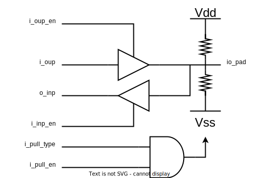
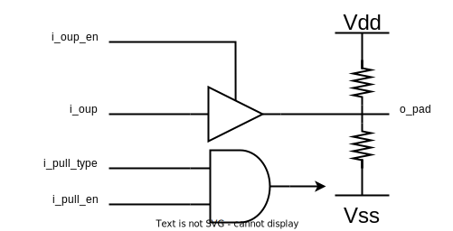
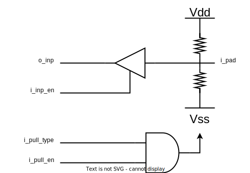

Here the functional description of the expected pad models is provided. A concrete tech node implementation should
choose technology cells which follow the same functionality.

## Bidirectional Pad: `axe_tcl_pad_inout`

A bidirectional pad with pull-up/down functionality. The schematic of the model is shown below:

### IO Description

{{ io_table("axe_tcl_pad_inout") }}

## Output Pad: `axe_tcl_pad_output`

A pure output pad with pull-up/down functionality. The schematic of the module is shown below:

### IO Description

{{ io_table("axe_tcl_pad_output") }}

## Input Pad: `axe_tcl_pad_input`

A pure input pad. The schematic of the module is shown below:

### IO Description

{{ io_table("axe_tcl_pad_input") }}

## Retention Pad Cell: `axe_tcl_pad_retention`

A retention enable pad. The schematic of the module is shown below:

### IO Description

{{ io_table("axe_tcl_pad_retention") }}
