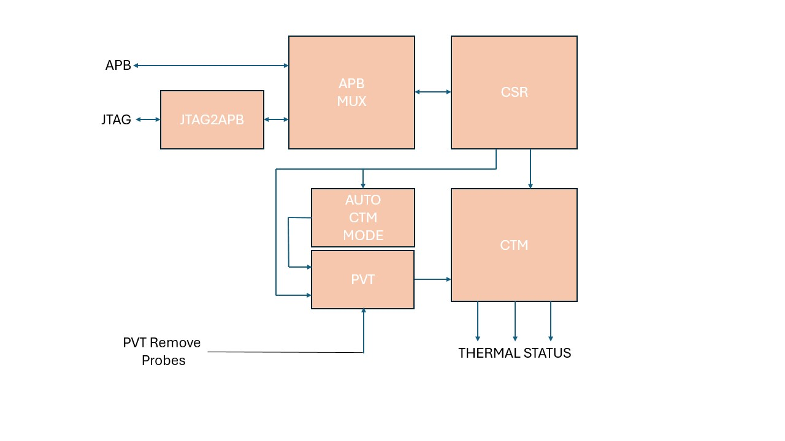
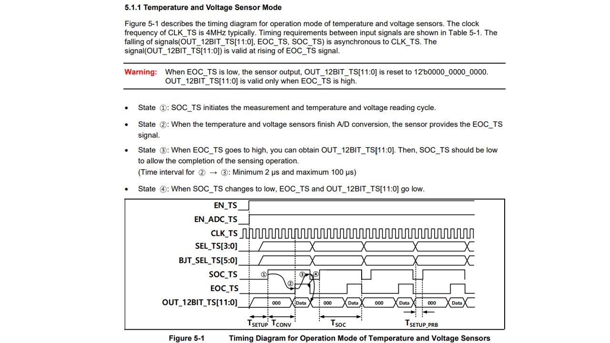
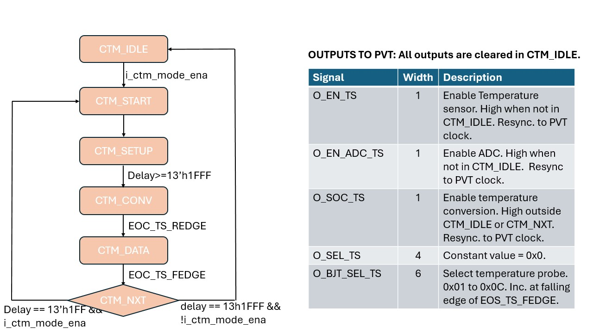
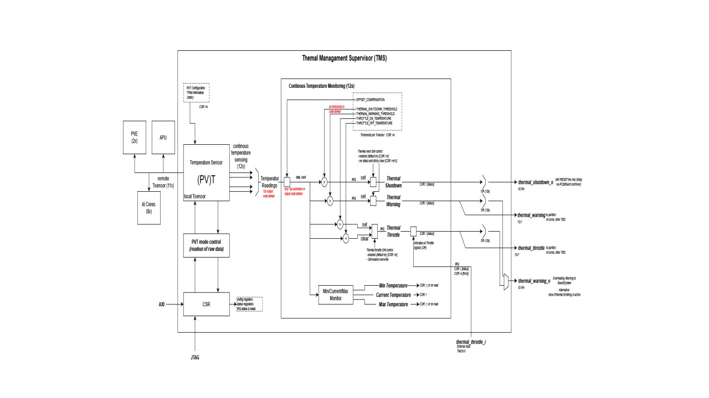

# TMS Functional Spec

## Introduction
Thermal Management Supervisor (TMS) is a sub block of the SOC management module. This IP is used to monitor device temperature. To perform this temperature monitoring task TMS includes one PVT process sensor that can obtain temperature information from remote temperature probes connected to the processor. TMS includes the following sub-components:
  - PVT Process sensor.
  - Configuration and Status Registers (CSR).
  - Continuous Temperature Monitor (CTM).
  - JTAG to APB interface and APB mux that all test access to module CSR.

### System Diagram

## Functional Description
TMS is responsible for monitoring device temperatures. The module host a single centralised PVT controller that will be connected to remote temperature probes distributed throughout the host device. Raw temperature values obtained by the PVT controller are processed in the CTM to determine whether any device thermal limits are exceeded. CTM generates thermal warning and shutdown outputs that can be used elsewhere to disable certain device features or at extremes shutdown the host device.

Raw temperature readings produced by PVT are further processed in the continuous temperature monitor (CTM). CTM compares the measured temperature with threshold levels programmed in CSR and generates thermal status flags that can be used to control device operation. Three status flags are output. These are:
  1. Thermal shutdown. Set when temperature is above the thermal shutdown temperature. Thermal shutdown level is set via CSR ctm_thrm_shtdwn_thresh.
  2. Thermal warning. Set when temperature is above the thermal warning temperature. Thermal warning level is set with CSR ct_thrm_warn_thresh.
  3. Thermal throttle. Set when temperature is above the throttle on temperature. Thermal throttle will remain set until the temeprature goes below the throttle off CSR value. Note that TMS includes a thermal throttle input that can directly set the output regardless of current temperature and CSR settings. Thermal throttle on level is set with CSR ctm_thrtl_on_temp and off level is set with CSR ctm_thrtl_off_temp.

There is one CTM for each PVT probe. The number of CTM included is set with parameter NB_TEMP_SENSE. CTM thermal status outputs from each channel are ored in TMS top level to provide a single status signal for each mode. There are separate CSR for configuring thermal control and monitor status of CTM. Additionally, CSR are used to store minimum, maximum and current temperature for all channels.

### CSR Details

| CSR Name                  | Size (bits) | Reset Value | Description                                     |
|:-------------------------:|:-----------:|:-----------:|:-----------------------------------------------:|
| pvt_mode_ctrl             | 32          | 0x3001      | PVT sensor mode control.                        |
| pvt_ctrl                  | 32          | 0x1CC21000  | PVT sensor control.                             |
| pvt_data                  | 32          | 0           | PVT measurement result.                         |
| ctm_offset_comp[0]        | 32          | 0           | CTM0/1   offset compensation value.             |
| ctm_offset_comp[1]        | 32          | 0           | CTM2/3   offset compensation value.             |
| ctm_offset_comp[2]        | 32          | 0           | CTM4/5   offset compensation value.             |
| ctm_offset_comp[3]        | 32          | 0           | CTM6/7   offset compensation value.             |
| ctm_offset_comp[4]        | 32          | 0           | CTM8/9   offset compensation value.             |
| ctm_offset_comp[5]        | 32          | 0           | CTM10/11 offset compensation value.             |
| ctm_thrm_shtdwn_thresh[0] | 32          | 0           | CTM0/1   thermal shutdown threshold value.      |
| ctm_thrm_shtdwn_thresh[1] | 32          | 0           | CTM2/3   thermal shutdown threshold value.      |
| ctm_thrm_shtdwn_thresh[2] | 32          | 0           | CTM4/5   thermal shutdown threshold value.      |
| ctm_thrm_shtdwn_thresh[3] | 32          | 0           | CTM6/7   thermal shutdown threshold value.      |
| ctm_thrm_shtdwn_thresh[4] | 32          | 0           | CTM8/9   thermal shutdown threshold value.      |
| ctm_thrm_shtdwn_thresh[5] | 32          | 0           | CTM10/11 thermal shutdown threshold value.      |
| ctm_thrm_warn_thresh[0]   | 32          | 0           | CTM0/1   thermal warning threshold value.       |
| ctm_thrm_warn_thresh[1]   | 32          | 0           | CTM2/3   thermal warning threshold value.       |
| ctm_thrm_warn_thresh[2]   | 32          | 0           | CTM4/5   thermal warning threshold value.       |
| ctm_thrm_warn_thresh[3]   | 32          | 0           | CTM6/7   thermal warning threshold value.       |
| ctm_thrm_warn_thresh[4]   | 32          | 0           | CTM8/9   thermal warning threshold value.       |
| ctm_thrm_warn_thresh[5]   | 32          | 0           | CTM10/11 thermal warning threshold value.       |
| ctm_thrtl_on_temp[0]      | 32          | 0           | CTM0/1   throttle on temperature.               |
| ctm_thrtl_on_temp[1]      | 32          | 0           | CTM2/3   throttle on temperature.               |
| ctm_thrtl_on_temp[2]      | 32          | 0           | CTM4/5   throttle on temperature.               |
| ctm_thrtl_on_temp[3]      | 32          | 0           | CTM6/7   throttle on temperature.               |
| ctm_thrtl_on_temp[4]      | 32          | 0           | CTM8/9   throttle on temperature.               |
| ctm_thrtl_on_temp[5]      | 32          | 0           | CTM10/11 throttle on temperature.               |
| ctm_thrtl_off_temp[0]     | 32          | 0           | CTM0/1   throttle off temperature.              |
| ctm_thrtl_off_temp[1]     | 32          | 0           | CTM1/3   throttle off temperature.              |
| ctm_thrtl_off_temp[2]     | 32          | 0           | CTM2/5   throttle off temperature.              |
| ctm_thrtl_off_temp[3]     | 32          | 0           | CTM3/7   throttle off temperature.              |
| ctm_thrtl_off_temp[4]     | 32          | 0           | CTM4/9   throttle off temperature.              |
| ctm_thrtl_off_temp[5]     | 32          | 0           | CTM10/11 throttle off temperature.              |
| ctm_cur_temp[0]           | 32          | 0           | CTM0/1   current temperature.                   |
| ctm_cur_temp[1]           | 32          | 0           | CTM1/3   current temperature.                   |
| ctm_cur_temp[2]           | 32          | 0           | CTM2/5   current temperature.                   |
| ctm_cur_temp[3]           | 32          | 0           | CTM3/7   current temperature.                   |
| ctm_cur_temp[4]           | 32          | 0           | CTM4/9   current temperature.                   |
| ctm_cur_temp[5]           | 32          | 0           | CTM10/11 current temperature.                   |
| ctm_thermal_ctrl[0]       | 32          | 0x7         | CTM0  thermal control enable.                   |
| ctm_thermal_ctrl[1]       | 32          | 0x7         | CTM1  thermal control enable.                   |
| ctm_thermal_ctrl[2]       | 32          | 0x7         | CTM2  thermal control enable.                   |
| ctm_thermal_ctrl[3]       | 32          | 0x7         | CTM3  thermal control enable.                   |
| ctm_thermal_ctrl[4]       | 32          | 0x7         | CTM4  thermal control enable.                   |
| ctm_thermal_ctrl[5]       | 32          | 0x7         | CTM5  thermal control enable.                   |
| ctm_thermal_ctrl[6]       | 32          | 0x7         | CTM6  thermal control enable.                   |
| ctm_thermal_ctrl[7]       | 32          | 0x7         | CTM7  thermal control enable.                   |
| ctm_thermal_ctrl[8]       | 32          | 0x7         | CTM8  thermal control enable.                   |
| ctm_thermal_ctrl[9]       | 32          | 0x7         | CTM9  thermal control enable.                   |
| ctm_thermal_ctrl[10]      | 32          | 0x7         | CTM10 thermal control enable.                   |
| ctm_thermal_ctrl[11]      | 32          | 0x7         | CTM11 thermal control enable.                   |
| ctm_thermal_status[0]     | 32          | 0           | CTM0  thermal status.                           |
| ctm_thermal_status[1]     | 32          | 0           | CTM1  thermal status.                           |
| ctm_thermal_status[2]     | 32          | 0           | CTM2  thermal status.                           |
| ctm_thermal_status[3]     | 32          | 0           | CTM3  thermal status.                           |
| ctm_thermal_status[4]     | 32          | 0           | CTM4  thermal status.                           |
| ctm_thermal_status[5]     | 32          | 0           | CTM5  thermal status.                           |
| ctm_thermal_status[6]     | 32          | 0           | CTM6  thermal status.                           |
| ctm_thermal_status[7]     | 32          | 0           | CTM7  thermal status.                           |
| ctm_thermal_status[8]     | 32          | 0           | CTM8  thermal status.                           |
| ctm_thermal_status[9]     | 32          | 0           | CTM9  thermal status.                           |
| ctm_thermal_status[10]    | 32          | 0           | CTM10 thermal status.                           |
| ctm_thermal_status[11]    | 32          | 0           | CTM11 thermal status.                           |
| thermal_warning_ctrl      | 32          | 0           | CTL thermal warning and throttle output select. |

### PVT_MODE_CTRL Register Description

| Field Name             | Position | Reset  | Access Type | Description                                 |
| ---------------------- | -------- | ------ | ----------- | ------------------------------------------- |
| PVT_EN_TS              | 0        | 0      | RW          | PVT sensor enable.                          |
|                        |          |        |             | 1 = Enable,                                 |
|                        |          |        |             | 0 = Disable                                 |
| PVT_EN_ADC_TS          | 1        | 0      | RW          | PVT ADC Enable.                             |
| PVT_SOC_TS             | 2        | 0      | RW          | Start temperature and voltage conversion.   |
| PVT_BJT_SEL_TS         | [8: 3]   | 0      | RW          | Remote probe selection.                     |
|                        |          |        |             | 1 = Select PVT load probe.                  |
|                        |          |        |             | 2-0x3F select up to probe 62                |
| PVT_SEL_TS             | [12:9]   | 0      | RW          | ADC input control.                          |
|                        |          |        |             | 0 = Voltage sensor mode                     |
|                        |          |        |             | 1 = ADC                                     |
|                        |          |        |             | 0xF = ADC test mode.                        |
| PVT_MUX_ADDR_TS        | [15:13]  | 0      | RW          | Mux control signal for testmode.            |
| PVT_AVG_MODE_TS        | [17:16]  | 0x3    | RW          | Average mode control for digital offset     |
|                        |          |        |             | cancellation.                               |
|                        |          |        |             | 1 = 2 sample average,                       |
|                        |          |        |             | 2 = 4 sample average,                       |
|                        |          |        |             | 3 = 8 sample average.                       |
| PVT_SOC_PS             | 18       | 0      | RW          | Start process sensor measurement.           |
| PVT_EN_PS              | [21:19]  | 0      | RW          | Process sensor enable.                      |
| PVT_MODE               | 22       | 0      | RW          | PVT mode select.                            |
|                        |          |        |             | 0 = enable CTM mode.                        |
|                        |          |        |             | 1 = enable SW control mode.                 |

### PVT_CTRL Register Description

| Field Name             | Position | Reset  | Access Type | Description                                 |
| ---------------------- | -------- | ------ | ----------- | ------------------------------------------- |
| PVT_BGR_TRIM_TS        | [3:0]    | 0      | RW          | PVT BGR Trim control.                       |
| PVT_VREF_TRIM_TS       | [7:4]    | 0      | RW          | PVT VREF Trim control.                      |
| PVT_VBE_TRIM_TS        | [11:8]   | 0      | RW          | PVT VBE Trim control.                       |
| PVT_BUF_VREF_SEL_TS    | [16:12]  | 1      | RW          | Offset control for temperature output code. |
| PVT_BUF_SLOPE_SEL_TS   | [21:17]  | 1      | RW          | Slope control for temperature output code.  |
| PVT_AVG_MODE_TS        | [23:22]  | 3      | RW          | Average mode control input signal.          |
| PVT_ADC_CCTRL_TS       | [26:24]  | 4      | RW          | ADC Cap control.                            |
| PVT_ADC_ICTRL_TS       | [29:27]  | 3      | RW          | ADC Current control.                        |

### PVT_DATA Register Description

| Field Name             | Position | Reset  | Access Type | Description                                 |
| ---------------------- | -------- | ------ | ----------- | ------------------------------------------- |
| PVT_OUT_12BIT_TS       | [11:0]   | 0      | RO          | PVT temperature and voltage sensor data.    |
| PVT_EOC_TS             | 12       | 0      | RO          | End of conversion for temp and volt sensor. |
| PVT_OUT_12BIT_PS       | [24:13]  | 0      | RO          | PVT process data.                           |
| PVT_EOC_PS             | 25       | 0      | RO          | End of conversion of process sensor.        |

### CTM_OFFSET_COMP Register Description

| Field Name             | Position | Reset  | Access Type | Description                                 |
| ---------------------- | -------- | ------ | ----------- | ------------------------------------------- |
| OFFSET_COMPN           | [11:0]   | 0      | RW          | CTM Offset compensation value               |
| OFFSET_COMPN+1         | [11:0]   | 0      | RW          | CTM Offset compensation value               |

### CTM_THRM_SHTDWN_THRESH Register Description

| Field Name             | Position | Reset  | Access Type | Description                                 |
| ---------------------- | -------- | ------ | ----------- | ------------------------------------------- |
| THRESHOLDN             | [11:0]   | 0      | RW          | Shutdown threshold value                    |
| THRESHOLDN+1           | [11:0]   | 0      | RW          | Shutdown threshold value                    |

### CTM_THRM_WARNING_THRESH Register Description

| Field Name             | Position | Reset  | Access Type | Description                                 |
| ---------------------- | -------- | ------ | ----------- | ------------------------------------------- |
| THRESHOLDN             | [11:0]   | 0      | RW          | Warning threshold value                     |
| THRESHOLDN+1           | [11:0]   | 0      | RW          | Warning threshold value                     |

### CTM_THRTL_ON_TEMP Register Description

| Field Name             | Position | Reset  | Access Type | Description                                 |
| ---------------------- | -------- | ------ | ----------- | ------------------------------------------- |
| THRESHOLDN             | [11:0]   | 0      | RW          | Throttle on temp value                      |
| THRESHOLDN+1           | [11:0]   | 0      | RW          | Throttle on temp value                      |

### CTM_THRTL_OFF_TEMP Register Description

| Field Name             | Position | Reset  | Access Type | Description                                 |
| ---------------------- | -------- | ------ | ----------- | ------------------------------------------- |
| TEMPERATUREN           | [11:0]   | 0      | RW          | Throttle off temp value                     |
| TEMPERATUREN+1         | [11:0]   | 0      | RW          | Throttle off temp value                     |

### CTM_MAX_TEMP Register Description

| Field Name             | Position | Reset  | Access Type | Description                                 |
| ---------------------- | -------- | ------ | ----------- | ------------------------------------------- |
| TEMPERATUREN           | [11:0]   | 0      | RC          | Maximum temp value                          |
| TEMPERATUREN+1         | [11:0]   | 0      | RC          | Maximum temp value                          |

### CTM_MIN_TEMP Register Description

| Field Name             | Position | Reset  | Access Type | Description                                 |
| ---------------------- | -------- | ------ | ----------- | ------------------------------------------- |
| TEMPERATUREN           | [11:0]   | 0      | RC          | Minimum temp value                          |
| TEMPERATUREN+1         | [11:0]   | 0      | RC          | Minimum temp value                          |

### CTM_CUR_TEMP Register Description

| Field Name             | Position | Reset  | Access Type | Description                                 |
| ---------------------- | -------- | ------ | ----------- | ------------------------------------------- |
| TEMPERATUREN           | [11:0]   | 0      | RC          | Current temp value                          |
| TEMPERATUREN+1         | [11:0]   | 0      | RC          | Current temp value                          |

### CTM_THERMAL_CTRL Register Description

| Field Name             | Position | Reset  | Access Type | Description                                 |
| ---------------------- | -------- | ------ | ----------- | ------------------------------------------- |
| SHTDWN_ENA             | 0        | 1      | RW          | Enable for thermal shutdown output.         |
| WARN_ENA               | 1        | 1      | RW          | Enable for thermal warning output.          |
| THRTLE_ENA             | 2        | 1      | RW          | Enable for thermal throttle warning output. |

### CTM_THERMAL_STATUS Register Description

| Field Name             | Position | Reset  | Access Type | Description                                 |
| ---------------------- | -------- | ------ | ----------- | ------------------------------------------- |
| SHTDWN_STATUS          | 0        | o      | RO          | Thermal shutdown status.                    |
| WARN_STATUS            | 1        | o      | RO          | Thermal warning status.                     |
| THRTL_STATUS           | 2        | o      | RO          | Thermal throttle warning status.            |

### THERMAL_WARNING_CTRL Register Description

| Field Name             | Position | Reset  | Access Type | Description                                 |
| ---------------------- | -------- | ------ | ----------- | ------------------------------------------- |
| WARN_SRC_SEL           | 0        | o      | RW          | Set source for the thermal throttle/warning |
|                        |          |        |             | shared output. Shutdown status.             |

## Implementation Description
TMS is instantiated in SOC management. IP includes APB interface to configure CSR. Additionally a JTAG tap can also access the same CSR.

### CSR Access Via JTAG
Address -> Set. 16-bit transfer. Bits [15:0] used for address and bit [16] used to specify transfer direction. Transfer direction can be set as follows:
  - `Bit [16] = 0` - CSR Read.
  - `Bit [16] = 1` - CSR Write.

### PVT Measurements
PVT measurements can be performed either automatically by the CTM controller or by software. Automatic CTM is the default mode. In default mode CTM controller will start the PVT measurements automatically. The mode can be changed by updating the `pvt_mode` field of the `PVT_MODE_CTRL` register. Set register to zero to enable automatic CTM mode and set to one to enable software mode.

PVT conversion sequence and timing is shown in the following diagram.

Further details explaining the conversion process can be found in the following document: https://axeleraai.sharepoint.com/sites/AXELERAAI-ResearchandDevelopment/Gedeelde%20documenten/Forms/AllItems.aspx?id=%2Fsites%2FAXELERAAI%2DResearchandDevelopment%2FGedeelde%20documenten%2FResearch%20and%20Development%2Fhw%2Fdoc%2Fvendors%2FTechwidU%2FTechwidU%5Ftu%5Fpvt0501a01%5Fln05lpe%5F4007002%5Fv1%2E00%5Fdatasheet%5Frev1%2E00%2Epdf&parent=%2Fsites%2FAXELERAAI%2DResearchandDevelopment%2FGedeelde%20documenten%2FResearch%20and%20Development%2Fhw%2Fdoc%2Fvendors%2FTechwidU

The PVT state diagram is shown below.

To obtain meaningful results from CTM it is necessary to configure the following registers:
  - Offset compensation. At CTM input an offset compensation is applied to the raw temperature result.
  - Shutdown threshold level that sets the maximum temperature value allowed before the thermal shutdown output is asserted.
  - Warning threshold level that sets the maximum temperature value allowed before the thermal warning output is asserted.
  - Thermal throttle on and off levels that set the maximum and minimum levels where thermal throttle output will be set.
  - Optionally, update thermal throttle/warning multiplexer control to chose what status is output on the o_thermal_warning pin. Either thermal warning or thermal throttle can be output on this pin.

#### CTM Description
In automatic mode the active channel is incremented following each completed measurement. When temperature measurement completes the selected CTM captures and processes the temperature. Offset compensation is applied to the saved value. After the offset compensation stage the current temperature CSR is updated. Depending on the current temperature, minimum and maximum CSR may also be updated if this measurement exceeds the previous limit. The threshold status may also be updated depending on the current temperature if temperature exceeds any programmed limits.

In software mode PVT measurements can be started by CSR. Follow the steps below to use PVT in software mode:
  - Set software mode enable
    - `PVT_MODE_CTRL.pvt_mode = 1`
  - Set PVT enables
    - `PVT_MODE_CTRL.pvt_en_ts = 1`
    - `PVT_MODE_CTRL.pvt_en_adc_ts = 1`
    - `PVT_MODE_CTRL.pvt_sel_ts = 1`
    - `PVT_MODE_CTRL.pvt_avt_mode_ts = 1`
  - Set required channel number
    - `PVT_MODE_CTRL.pvt_bjt_sel_ts = <channel>`
  - Write this configuration to `PVT_MODE_CTRL`.
  - Delay for `Tsetup`.
  - Set `PVT_MODE_CTRL.pvt_soc_ts = 1`
  - Write `PVT_MODE_CTRL` register to start conversion.
  - Wait for conversion to complete by polling `PVT_DATA.pvt_eoc_ts` until field is set.
  - Clear conversion start
    - Write `PVT_MODE_CTRL.pvt_soc_ts = 0`.
  - If required check field `PVT_DATA.pvt_out_12bit_ts` to read the channel temperature.
  - Thermal status for the active channel can be read from ctm_thermal_status register.

### Block Diagram

### Clocks and Resets

| Clock        |  Target Freq  |  Uses                                                |
| ----------   | ------------- | ---------------------------------------------------- |
| `i_clk`      |   1.2GHz      | System clock.                                        |
| `i_pvt_clk`  |   4MHz/8MHz   | PVT clock. Switchable based on PVT measurement mode. |
| `ijtag_tck`  |   100MHz      | JTAG clock.                                          |

|  Reset        | Protocols   | Clock     |  Uses
| -----------   | ----------- | --------- | -------------------------------------------- |
| `i_rst_n`     | Active low  | `i_clk`     | System reset                                 |
| `i_pvt_rst_n` | Active low  | `i_pvt_clk` | pvt reset                                    |
| `ijtag_reset` | Active low  | `tck`       | jtag infrastructure                          |

### IO and Interfaces

| I/F                          | Protocol        | Clock            | Description                             |
| --------------------------   | --------------- | ---------------- | --------------------------------------- |
| `SysCfg`                     | APB S           | `i_clk`            | SysCfg to AO CSR.                       |
| `JTAG`                       | JTAG            | `tck`              | I/F for JTAG unit: JTAG2AP.             |
| Remote temperature sensors   | PVT             | `i_pvt_clk`        | I/F for Remote PVT Probes.              |
| `i_thermal_throttle`         | External input  | `i_clk`            | Thermal throttle force.                 |
| `o_thermal_throttle`         | External output | `i_clk`            | Thermal throttle active.                |
| `o_thermal_throttle_warning` | External output | `i_clk`            | Selectable thermal throttle or warning. |
| `o_thermal_warning`          | External output | `i_clk`            | Thermal warning temperature achieved.   |
| `o_thermal_shutdown`         | External output | `i_clk`            | Thermal shutdown temperature reached.   |

