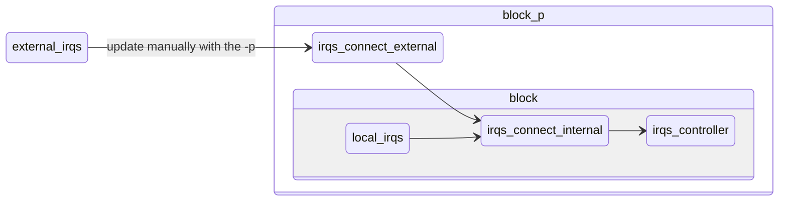

# Interrupt Map

- Generate the connectivity modules from a single yaml source file (located in
`{block}/data/interrupt_map.yaml`)
- Print an indexed table from the yaml source file
- Print the IOs to be implemented for the given block
- (TODO): Generate C header for firmware from this yaml file

# Usage

```bash
source .env-default-modules
irqmap --help
```

## Validate the yaml source file

Looking for:
- duplicated names/indexes
- holes in the interrupt indexes
- correct file format and data structures

```bash
irqmap -b {block}
```

## Print IRQs as a table

As the IRQs are indexed at runtime, the following cmd will give you the indexes
of all IRQs as a table.

```bash
irqmap -b {block} -l
```

## Print the IOs for the block partition interface

As the partition interface cannot be easily automatically updated, the script
can print the IOs, then the user can copy/paste/replace in the partition file
directly.

(side note: using anchor?)

```bash
irqmap -b {block} -p
```

## Render modules and package

The script generate the following files:
- `{block}_interrupt_connectivity_external.sv`
- `{block}_interrupt_connectivity_internal.sv`
- `pkg/{block}_interrupt_map_pkg.sv`

```bash
irqmap -b {block} -r
```

## Overall dataflow


