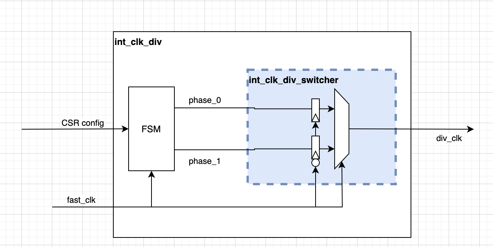
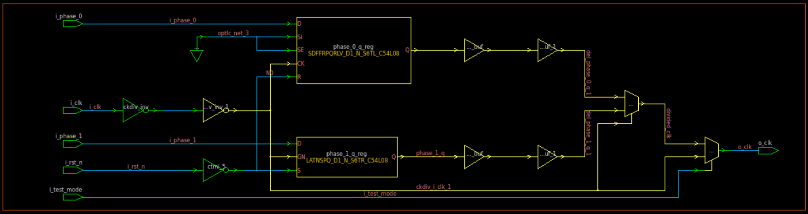

# clk_div_by_int_modulator

This module is a sub-block of the clk_div_by_int clock divider module. It corresponds to the blue box below:

This module has two views:
- A functional model implementation clk_div_by_int_modulator_functional.sv used for simulation only
- A PD implementation made of tech cells clk_div_by_int_modulator.v used for synthesis

## PD implementation

