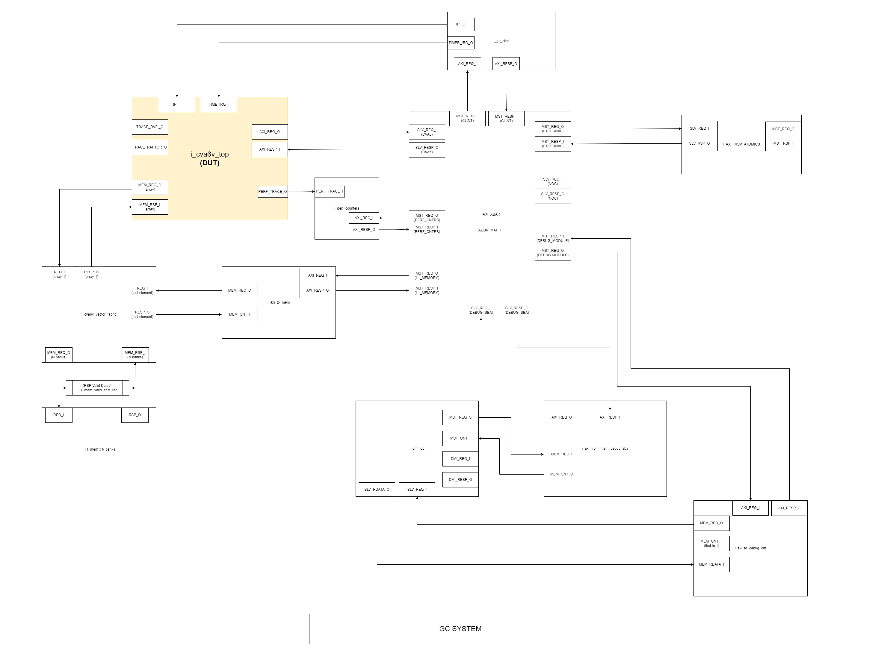
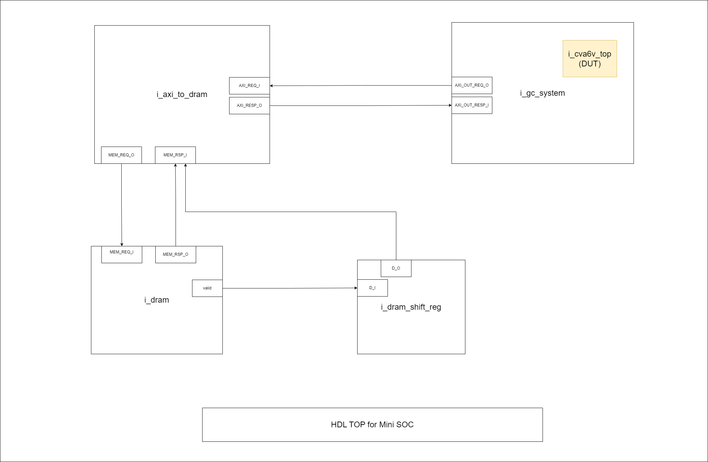

# CVA6V DV Mini-SOC TestBench

## Introduction

### Overview
CVA6V DV Mini-SOC TestBench is one of the 3 DV testbenches to verify our own RISCV Core named **CVA6V**.
This testbench does/is":

 - Optimized to compile and simulate with pure SystemVerilog code with a little bit of C-code to avoid the slower UVM compilation and simulation
 - Optimized to simulate binaries/elf generated by the testbench or other sources
 - Use Spike as an ISS to generate expected RISCV instruction logs
 - Use built-in **CVA6** core instruction tracer to generate actual RTL simulation instruction logs output by **CVA6V**
 - Convert Spike and RTL simulation logs into CSV and compares them


### Ownership of Mini-SOC TestBench
CVA6V DV Mini-SOC TestBench is originally authored by @raymond.garcia. The whole verification team for CVA6V DV is shown in the table below:

|  CVA6V TestBench   | Developer         |
| ------------------ | ----------------- |
| ***Spike-Only***   | @abhilash.chadhar |
| ***Mini-SOC***     | @raymond.garcia   |
| ***UVM***          | @raymond.garcia   |


### Reference
CVA6 Core and the Raptor (Vector) documentation can be found at the following links below.

| Team               | Specification |
| ------------------ | ------------- |
| ***Design***       |[Core](https://github.com/axelera-ai/hw.cva6.private)|
| ***Design***       |[Raptor](https://github.com/axelera-ai/hw.riscv)|

### Project Planning and Tracking
Where to find project plans and trackers

|   | Link |
| - | ---- |
| ***Plan*** |[CVA6V Issue Board](https://git.axelera.ai/ai-dv-team/dv-europa-planning/cva6v/-/boards)|
| ***Status*** |[CVA6V DV Weekly](https://axeleraai.sharepoint.com/:f:/r/sites/AXELERAAI-ResearchandDevelopment/Gedeelde%20documenten/Research%20and%20Development/hw/projects/europa/IP/CVA6/DV_Status?csf=1&web=1&e=K4CNCP)|
| ***Issues*** |[Gitlab Open Issues]()|

## Block Diagrams

### GC System Block Diagram



#### Overview
GC system instantiates *cva6v_top* which is the CVA6 core plus the Raptor. *cva6v_top* is the Design Under Test (DUT). Along with *cva6v_top* are miscellaneous RTL components listed in the following table.

| Components              | Description |
| ----------------------- | ----------- |
| i_cva6v_top             | DUT. CVA6 Core Plus the Vector Co-processor |
| i_axi_xbar              | AXI4 Crossbar. The fabric where AXI Masters and Slaves interconnect |
| i_axi_riscv_atomics     | Intermediate AXI module for GC system to output atomic AXI transactions |
| i_l1_mem                | L1 Memory. Not the real L1 memory, but a memory model nonetheless. |
| i_l1_mem_valid_shift_reg| A simple delay block used to mimic L1 latency |
| i_cva6v_vector_fabric   | Vector Fabric. These are the interfaces that connects Raptor memory access ports into L1 Memory banks.|
| i_axi_to_mem            | Routes AXI Master transaction from *cva6v_top* that goes out to the AXI4 Cross into memory request transactions to access L1 Memory |
| i_gc_clint              | Interrupt Client for *cva6v_top*|
| i_perf_counters         | Monitors performance output from *cva6v_top* |
| i_dm_top                | Debug module used by designer tb. No current use for DV and it is dummied/stubbed |
| i_axi_to_debug_dm       | Bridges AXI transaction to the debug module.  No current use for DV |
| i_axi_from_mem_debug_sba| AXI Master that interfaces with Debug module. Since Debug module is not used for DV, this module is also not used.|
| i_dmi_jtag              | JTAG Module. Not in the figure but still present in the GC system as dummy/stubbed module. |


### HDL Top Block Diagram


#### Overview
The top level module for Mini-SoC instantiates the GC system. From this point, everything becomes a simple connection between an AXI Master (*cva6v_top*) and Memory (DRAM).

| Components              | Description |
| ----------------------- | ----------- |
| i_gc_system             | Contains the DUT inside. |
| i_axi_to_dram           | Bridges AXI accesses into DRAM accesses |
| i_dram                  | The memory where binaries will be stored/loaded.|
| i_dram_shift_reg        | Simple delay implementation for DRAM responses. |

#### Setting the CVA6V Mini-Soc Environment
Follow these steps to setup the Mini-SoC TestBench:

```bash
git clone git@git.axelera.ai:prod/europa.git
cd <repo-dir>
source .env-default-modules
cd hw/vendor/axelera/cva6v/default/dv/sim-mini-soc
source setup_env.sh
```

#### Example for running a single simulation
```bash
make run_vcs TESTNAME=cva6v_riscv_tests_rv64ui_p_addi_test NODEPS=0 SEED=1 VCS_GUI_TYPE=dve VCS_DUMP_TYPE=vpd GRID_NUM_CPUS=4
```

#### Example for running a regression
```bash
make regress_vcs VCS_REGRESSION=riscv_tests_p
```

#### Regressions
Currently, the following regression lists and where they are based are supported.

| Regression List      | Description                   | Source | Link |
| -------------------- | ----------------------------- | ------ | ---- |
| riscv_tests_p.list   | riscv-tests Suite VM disabled | [Link to OpenSource YAML](https://github.com/axelera-ai/hw.cva6.private/blob/main/verif/tests/testlist_riscv-tests-cv64a6_imafdc_sv39-p.yaml) | [Last CI Run]()|
| riscv_tests_v.list   | riscv-tests Suite VM enabled  | [Link to OpenSource YAML](https://github.com/axelera-ai/hw.cva6.private/blob/main/verif/tests/testlist_riscv-tests-cv64a6_imafdc_sv39-v.yaml) | [Last CI Run]()|
| riscv_compliance.list| riscv-compliance Suite        | [Link to OpenSource YAML](https://github.com/axelera-ai/hw.cva6.private/blob/main/verif/tests/testlist_riscv-compliance-cv64a6_imafdc_sv39.yaml) | [Last CI Run]()|
| riscv_arch.list      | riscv-arch Suite (TODO)       | [Link to OpenSource YAML](https://github.com/axelera-ai/hw.cva6.private/blob/main/verif/tests/testlist_riscv-arch-test-cv64a6_imafdc_sv39.yaml) | [Last CI Run]()|

#### Metrics / Coverage Plan
VPlan / Verification IQ excel / csv file

- [Regression Dashboard](http://10.1.5.106/triton_RMS/index.php)


#### Metrics / Coverage Plan
VPlan / Verification IQ excel / csv file

- [Vplan]()

### Running with RAG (random assembly generator)
RAG flow was integrated into existing makefile flow. RAG source code is in cva6v/default/dv/deps/rag. To use it, one has to:

1. Build RAG like a UVM testbench. This is a one-time build. Each `clean` or change of the RAG source code requires a rerun of this command.
Example for building a generator (1) and building it before running a test (single command, 2):
```bash
make rag_build
```
```bash
make run_vsim TESTNAME=foo ELF=fooelf RAG_BUILD=1
```

2. Generate random tests based on the recipe pointed to by `TARGET` variable (rag/target/$(TARGET)/testlist.yaml). Tests will be generated to rag/generation_out/ and copied to `dv/asm/tests/random/`. Default `TARGET` is `base`. `SEED` controls inital seeding of random generator.
Example for generating tests from TARGET (1) and running a single generated test.
```bash
make rag_generate TARGET=abc
```
```bash
make run_vsim TESTNAME=bar ELF=barelf RAG_GENERATE=1 TARGET=def
```

3. After building & generating tests (suppose you've generated fp_0 test alongside them), run it by providing `TESTNAME` `ELF`:
So, to run the aforementioned test the command would be:
```bash
make run_vsim TESTNAME=fp_0 ELF=$REPO_ROOT/hw/vendor/axelera/cva6v/default/dv/asm/tests/random/build/fp_0
```

4. To run the pre-generated tests from the Europa dedicated drive provide a path to the ELF in the drive. Tests are here: /data/regression/europa/verif_team/tests/cva6v/asm/rag/. They are grouped by the date and seed (as subfolders, like 240731_123). To run tests `fp_0` generated on `240731` with seed `123` the command would be:
```bash
make run_vsim TESTNAME=cva6v_ax_asm_rag_240731_123_fp_0 ELF=ELF=/data/regression/europa/verif_team/tests/cva6v/asm/rag/240731/123/build/fp_0
```

5. To clean the generator and generated tests (alongside the folder they were copied to, i.e. `random`) run `make rag_clean`.
