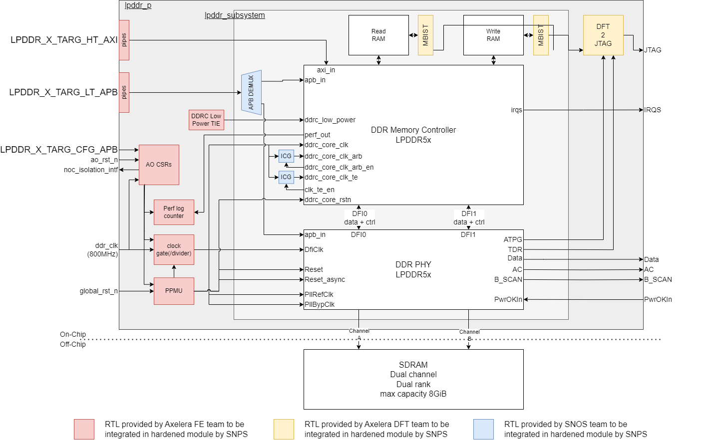

# LPDDR SUBSYS

The lpddr subsys is IP from SNPS, it consist of an LPDDR MEM ctrl integrated with 2 LPDDR phys.

## RTL structure

### lpddr_p / top-level
Our RTL wrapper around lpddr_subsys defining the top-level of the LPDDR block as shown in the figure below. We provide all the RTL in the wrapper to the SNPS hardening team. They will do the actual physical implementation, and deliver to us the `lpddr_p` as physical top-level for the lpddr IP.



> **NOTE:**
The current version of the wrapper is not autogenerated, and does not include the `pipes`, `AO CSR`, `PPMU`, and `perf counters` elements.

### lpddr_subsys
RTL from SNPS that provides the integration between the LPDDR memory controller and the lpddr PHY. Additionally, it contains an APB bridge to merge CTRL and PHY APB interfaces into one interface. And, the integrated clock gates (ICG) cells to enable clock gating on the Arbitter and T-engine.

Since this RTL is provided by SNPS, it does not live in our Europa repository, but in the release dir as part of the SNPS LPDDR release drops.

> **NOTE:**
While we are waiting for the first SNPS release, there is a temporary subsys build for Veloce that integrates the RTL of the memory controller with emulations PHYs from SNPS.

### DWC_ddrctl
The LPDDR memory controller provided by SNPS. RTL generated using coreConsultant based on primeprofile and config file included at `./config`. The generated RTL should live in SNPS release directory, but since we have not yet had a release, a temporary release is placed at `/data/foundry/LIB/synopsys/lpddr5x/v_roel`.

#### CoreConsultant Workspace
Using the primeprofile in the config directory, you can create a local coreConsultant workspace. In such a workspace you get 'freshly' generated RTL, documentation, verification framework, and software utilities. To create the workspace you can follow these steps starting from the repo root.

```bash
source .env-default-modules
module unload coretools
module load coretools/V-2024.03
export DESIGNWARE_HOME=/opt/synopsys/dware/eu001-1.0
cd hw/vendor/synopsys/lpddr_subsys/default
mkdir -p workspaces
cd workspaces
```
At this point you can either launch coreConsultant with gui, or continue on the command line. If you want to make changes to the default setup of the workspace, you will need to use the gui. The commandline approach always load the predifined config in the `./config/create_workspace.tcl` and should be used to make the workspace initially.

##### GUI
- `coreConsultant`
- Click open workspace if you have already made a workspace that you want to reuse.
- Click `DWC_ddrctl_lpddr54` in the Getting Started section to manually create a new workspace (if the option is not there you have not set the correct `DESIGNWARE_HOME` enviroment variable)
- Modify as you please/dare

##### Batch
Use this option to create a new workspace called `my_lpddr5` with the settings defined in `./config/create_workspace.tcl`
- `coreConsultant -f ../config/create_workspace.tcl -shell`

> **NOTE:**
This error can be ignored `OSError: Tunnel connection failed: 403 Forbidden`

##### WorkSpace content
Important workspace directories
- `src` - RTL source files
- `sim/sw_utilities` - SW source files

### dwc_lpddr5xphy_top
Top-level of the LPDDR PHY provided by SNPS.

RTL can be found at `/home/projects/LIB/synopsys/dwc_ap_lpddr5x_phy_sssf5a`

> **NOTE:**
This RTL can not be used on veloce, on Veloce you have to use the PHY elements from Veloce itself.
