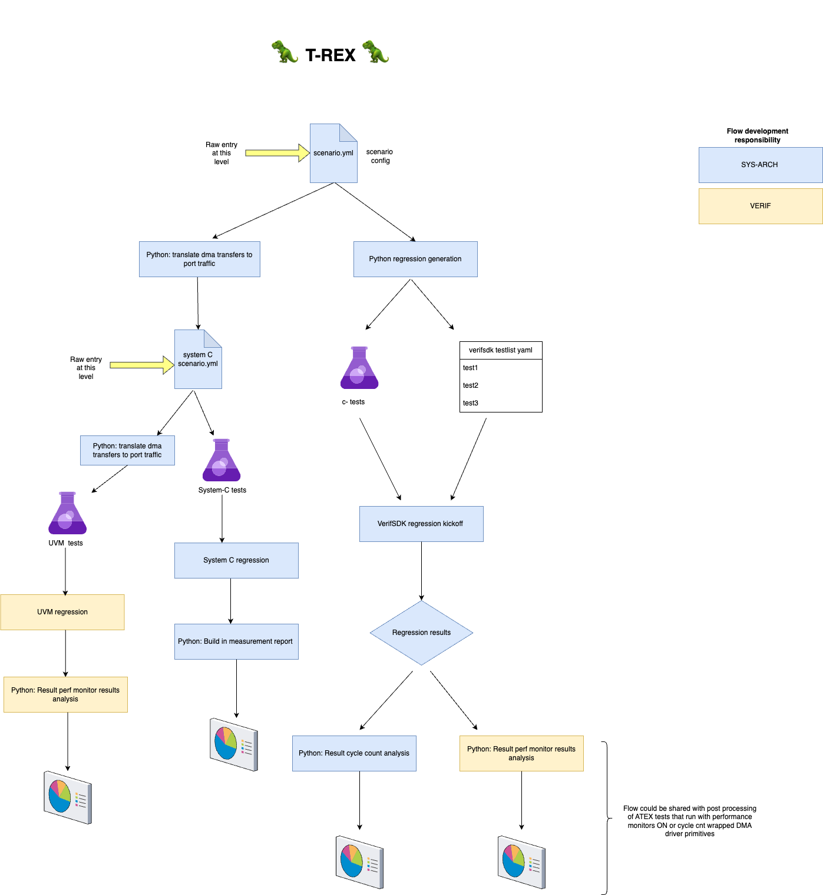

## Traffic Rergression Exchange format (TREX) 🦖

The TREX tool aims to generate easily all tests needed to do performance evaluation in the interconnects and DMAs in the system.
The tool receives as an input a scenario schema where the user defines the scenarios that need to be tested.
These scenarios are then translated into top level .c tests that trigger the respective DMA tasks. The same scenarios can be expanded into port traffic information in order to verify the
performance of the NOC. The scenario schema can be used to provide a regression that can be tested in top level and NOC level (SystemC and UVM).



The schema allows different DMA transfers to be setup in all the DMAs in the system. Simultaenous DMA transfers in different parts of the system can also be setup.
The user can provide a list tasks that need to be executed by the different DMAs in the resources ex APU, AICORE0, AICORE1 etc
The user does not need to know what type of DMA the precise instance is, the selection between the Axelera DMA driver and the SNPS DMA driver will happen automatically during the test
rendering. Depending on the DMA instance different configuration parameters need to be provided for the DMA transfers to be setup with ( please see schema template below).

The tasks in a scenario are executed in parallel. If the same DMA instance needs to execute mutliple transfers then these tasks are occuring sequentially.

```bash
scenarios:
  - name: test_trex_sanity
    description: "This test is starting 1 stream transfer in the AICORE0 stream on 1 channel"
    data_check: True
    data_random: True
    perf_counter: True
    noc_config:
       interleaving: True
    tasks:
      - name: task1
        resource: AI0
        instance: LP_DMA
        mode: CSR # or CMD
        num_channels: 1
        channels: [0]
        source_address: [] # empty implies random allocation
        destination_address: [] # empty implies random allocation
        xbytesize: [16384] # in bytes
        burst_length: [64]
        osr: [15]
        flags: [] #placeholder for flags
```


The architecture of the the arch.py
The tool supports the following features:
- Task handling for all DMAs in the system
- Most important DMA transfer parameters should be enabled (address type , selectable defined addresses , transfer size, osr, burst len)
- Option to control different NOC parameters (interleaving, addressing mode)
- easily extendable cores/dma instances as part of the architecture definition arch.py
- Data checks can be enabled or disabled (disabled for faster execution, enabled for data consistency checks)
- Data randomization should be enabled or disabled
- Performance monitors should be enabled or disabled
- Cycle counter should be enabled or disabled ( config phase , transfer phase )
- Automatic Test list generated and addition to the fw yaml list
-  Configurable to run for both emulator or simulation

### Test generation

```bash
trex render -c <path-to-scenarios.yml file>
```

For any issues, bugs please report to Spyridoula Koumousi @spyridoula.koumousi@axelera.ai


### Current features missing

The current version of TREX does not support the following:

- For the AXE-DMA we currently do not support generation of tests that have different SRC and DST sizes for the X and Y transfers.
- For the NOC, currently we do not support the different interleaving and addressing modes
- No support for automatic label generation. Currently only 1 label can be used.

All of the above limitations will be fixed in coming versions.
