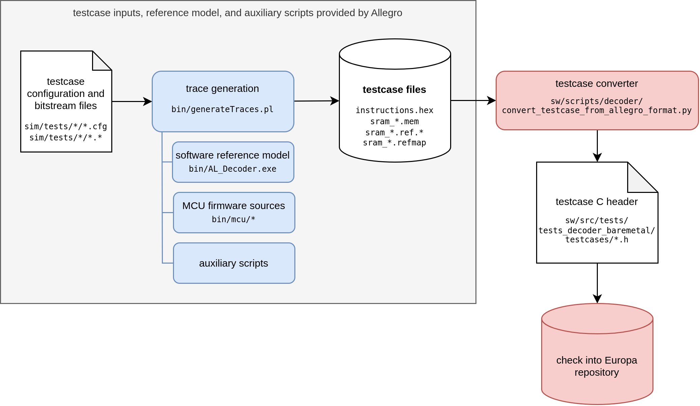

# Decoder Testcase Conversion

This directory contains the infrastructure to convert decoder integration testcases from the Allego testbench, such that they can be executed from the APU.

> This type of decoder test is commonly called **bare-metal tests** within Axelera.

## Testcase Generation and Conversion Flow

The testcase generation and conversion flow consists of two distinct steps, as described in the diagram below:

1. **Testcase Generation:** The Allegro flow uses the decoder reference model (`AL_Decoder.exe`) to generate a testcase, based on a configuration file and an input bitstream (e.g., JPG image file).
This flow is provided by Allegro (with minor modifications for e.g. changed address map).
2. **Testcase Conversion:** An entire testcase (consisting of testbench instructions, inputs, and outputs) is converted into a single C source file.
This is done by a custom Python script (`convert_testcase_from_allegro_format.py`).

The C source files are checked into the Europa repository (in `sw/src/tests/test_decoder_baremetal/testcases/*.c`).



### Generation Script

The entire flow is performed by the `generate_decoder_testcase.sh` shell script.
For a reference on how to use the script, see below or use the `--help` flag.

The Allegro decoder deliveries are only available on Hetzner. To use delivery v0.1, for example:
```sh
export ALLEGRO_DELIVERY_DIR=/home/projects/allegro/delivery.Decoder_D300-R_RTL0p1
```

This is an approximate reproduction of what the script does (for regular testcasesa):
```sh
export CONFIG_FILE="$ALLEGRO_DELIVERY_DIR/sim/tests/g_integration/JPG_128x64_400_8_1c0.cfg"
export CONFIG_NAME="$(basename "$CONFIG_FILE" .cfg)"

# 1. Create local copy of Allegro's RTL+testbench delivery
mkdir -p work
cp -r $ALLEGRO_DELIVERY_DIR work/

# 2. Create local copy of config file
cp $CONFIG_FILE work/

# 3. Patch delivery (e.g., address map changes)
cd work/$(basename "$ALLEGRO_DELIVERY_DIR")
for patch in ../../allegro_delivery_patches/*.patch; do
    patch -p1 < "$patch"
done

# 4. Generate testcase files (using Allegro `bin/generateTraces.pl` flow)
cd sim
./run.pl -no_compile -no_sim "$config_file"

# 5. Convert testcase to C source file
../../../convert_testcase_from_allegro_format.py ../../$CONFIG_NAME
```

The Python script prints the path of the output C source file to STDOUT, which should then be moved to the appropriate location.

#### Regular Testcases

For regular testcases, the inputs consist of a bitstream file (e.g., JPG image) and associated configuration file (`*.cfg`).

```sh
./generate_decoder_testcase.sh       \
    --delivery $ALLEGRO_DELIVERY_DIR \
    --config $ALLEGRO_DELIVERY_DIR/sim/tests/g_integration/JPG_128x64_400_8_1c0.cfg
```

#### Boot-Only Testcase

For a first simple test, a custom "boot-only" testcase has been implemented (by Axelera).
This test simply boots the MCU and raises the MCU-to-CPU IRQ.

To generate this testcase, the `--boot-only` flag is used.

```sh
./generate_decoder_testcase.sh       \
    --delivery $ALLEGRO_DELIVERY_DIR \
    --boot-only
```

## Testcase Execution

To execute the testcase from C code, consider the following code snippet:

```c
// testbench emulation
#include <decoder/decoder_testcase.h>
// testcase data
extern struct decoder_testcase testcase;

int main() {
    return decoder_testcase_execute(&testcase) ? 0 : 1;
}
```

The entire testcase is contained within a `struct decoder_testcase` as generated by the Python conversion script.
